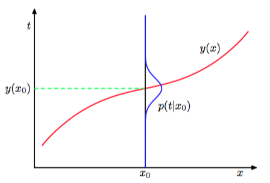
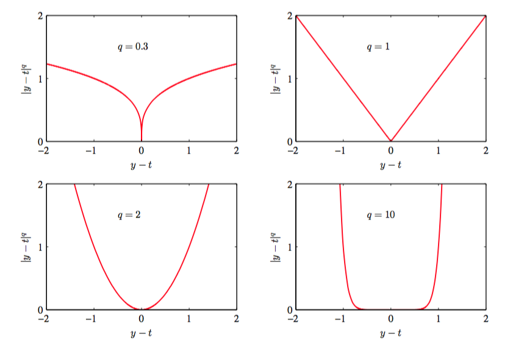

之前，一直在讨论分类问题中讨论决策论。现在开始讨论回归问题，如之前讨论的曲线拟合的问题。决策阶段包括对于每个输入$$ x $$选择目标$$ t $$的一个具体的估计$$ y(x) $$。假设这样做之后，记损失为$$ L(t, y(x)) $$。那么平均损失或损失期望为：    

$$
\mathbb{E}[L] = \int\int L(t,y(x))p(x,t)dxdt \tag{1.86}
$$

在回归问题中，损失函数通常选择为平方误差：$$ L(t,y(x)) = \{y(x) - t\}^2 $$。在这个例子中，误差期望就可以写成

$$
\mathbb{E}[L] = \int\int\{y(x) - t\}^2p(x, t)dxdt \tag{1.87}
$$

我们的目标是选择$$ y(x) $$使得$$ \mathbb{E}[L] $$最小。假设$$ y(x) $$的选择完全自由，我们可以使用微积分来形式化的得到它：    

$$
\frac{\delta\mathbb{E}[L]}{\delta y(x)} = 2\int \{y(x) - t\}p(x,t)dt = 0 \tag{1.88}
$$

使用概率的加法，乘法规则求解$$ y(x) $$：

$$
y(x) = \frac{\int t p(x,t)dt}{p(x)} = \int t p(t|x)dt = \mathbb{E}_t[t|x] \tag{1.89} 
$$

这是条件$$ x $$下$$ t $$的条件均值，被称为回归函数（regression function）。结果如图1.28展示。

      
图 1.28: 最小化了期望平方损失的回归函数$$ y(x) $$由条件概率分布$$ p(t|x) $$的均值给出。

这可以很容易的扩展到用向量$$ t $$表示的多目标变量的情形。这种情况下，最优解是条件均值$$ y(x) = E_t[t|x] $$。    

我们也可以用一种透露回归问题本质的稍微不同的方式推导出这个结果。已经知道最优解是条件期望，我们可以把平方项按照下面的方式展开：    

$$
\begin{eqnarray}
\{y(x) − t\}^2 &=& \{y(x) − E[t|x] + E[t|x] − t\}^2 \\
&=& \{y(x) − E[t|x]\}^2 + 2\{y(x) − E[t|x]\}\{E[t|x] − t\} + \{E[t|x] − t\}^2 
\end{eqnarray}
$$

其中，为了不让符号过于复杂，我们使用$$ E[t|x] $$来表示$$ E_t[t|x] $$。代入损失函数中，对$$ t $$进行积分，我们看到交叉项消失（详细证明参看本节最后），因而得到损失函数:   

$$
\mathbb{E}[L] = \int\{y(x) − E[t|x]\}^2p(x)dx + \int var[t|x]p(x)dx \tag{1.90}
$$

我们要寻找的函数$$ y(x) $$只出现在第一项中。当$$ y(x) $$等于$$ E[t|x] $$时第一项取得最小值，这时第一项会被消去。这正是我们之前推导的结果，表明最优的最小平方预测由条件均值给出。第二项是$$ t $$的分布的方差，在$$ x $$分布上的平均。它表示目标数据内在的变化性，可以理解为噪声。由于它与$$ y(x) $$无关，所以它表示损失函数的不可减小的最小值。    

与分类问题相同，我们可以确定合适的概率，然后使用这些概率做出最优的决策，也可以直接建立决策的模型。实际上，也可以区分出三种解决回归问题的方法，按照复杂度降低的顺序：

1. 首先解决确定联合概率密度$$ p(x, t) $$的推断问题。然后，计算条件概率密度$$ p(t|x) $$。最后，使用公式（1.89）积分，求出条件均值。    
2. 首先解决确定条件概率密度$$ p(t|x) $$的推断问题。之后使用公式（1.89）计算条件均值。    
3. 直接从训练数据中寻找一个回归函数$$ y(x) $$。    

这三种方法的优缺点和之前的分类问题的情形很相似。    

平方损失函数不是回归问题中损失函数的唯一选择。实际上，有些情况下，平方损失函数会导致非常差的结果，这时我们就需要更复杂的方法。有多个峰值条件分布$$ p(t|x) $$就是这样的一个例子。这在解决逆问题时经常出现。这里我们简要介绍一下平方损失函数的一种推广，叫做闵可夫斯基损失函数（Minkowski loss），它的期望为    

$$ \mathbb{E}[L_q] = \int\int|y(x) - t|^qp(x,t)dxdt \tag{1.91} $$

当$$ q = 2 $$时，这个函数就变成了平方损失函数的期望。图1.29给出了不同$$ q $$值下，函数$$ |y − t|^q $$关于$$ y − t $$的图像。当$$ q = 2 $$时，$$ \mathbb{E}[L_q] $$的最小值是条件均值。当$$q = 1 $$时，$$ \mathbb{E}[L_q] $$的最小值是条件中位数。当$$ q \to 0 $$时，$$ \mathbb{E}[L_q] $$的最小值是条件众数。

      
图 1.29: 闵可夫斯基损失函数

####一些证明    

#####交叉项消去    

展开

$$
\{y(x) − E[t|x]\}\{E[t|x] − t\}
$$

得到

$$
y(x)E[t|x] - y(x)t - \{E[t|x]\}^2 + E[t|x]t
$$    

代入（1.87）得到
$$
\int\int (y(x)E[t|x] - y(x)t - \{E[t|x]\}^2 + E[t|x]t)p(x,t)dxdt
$$    

分别对各项求积分可得    

$$
\begin{eqnarray}
\int\int y(x)E[t|x]p(x,t)dxdt &=& \int y(x)E[t|x]p(x)dx \\
\int\int y(x)tp(x,t)dxdt &=& \int\int y(x)tp(t|x)p(x)dxdt \\
&=& \int y(x)E[t|x]p(x)dx \\
\int\int \{E[t|x]\}^2p(x,t)dxdt &=& \int \{E[t|x]\}^2p(x)dx \\
\int\int E[t|x]tp(x,t)dxdt &=& \int  E[t|x]tp(t|x)p(x)dxdt \\
&=& \int\{E[t|x]\}^2p(x)dx 
\end{eqnarray}
$$

其中我们使用了式（1.89），这样它们就可以两两消去。

#####第三项展开    

$$
\begin{eqnarray}
\int \int \{ E[t|x] - t \}^2 p(x,t) dxdt &=& \int \int \{ E[t|x] - t \}^2 p(t|x) p(x) dxdt \\
&=& \int \left(\int\{E[t|x]\}^2p(t|x)dt - \int 2E[t|x]tp(t|x)dt + \int t^2p(t|x)dt\right)p(x)dx \\
&=& \int \left(\{E[t|x]\}^2 - 2\{E[t|x]\}^2 + E[t^2|x]\right)p(x)dx \\
&=& \int \left(E[t^2|x] - \{E[t|x]\}^2\right)  p(x) dx \\
&=& \int var[t|x] p(x) dx
\end{eqnarray}
$$

