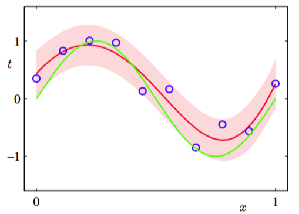

尽管包含了先验分布$$ p(w|\alpha) $$，我们还是在对$$ w $$做点估计，还没有以贝叶斯的观点来对待。在完全的贝叶斯的方法中，应该一致的使用概率的加法，乘法规则。我们稍后会看到，这需要对所有$$ w $$值进行积分。这样的边缘化是使用贝叶斯方法的模式识别的核心。    

在曲线拟合问题中，已经给定训练数据集$$ X, T $$和新的测试数据$$ x $$。我们的目标是预测$$ t $$。因此，我们想估计预测分布$$ p(t|x, X, T) $$。这里我们假设参数$$ \alpha , \beta $$是固定的，并且事先知道（在后续章节中我们将讨论如何使用贝叶斯方法从数据中推断出这样的参数）。    

简单地说，贝叶斯方法就是一致的使用概率的加法，乘法规则。预测分布可以写成：    

$$
p(t|x, X, T) = \int p(t|x, w)p(w|X, T)dw \tag{1.68}
$$

这里的$$ p(t|x, w) $$是由公式（1.60）省略了参数$$ \alpha , \beta $$简化后得到，$$ p(w|X, T) $$是参数的后验分布，可以由公式（1.66）的右手边标准化得到。在3.3节将看到，对于曲线拟合这样的问题，这个后验分布是一个高斯分布，并可以得到解析解。同样的，公式（1.68）中的积分也可以解析的得到预测分布的高斯分布形式：    

$$
p(t|x, X, T) = \mathcal{N}(t|m(x), s^2(x)) \tag{1.69}
$$

其中均值和方差是由下式给出的：    

$$
\begin{eqnarray}
m(x) = \beta \phi(x)^TS\sum\limits_{n=1}^N\phi(x_n)t_n  \tag{1.70} \\
s^2(x) = \beta^{-1} + \phi(x)^TS\phi(x)t_n  \tag{1.71} 
\end{eqnarray}
$$

其中矩阵$$ S $$是由

$$
S^{-1} = \alpha I + \beta\sum\limits_{n=1}^N\phi(x_n)\phi(x)^T \tag{1.72}
$$

其中$$ I $$是单位矩阵，定义向量$$ \phi(x) $$为$$ \phi_i(x) = x^i, i = 0,...,M $$。    

我们看到公式（1.69）的预测分布的均值和方差是依赖$$ x $$的。公式（1.71）的第一项表示由目标值上的噪声引起的预测值$$ t $$的不确定性。这种不确定性在最大似然的预测分布（1.64）中由$$ \beta_{ML}^{-1} $$表达的。然而，第二项是由使用贝叶斯方法导致的参数$$ w $$的不确定性引起的。合成正弦回归问题的预测分布在图1.17展现。

      
图 1.17: 用贝叶斯方法处理多项式曲线拟合问题得到的预测分布的结果。使用的多项式为$$ M = 9 $$，超参数被固定为$$ \alpha = 5 × 10^{−3}, \beta = 11.1 $$(对应于已知的噪声方差)。其中，红色曲线表示预测概率分布的均值，红色区域对应于均值周围±1标准差的范围。
