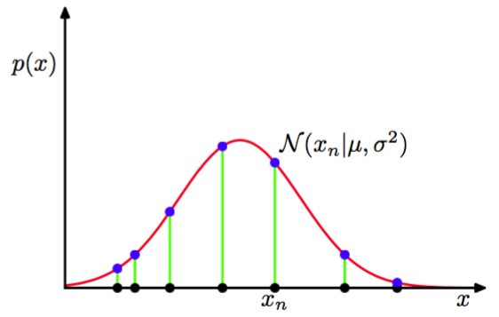

我们将会用整个第二章来学习不同的概率分布及他们的核心属性。但是，我们先介绍在连续变量中最重要的一个分布：正态或高斯分布（Normal 或 Gaussian）分布。我们在本章接下来的部分和本书剩余的部分中大量的使用这个分布。    

对于一元实值变量$$ x $$，高斯分布被定义为：    

$$
\mathcal{N}(x|\mu ,\sigma) = \frac{1}{(2\pi \sigma^2)^{1 / 2}}exp\left\{-\frac{1}{2\sigma^2}(x - \mu)^2\right\} \tag{1.46}
$$
它是由均值（mean）$$ \mu $$和方差（variance）$$ \sigma^2 $$控制的。方差的平方根，也就是$$ \sigma $$被称为标准差（standard deviation）。方差的导数写作：$$ \beta = 1/\sigma^2 $$被称为精度（precision）。我们很快就能看到使用这些项的动机。图1.13展示了高斯分布的图像：

      
图 1.13: 高斯分布

从公式（1.46）可以得到高斯分布满足： 
$$
\mathcal{N}(x|\mu, \sigma^2) > 0 \tag{1.47}
$$

再者，很容易就证明高斯是标准化的：    
$$
\int_{-\infty}^{\infty} \mathcal{N}(x|\mu, \sigma^2)dx = 1 \tag{1.48}
$$

因此公式(1.46)满足有效的概率密度的两个条件。     
我们已经能够找到关于$$ x $$的函数在高斯分布下的期望，特别的$$ x $$的均值：    
$$
\mathbb{E}[x] = \int_{-\infty}^{\infty} \mathcal{N}(x|\mu, \sigma^2)xdx = \mu \tag{1.49}
$$

由于参数$$ \mu $$表示在分布下的$$ x $$的平均值，它通常被叫做均值。类似的，二阶矩为：    
$$
\mathbb{E}[x^2] = \int_{-\infty}^{\infty} \mathcal{N}(x|\mu, \sigma^2)x^2dx = \mu^2 + \sigma^2 \tag{1.50}
$$    

从公式（1.49）和（1.50），可以得出$$ x $$的方差是：    
$$
var[x] = \mathbb{E}[x^2] - \mathbb{E}[x]^2 = \sigma^2 \tag{1.51}
$$

因此，$$ \sigma^2 $$也被称为方差参数。分布中出现最多的被称为众数。在高斯分布中众数正好与均值重合。    

我们也对$$ D $$维连续变量的向量$$ x $$的高斯分布也感兴趣。定义为：    
$$
\mathcal{N}(x|\mu, \Sigma) = \frac{1}{(2\pi)^{D/2}} \frac{1}{|\Sigma|^{1/2}} exp\{-\frac{1}{2}(x-\mu)^T\Sigma^{-1}(x - \mu)\} \tag{1.52}
$$

其中$$ D $$为向量$$ \mu $$被称为均值，$$ D × D $$矩阵$$ \Sigma $$被称为协方差，$$ |\Sigma| $$表示$$ \Sigma $$的行列式。本章中我们很少用到多变量高斯分布，详细的性质将在2.3节讨论。    

现在，假设我们有观测值$$ X = (x_1,...,x_n)^T $$的数据集，用来表示$$ N $$个标量$$ x $$的观测值。注意，我们使用了一个大写的$$ X $$的来和使用$$ x $$标记的向量变量$$ (x_1,...,x_D)^T $$作区分。假定，独立的从均值$$ \mu $$和方差$$ \sigma^2 $$未知的高斯分布中获取观测数据集合，我们想从这个数据集中获取这些参数。独立地从相同的分布中抽取的数据点被称为独立同分布（independent and identically
distributed），通常缩写成i.i.d。我们已经知道两个独立事件的联合概率可以由各个事件的边缘概率的乘积得到。由于我们的数据集$$ X $$是独立同分布的，我们可以用$$ \mu, \sigma^2 $$给出数据集的概率：    

$$
p(X|\mu, \sigma^2) = \prod\limits_{n=1}^{N}N(x_n|\mu, \sigma^2) \tag{1.53}
$$

当我们把它看成$$ \mu, \sigma^2 $$的函数时，这就是高斯分布的似然函数。就像图1.14展示的那样。     

      
图 1.14: 高斯概率分布的似然函数，黑点表示数据集$$ \{x_n\} $$的值，公式(1.53)给 出的似然函数对应于蓝色值的乘积。

使用一个观测数据集来决定概率分布的参数的一个通用的标准是寻找使似然函数取得最大值的参数值。这个观点看起来有点奇怪，因为在之前的概率论讨论中，似乎在给定数据集的情况下求最大化概率的参数，而不是给定参数的最大化数据集出现的概率会更加自然。事实上，这两个标准是相关的。后面将使用曲线拟合的例子来说明这一点。    

但是现在，我们需要通过最大化似然函数（1.53）来确定高斯分布中的$$ \mu, \sigma^2 $$。实际上，最大化似然函数的对数会更加方便。因为对数是一个单调递增函数，最大化一个函数的对数等价于最大化这个函数。取对数后不仅简化了后续的数学分析，同样有助于数学计算。因为大量小概率的乘积很容易下溢，这可以通过去对数后的加法来解决。通过公式（1.46）和（1.53）似然函数可以写成：    
$$
\ln p(x|\mu, \sigma^2) = -\frac{1}{2\sigma^2}\sum\limits_{n=1}^N(x_n - \mu)^2 - \frac{N}{2}\ln \sigma^2 - \frac{N}{2}\ln(2\pi)  \tag{1.54}
$$

关于$$ \mu $$，最大化函数（1.54），我们可以得到最大似然解：    
$$
\mu_{ML} = \frac{1}{N}\sum\limits_{n=1}^{N}x_n \tag{1.55}
$$
这是样本均值（sample mean），即观测到样本的均值。类似的，关于$$ \sigma^2 $$的最大化函数（1.54）得到了方差的最大似然解：    

$$
\sigma_{ML}^2 = \frac{1}{N}\sum\limits_{n=1}^{N}(x_n - \mu_{ML})^2 \tag{1.56}
$$

这是关于样本均值$$ \mu_{ML} $$的样本方差，注意，我们要求关于$$ \mu, \sigma^2 $$的联合最大化函数（1.54），但是在高斯分布中$$ \mu $$与$$ \sigma^2 $$是无关的，所以我们先求出（1.55）然后用这个结果来求（1.56）。    

接下来，我们会强调最大化似然的一些限制，这里我们以使用最大化似然求解一元高斯分布的参数为例。实际情况下，最大似然方法会系统性的低估分布的方差。这一种被称为偏置（bias）的现象。它与多项式曲线拟合中的过拟问题有关。注意，最大似然的解：$$ \mu_{ML} ,\sigma_{ML}^2 $$是关于数据集的值$$ x_1,...,x_n $$的函数。考虑这些量关于具有参数$$ \mu, \sigma^2 $$的高斯分布的数据集的期望。很容易就能证明：    

$$
\begin{eqnarray}
\mathbb{E}[\mu_{ML}] &=& \mu \tag{1.57} \\
\mathbb{E}[\sigma_{ML}^2] &=& \left(\frac{N - 1}{N}\right)\sigma^2 \tag{1.58}
\end{eqnarray}
$$

所以一般来说，最大似然能对均值做出正确的估计，但是对方差低估了因子$$ (N - 1) / N $$。背后的原因在图1.15中说明。     

      
图 1.15:
最大似然方法确定高斯分布的方差时，偏移是如何产生的。绿色曲线表示真实的高斯分布，数据点是根据这个概率分布生成的。三条红色曲线表示对三个数据集拟合得到的高斯概率分布，每个数据集包含两个蓝色的数据点，使用式（1.55）和式（1.56）给出的最大似然的结果进行拟合。对三个数据集求平均，均值是正确的，但是方差被系统性地低估了，因为它是相对样本均值进行测量的，而不是相对真实的均值进行测量。

根据公式（1.58）下面公式是无偏的：    

$$
\widetilde\sigma^2 = \frac{N}{N - 1}\sigma_{ML}^2 = \frac{1}{N - 1}\sum\limits_{n=1}^{N}(x_n - \mu_{ML})^2 \tag{1.59}
$$

在10.1.3节中，我们将会看到当我们采用贝叶斯方法是这个结果是如何自动出现的。    

注意，当数据点的数量$$ N $$增加时，最大似然的偏置变得越来越不重要，当$$ N \to \infty $$时，方差的最大似然的解等于生成数据的分布的方差。实际上，$$ N $$的值只要不是太小，偏置不会导致大问题。然而，在本书中，我们感兴趣的是带有很多参数的复杂模型，这时最大似然带来的偏置问题会严重的多。实际上，我们会看到，最大似然的偏置问题是我们在之前的多项式曲线拟合问题中遇到的过拟问题的核心。    

#### 一些证明    

#####1.58：

$$
\begin{eqnarray}
\mathbb{E}[\sigma^2_{ML}] &=& E\left[\frac{1}{N}\sum\limits_{n=1}^N\left(x_n - \frac{1}{N}\sum\limits_{m=1}^Nx_m\right)^2\right] \\
&=& \frac{1}{N}\sum\limits_{n=1}^N\mathbb{E}\left[x_n^2 - \frac{2}{N}x_n\sum\limits_{m=1}^Nx_m + \frac{1}{N^2}\sum\limits_{m=1}^N\sum\limits_{l=1}^Nx_mx_l\right] \\
&=& \mu^2 + \sigma^2 - 2\left(\mu^2 + \frac{1}{N}\sigma^2\right) + \mu^2 + \frac{1}{N}\sigma^2 \\
&=& \left(\frac{N-1}{N}\right)\sigma^2
\end{eqnarray}
$$

其中使用了

$$
\begin{eqnarray}
\mathbb{E}[x_n^2] &=& \mu^2 + \sigma^2 \\
\mathbb{E}[x_n]\mathbb{E}[x_m] &=& \mu^2 \ when \ m \neq n
\end{eqnarray}
$$

