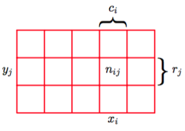

模式识别的一个核心概念是不确定性。这是由测量时的噪声以及有限的数据集造成的。概率论提供了一个量化，控制这样的不确定性的一致性框架，是模式识别的核心基础。当于1.5节中讨论的决策论相结合时，我们可以从有限的信息中做出最优的决定，尽管这些信息是不完整的、有歧义的。

我们以一个简单的例子来介绍概率论的基本概念。想象一下，我们有两个盒子，一个红的一个蓝的，红的盒子中有2个苹果6个橘子，蓝色盒子中有3个苹果1个橘子，就像图1.9中展示的那样。

    
图 1.9 两个不同颜色的盒子,每个盒子中都有水 果,苹果用绿色表示,橘子用橙色表示。    

假设我们随机的挑选一个盒子，并从中随机的挑选一个水果，观察一下我们选择的水果种类，然后把它放回到原来的盒子中。假设重复这个过程很多次。假设我们在40%的情况中选择了红盒子，在60%的情况中选择了蓝盒子。并且我们选择盒子中的水果时是等可能的。    

在这个例子中,我要选择的盒子的颜色是一个随机变量,记作$$ B $$。这个随机变量可以取两个值中的一个,即$$ r $$(对应红盒子)或$$ b $$(对应蓝盒子)。同样的水果的选择也是一个随机变量，记作$$ F $$。它可以取$$ a $$(苹果)或者$$ o $$(橘子)。     

开始阶段,我们把一个事件的概率定义为在总试验次数趋于无穷的情况下事件发生的次数与试验总数的比值。因此选择红盒子的概率为$$ \frac{4}{10} $$，选择蓝色盒子的概率是$$ \frac{6}{10} $$。我们把这个概率记作 $$ p(B = r) = \frac{4}{10} , p(B = b) = \frac{6}{10} $$。注意，根据定义概率一定位于区间[0,
1]内。另外，包含所有可能的结果，并且它们之间是互斥的（如在前面的例子中我们必须选择红色或蓝色盒子），那么他们的概率的和就等于1。    

现在我们可以问这样的问题:选择到苹果的整体概率是多少?或者,假设我们选择了橘子, 那么选择的盒子是蓝色的概率是多少？一旦我们通过掌握概率论的两个基本规则：加法规则（sum rule）和乘积规则（product rule），来回答这样的问题，事实上我们也就可以回答与模式识 别相关的比这些复杂得多的问题。掌握这些规则之后,我们将重新回到我们的水果盒子的例子。    

为了推导概率的规则，考虑图1.10所示的更一般的情形。如图1.10所示，它涉及到两个随机变量$$ X, Y $$（例如可以是上面例子中“盒子”和“水果”的随机变量）。

    
图 1.10:两个随机变量     

假设$$ X $$可以任意的取$$ x_i $$，其中$$ i = 1,...,m $$。设$$ Y $$可以任意的取$$ y_j $$，其中$$ j = 1,...,l $$。现在我们做$$ N $$次同时对$$ X $$和$$ Y $$进行取样的实验，把结果为$$ X = x_i, Y = y_j $$的试验的数量记作$$ n_{ij} $$。并且,把$$ X $$的结果是$$ x_i $$(与$$ Y $$的取值无关)的试验的数量记作$$ c_i $$,类似的,把$$ Y $$的结果是$$ y_i $$(与$$ X $$的取值无关)的试验的数量记作$$ r_j $$ 。     

$$ X $$取$$ x_i $$且$$ Y $$取$$ y_j $$的概率被记作$$ p(X = x_i,Y = y_j) $$,被称为$$ X = x_i $$和$$ Y = y_j $$的联合概率(joint probability)。它的计算方法是单元格$$ i, j $$中的数量与总数的比值，即：     
$$
\begin{equation}
p(X = x_i,Y = y_i) = \frac{n_{ij}}{N} \tag{1.5}
\end{equation}
$$    
这里有一个隐式的规则：$$ N \to \infty $$。类似地,$$ X $$取$$ x_i $$（与$$ Y $$取值无关）的概率被记作$$ p(X = x_i) $$,计算方法是列$$ i $$的数量与总数的比值,即:     
$$
\begin{equation}
p(X = x_i) = \frac{c_{i}}{N} \tag{1.6}
\end{equation}
$$    
由于在图1.10中列$$ i $$的数量是列中每一个单元格的数量的和（$$ c_i = \sum_jn_{ij} $$），所以根据公式(1.5)和(1.6)我们就得到：     

$$
\begin{equation}
p(X = x_i) = \sum\limits_{j=1}^lp(X = x_i, Y = y_j) \tag{1.7}
\end{equation}
$$    

这就是加法规则。注意,$$ p(X = x_i) $$有时被称为边缘概率(marginal probability),因为它是通过对其它变量的边缘化或求和来得到的（本例中为$$ Y $$）。     

如果我们只考虑那些$$ X = x_i $$的情况，那么其中$$ Y = y_j $$所占的比例被记作$$ p(Y = y_j | X = x_i) $$，被称为给定$$ X = x_i $$的$$ Y = y_j $$的条件概率(conditional probability)。它是由单元格$$ i, j $$中的数量与列$$ i $$的总数的比值，即：    

$$
\begin{equation}
p(Y = y_j | X = x_i) = \frac{n_{ij}}{c_i} \tag{1.8}
\end{equation}
$$    

由公式(1.5),(1.6)和(1.8)我们可以得到：

$$
\begin{equation}
p(X = x_i, Y = y_j) = \frac{n_{ij}}{N} = \frac{n_{ij}}{ci} \cdot \frac{c_i}{N} = p(Y = y_j|X = x_i)p(X = x_i) \tag{1.9}
\end{equation}
$$    
这就是概率的乘法规则。     

现在我们可以很清楚的区分随机变量（水果例子中的盒子变量$$ B $$）和随机变量的取值（盒子是红色时取值$$ r $$）。当$$ B $$取值为$$ r $$时的概率我们记作$$ p(B = r) $$。虽然这种记法消除了歧义，但是它相当笨拙，在很多情况下也没有必要。所以，在上下文没有奇异的情况下，我们简单地用$$ p(B) $$表示随机变量$$ B $$的分布，用$$ p(r) $$表示对于特定的值$$ r $$的分布估计。     

使用这种简洁的记法,可以用下面的形式表示概率论的两条基本规则:  
##### 加法规则
$$
p(X) = \sum\limits_Y p(X, Y ) \tag{1.10}
$$
##### 乘法规则
$$
p(X, Y) = p(Y|X)p(X) \tag{1.11} 
$$    
这里$$ p(X, Y) $$是联合概率，可以表述为“X且Y的概率”。同样的，$$ p(Y |X) $$是条件概率，可以表述为“给定$$ X $$的条件下$$ Y $$的概率”，$$ p(X) $$是边缘概率,可以简单地表述为“$$ X $$的概率”。这两个简单 的规则是我们全书中使用的全部概率推导的基础。    

根据乘法规则以及对称性$$  p(X, Y ) = p(Y, X) $$我们就可以得到两个条件概率之间的关系：    

$$ p(Y|X) = \frac{p(X|Y)p(Y)}{p(X)} \tag{1.12} $$    

这就是在模式识别和机器学习领域扮演着核心角色的贝叶斯定理。使用加法规则，贝叶斯定理中的分母可以用分子中的项表示为：    
$$ p(X) = \sum\limits_Yp(X|Y)p(Y) \tag{1.13} $$

我们可以把贝叶斯定理中的分母看作为了保证左边的条件概率对于所有的$$ Y $$取值的和为1。    

在图1.11中我们展示了两个变量的联合分布的简单例子，用来说明边缘和条件概率的概念。

    
图 1.11: 两个变量X和Y 上的概率分布的一个例子。

这里只有$$ N = 60 $$的有限个样本，它们的联合分布展示在左上。右上方是$$ Y $$ 取两种值的比例的直方图。根据概率的定义，这些比例在$$ N \to \infty $$时会等于相应的概率$$ p(Y) $$。我们可以吧直方图看作一种在给定有限的数据点的情形下，对概率分布建模的简单的方式。使用数据对概率分布建模是统计模式识别的核心，在本书中将会详细介绍。图1.11中剩下的两张图分别给出了$$ p(X) $$和$$ p(X | Y = 1)$$的估计的直方图。     

现在，让我们回到那个水果的例子中。再一次强调随机变量和它的实例之间的区别。选择红盒子或者蓝盒子的概率分别由下式给出:    
$$
\begin{eqnarray}
p(B = r) = \frac{4}{10} \tag{1.14} \\
p(B = b) = \frac{6}{10} \tag{1.15}
\end{eqnarray}
$$  
注意：$$ p(B = r) + p(B = b) = 1 $$。     

现在，假设我们随机的挑选一个盒子，并选到了蓝色。那么选到苹果的概率就是蓝盒子中苹果的比例：$$ \frac{3}{4} $$，所以$$ p(F = a|B = b) = \frac{3}{4} $$。实际上,我们可以写出给定盒子的条件下水果种类的全部四个概率： 

$$
\begin{eqnarray}
p(F = a | B = r) = \frac{1}{4} \tag{1.16} \\
p(F = o | B = r) = \frac{3}{4} \tag{1.17} \\
p(F = a | B = b) = \frac{3}{4} \tag{1.18} \\
p(F = o | B = b) = \frac{1}{4} \tag{1.19}
\end{eqnarray}
$$  

注意：这些概率是标准化的，所以：

$$
\begin{eqnarray}
p(F = a | B = r) + p(F = o | B = r) = 1  \tag{1.20} \\
p(F = a | B = b) + p(F = o | B = b) = 1  \tag{1.21}
\end{eqnarray}
$$  

现在我们可以用加法和乘法规则来计算选到苹果的总的概率。

$$ 
\begin{eqnarray}
p(F =a) &=& p(F =a|B=r)p(B=r)+p(F =a|B=b)p(B=b) \\
&=& \frac{1}{4} × \frac{4}{10} + \frac{3}{4} × \frac{6}{10} = \frac{11}{20} \tag{1.22}
\end{eqnarray}
$$

然后我们根据加法规则就可以得到：$$ p(F = o) = 1 − \frac{11}{20} = \frac{9}{20} $$。

反过来，假设我们知道选到是说过是橘子，我们想知道它是从那个盒子中来的。这需要我们在 给定水果种类的条件下估计盒子的概率分布,而公式(1.16)至(1.19)给出的是在已知盒子颜色的情形下水果的概率分布。我们可以通过贝叶斯定理来解决这样的反转的条件概率：    

$$
p(B=r|F=o)= \frac{p(F=o|B=r)p(B=r)}{p(F = o)} = \frac{3}{4} × \frac{4}{10} × \frac{20}{9} = \frac{2}{3} \tag{1.23}
$$

根据加法规则我们得到：$$ p(B=b|F =o)=1−\frac{2}{3} = \frac{1}{3} $$。

我们可以按下面的方式来解释贝叶斯定理。如果我们在不知道水果种类的情况下，被问及会选择哪个盒子，这是我们得到的最完整的信息只有概率$$ p(B) $$。因为这个概率是在我们知道水果种类之前就能得到的，所以我们把这叫做先验概率（prior probability）。一旦我们被告知我们选择的水果是橘子的时候，就可以使用贝叶斯定理来计算概率$$ p(B|F) $$。由于这个概率是我们在观察到$$ F
$$之后获得的，所以我们把这叫做后验概率（posterior probability）。注意，在这个例子中，选择红盒子的先验概
率是$$ \frac{4}{10} $$，所以我们更可能选择蓝盒子。但是，一旦我们观测到选择的是橘子的时候，我们得到选择红盒子的后验概率是$$ \frac{2}{3}
$$，更可能选择的时候红盒子。这个结果与我们的直觉相符，因为红盒子中橘子的比例比蓝盒子中的高得多。因此选择了橘子这个事实提供了利于选择红盒子的有效证据。事实上，这个超过了先验的假设的证据相当有效，使得红盒子被选择的可能性大于蓝盒子。

最后，我们强调一下，如果两个变量的联合分布可以分解成它们的边缘分布的乘积，也就是$$ p(X, Y) = p(X)p(Y) $$，那么变量$$ X, Y $$是相互独立的。根据乘法规则，我们得到$$ p(Y |X) = p(Y) $$，也就是对于对定的$$ X $$的条件下$$ Y $$的条件分布是独立于$$ X $$的。举个例子，在水果的例子中，如果每个盒子包含同样比例的苹果和橘子，那么$$ p(F |B) = P (F) $$，从而选择哪个苹果与选择哪个盒子无关。
