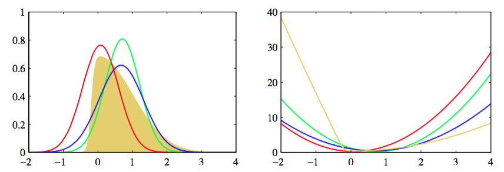

在本章的最后一节，我们讨论确定性近似推断的另一种被称为期望传播（expectation propagation）或EP(Minka, 2001a; Minka, 2001b)的形式。与目前为止讨论的变分贝叶斯方法相同，这种方法也基于对Kullback-Leibler散度的最小化，但是现在形式相反，从而得到了性质相当不同的近似结果。     

先考虑关于$$ q(z) $$最小化$$ KL(p \Vert q) $$的问题，其中$$ p(z) $$是一个固定的概率分布，$$ q(z) $$是指数族分布的一个成员，因此根据式（2.194），可以写成     

$$
q(z) = h(z)g(\eta)exp\{\eta^Tu(z)\} \tag{10.184}
$$      

作为$$ \eta $$的一个函数，Kullback-Leibler散度变成了     

$$
KL(p \Vert q) = -\ln g(\eta) - \eta^T\mathbb{E}_{p(z)}[u(z)] + const \tag{10.85}
$$    

其中常数项与自然参数$$ \eta $$无关。我们可以通过令关于$$ \eta $$的梯度等于零的方式，在这个概率分布族中最小化$$ KL(p \Vert q) $$，结果为     

$$
-\nabla\ln g(\eta) = \mathbb{E}_{p(z)}[u(z)] \tag{10.186}
$$     

然而，我们已经看到，在式（2.226）中，$$ ln g(\eta) $$的负梯度有概率分布$$ q(z) $$下$$ u(z) $$的期望给模型证据为定。令这两个结果相等，我们有     

$$
\mathbb{E}_{q(z)}[u(z)] = \mathbb{E}_{p(z)}[u(z)] \tag{10.87}
$$     

我们看到，最优解仅仅对应于将充分统计量的期望进行匹配。因此，例如，如果$$ q(z) $$是一个高斯分布$$ \mathcal{N}(z|\mu,\Sigma) $$，那么我们通过令$$ q(z) $$的均值$$ \mu $$等于分布$$ p(z) $$的均值并且令协方差$$ \Sigma $$等于$$ p(z) $$的协方差，即可最小化Kullback-Leibler散度。这有时被称为矩匹配（moment matching)。图10.3(a)给出了这个的一个例子。    

现在，让我们利用这个结果，得到近似推断的一个实用的算法。对于许多概率模型来说，数据$$ D $$和隐含变量（包括参数）$$ \theta $$的联合概率分布由一组因子的乘积组成，形式为      

$$
p(D,\theta) = \prod\limits_if_i(\theta) \tag{10.188}
$$     

这个结果可能由独立同分布的数据的模型产生，其中对于每个数据点$$ x_n $$，都有一个因子$$ f_n(\theta) = p(x_n|\theta) $$，且因子$$ f_0(\theta) = p(\theta) $$对应于先验概率分布。更一般地，它也适用于任何由有向图定义的模型，其中每个因子是一个条件概率分布，对应于一个结点。也适用于无向图，其中每个因子是一个团块势函数。我们感兴趣的是计算后验概率分布$$ p(\theta|D)
$$用于进行预测，以及计算模型证据$$ p(D) $$用于进行模型比较。根据公式(10.188)，后验概率分布为    

$$
p(\theta|D) = \frac{1}{p(D)}\prod\limits_if_i(\theta) \tag{10.189}
$$      

模型证据为     

$$
p(D) = \int\prod\limits_if_i(\theta)d\theta \tag{10.190}
$$     

这里，我们考虑连续变量，但是下面的讨论同样适用于离散变量，只需把积分替换为求和即可。我们假设$$ \theta $$上的边缘概率分布以及关于用来进行预测的后验概率分布的边缘分布都是无法计算的，从而需要某种形式的近似。     

期望传播基于后验概率分布的近似，这个近似也由一组因子的乘积给出，即     

$$
q(\theta) = \frac{1}{Z}\prod\limits_i\tilde{f}_i(\theta) \tag{10.191}
$$     

其中，近似中的每个因子$$ \tilde{f}_i(\theta) $$对应于真实后验分布（10.189）中的一个因子$$ f(\theta) $$，因子$$ 1 / Z  $$是标准化常数，用来确保式（10.191）的左侧的积分等于1。为了得到一个实用的算法，我们需要对因子$$ \tilde{f}_i(\theta) $$进行一定的限制，特别的，我们会假定因子来自指数族分布。于是，因子的乘积也是指数族分布，因此可以用充分统计量的有限集合来描述。例如，如果每个$$ \tilde{f}_i(\theta) $$是一个高斯分布，那么整体的近似$$ q(\theta) $$也是高斯分布。     

理想情况下，我们通过最小化真实后验概率分布与近似分布之间的Kullback-Leibler散度的方式来确定$$  \tilde{f}_i(\theta) $$，这个散度为     

$$
KL(p \Vert q) = KL\left(\frac{1}{p(D)}\prod\limits_if_i(\theta)\big\Vert\frac{1}{Z}\prod\limits_i\tilde{f}_i(\theta)\right) \tag{10.192}
$$     

注意与变分推断中使用的KL散度相比，这个KL的散度恰好相反。通常这个最小化是无法进行的，因为KL散度涉及到关于真实概率分布求平均。作为一个粗略的近似，我们反过来最小化对应的因子对$$ f_i(\theta) $$和$$ \tilde{f}_i(\theta) $$之间的KL散度。这个问题容易得多，并且具有算法无需迭代的优点。然而，由于每个因子被各自独立地进行近似，因此因子的乘积的近似效果可能很差。     

期望传播通过在所有剩余因子的环境中对每个因子进行优化，从而取得了一个效果好得多的近似。首先，这种方法初始化因子$$ \tilde{f}_i(\theta) $$，然后在因子之间进行循环，每次优化一个因子。这种方法的思想类似于之前讨论的变分贝叶斯框架的因子更近过程。假设我们希望优化因子$$ \tilde{f}_j(\theta) $$。     

首先，我们将这个因子从乘积中移除，得到$$ \prod_{i \neq j}\tilde{f}_i(\theta) $$。从概念上讲，我们要确定因子$$ \tilde{f}_j(\theta) $$的一个修正形式，使得乘积     

$$
q^{new}(\theta) \propto \tilde{f}_j(\theta)\prod_{i \neq j}\tilde{f}_i(\theta) \tag{10.193}
$$

尽可能地接近     

$$
f_j(\theta)\prod_{i \neq j}\prod_{i \neq j}\tilde{f}_i(\theta) \tag{10.194}
$$     

其中我们保持所有$$ i \neq j $$的因子$$ \tilde{f}_i(\theta) $$固定。这保证了近似在由剩余的因子定义的后验概率较高的区域最精确。后面，当我们将EP应用于“聚类问题”的时候，我们会看到这种效果的一个例子。为了达到这个目的，我们首先从当前的对后验概率的近似中移除因子$$ \tilde{f}_j＝(\theta) $$方法是定义下面的未标准化的分布    

$$
q^{\\j}(\theta) = \frac{q(\theta)}{\tilde{f}_j＝(\theta)} \tag{10.195}
$$     

注意，我们反过来从$$ i \neq j $$的因子的乘积中求出$$ q^{\\j}(\theta) $$，虽然在实际应用中，除法通常更容易。它现在与因子$$ f_j(\theta) $$结合，得到概率分布     

$$
\frac{1}{Z_j}f_j(\theta)q^{\\j}(\theta) \tag{10.196}
$$     

其中$$ Z_j $$是标准化常数，形式为    

$$
Z_j = \int f_j(\theta)q^{\\j}(\theta)d\theta \tag{10.197}
$$     

我们现在通过最小化Kullback-Leibler散度     

$$
KL\left(\frac{f_j(\theta)q^{\\j}(\theta)}{Z_j}\Vert q^{new}(\theta)\right) \tag{10.198}
$$     
 
来确定一个修正的因子$$ \tilde{f}_j＝(\theta) $$。这很容易求解，因为近似分布$$ q^{new}(\theta) $$来自指数族分布，因此我们可以使用结果（10.187），这个公式告诉我们，参数$$ q(\theta) $$可以通过匹配式（10.1960的对应矩的充分统计量的期望的方式获得。我们会假设这是一个可以计算的操作。例如，如果我们将$$ q(\theta) $$选择为高斯概率分布$$ \mathcal{N}(\theta|\mu,\Sigma) $$，那么$$ \mu $$被设置为（未标准化的）分布$$
f_j(\theta)q^{\\j}(\theta) $$的均值，$$ \Sigma $$被设置为它的方差。更一般地，得到指数族分布的任意成员的所需的分布是很容易的，只要它能够被标准化即可，因为充分统计量的期望可以与标准化系数的导数相关联，正如式（2.226）所述。图10.14说明了EP近似的过程。     

      
图 10.14 用高斯分布进行期望传播近似的说明,使用了之前在图4.14和图10.1中讨论的例子。左图给出了原始的概率分布（黄色）以及拉普拉斯近似（红色）、全局变分近似（绿色）以及EP近似（蓝色），右 图给出了对应的概率分布的负对数。注意,EP分布比变分推断得到的分布更宽，这是由于不同形式的KL散度造成的结果。

根据式(10.193），我们看到修正的因子$$ \tilde{f}_j(\theta) $$可以按照下面的方法得到：取$$ q^{new}(\theta) $$，然后，除以剩余的因子，即     

$$
\tilde{f}_j(\theta) = K\frac{q^{new}(\theta)}{q^{\\j}(\theta)} \tag{10.199}
$$      

其中我们使用了公式(10.195)。系数$$ K $$通过下面的方式确定：将等式（10.199）的两侧乘以$$ q^{\\j}(\theta) $$，然后积分，可得     

$$
K = \int\tilde{f}_j(\theta)q^{\\j}(\theta)d\theta \tag{10.200}
$$     

其中我们已经使用了$$ q^{new}(\theta) $$已经标准化这一事实。于是，$$ K $$的值可以通过匹配零阶矩的方式得到    

$$
\int\tilde{f}_j(\theta)q^{\\j}(\theta)d\theta = \int f_j(\theta)q^{\\j}(\theta)d\theta \tag{10.201}
$$     

将这个式子与式（10.197）结合，我们看到$$ K = Z_j $$，因此可以通过计算式（10.197）中的积分的方式得到。     

在实际应用中，在因子集合中会进行多次迭代，每次都修正所有的因子。之后，使用式（10.191）可以得到后验概率分布$$ p(\theta|D) $$的近似，模型证据$$ p(D) $$可以使用式（10.190）来近似，其中因子$$ f_i(\theta) $$被替换为它们的近似$$ \tilde{f}(\theta) $$。    

我们给定观测数据集$$ D $$和随机变量$$ \theta $$上的联合概率分布，用因子的乘积的形式表示     

$$
p(D,\theta) = \prod\limits_if_i(\theta) \tag{10.202}
$$     

我们希望使用下面形式的分布     

$$
q(\theta) = \frac{1}{Z}\prod\limits_i\tilde{f}_i(\theta) \tag{10.203}
$$     

来近似后验概率分布$$ p(\theta|D) $$。我们也希望近似模型证据$$ p(D) $$。     

1. 初始化所有的近似因子$$ \tilde{f}_i(\theta) $$。    
2. 通过设置
$$
q(\thea) \propto \prod\limits_i\tilde{f}_i(\theta) \tag{10.204}
$$
初始化后验近似。     
3. 直到收敛：     
* 选择一个因子$$ \tilde{f}_j(\theta) $$进行优化。     
* 通过下面的除法
$$
q^{\\j}(\theta) = \frac{q(\theta)}{\tilde{f}_j(\theta)} \tag{10.205}
$$
从后验概率分布中移除$$ \tilde{f}_j(\theta) $$。     
* 计算新的后验概率分布，方法为：令$$ q^{new}(\theta) $$的充分统计量（矩）等于$$ q^{\\j}(\theta)f_j(\theta) $$的充分统计量（矩），包括计算标准化系数     
$$
Z_j = \int q^{\\j}(\theta)f_j(\theta)d\theta \tag{10.206}
$$
* 计算和存储新的因子
$$
\tilde{f}_j(\theta) = Z_j\frac{q^{new}(\theta)}{q^{\\j}(\theta)} \tag{10.207}
$$     
4. 计算模型证据的近似
$$
p(D) \simeq \int\prod\limits_i\tilde{f}_i(\theta)d\theta \tag{10.208}
$$     

EP的一个特别的情况，被称为假定密度过滤（assumed density filtering, ADF）或矩匹配（moment matching）（MayBeck, 1982; Lauritzen, 1992; Boyen and Koller, 1998; Opper and Winther,
1999），可以这样得到：对除了第一个因子以外的所有近似因子初始化为1，然后在所有因子之间进行一次迭代，每次更新因子中的每一个。假定密度过滤对于在线学习很适用，其中数据点顺序地到达，我们需要从每个数据点中进行学习，然后在考虑下一个数据点之间将其丢弃。然而，在批处理的设定中，我们有机会多次重新适用数据点来得到更高的精度，并且这正是期望传播所利用的思想。此外，如果我们将ADF应用于批量的数据，结果会依赖于数据点的处理顺序，这不是我们想要的，而EP可以克服这个缺点。     

期望传播的一个缺点是，它不保证迭代会收敛。然而，对于指数族分布的近似$$ q(\theta) $$，如果迭代确实收敛，那么求得的解是特定的势函数的驻点（Minka, 2001a），虽然每轮EP迭代未必减小势函数的值。这与变分贝叶斯相反。变分贝叶斯中，每轮迭代保证不会减小界限。直接优化EP的代价函数是可能的，这种情况下，它保证收敛，虽然会导致算法更慢，实现起来更复杂。     

变分贝叶斯和EP的另一个区别是来自于两个算法所最小化的KL散度的形式，因为前者最小化$$ KL(q \Vert p) $$，而后者最小化$$ KL(p \Vert q) $$。正如我们在图10.3中看到的那样，对于多峰的概率分布$$ p(\theta) $$，最小化$$ KL(p \Vert q) $$会产生较差的近似。特别的，如果将EP应用于混合概率分布，那么得到的结果没有意义，因为得到的近似试图覆盖后验概率分布的所有峰值。相反，在logistic类型的模型中，EP通常要比局部变分方法和拉普拉斯近似方法的表现更好（Kuss and Rasmussen, 2006）。
