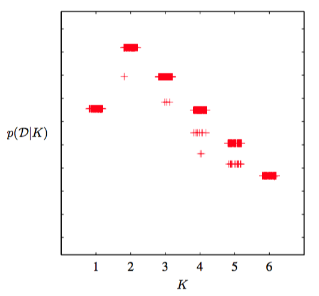

我们已经看到，变分下界可以用来确定具有$$ K $$个分量的混合模型的后验概率分布。然而，这里有一个需要强调的比较微妙的地方。对于高斯混合模型的任意给定的参数设置（除了一些特殊的退化的设置之外），会存在一些其他的参数设置，对于这些参数设置，观测变量上的概率密度是完全相同的。这些参数值的差别仅仅是由于分量的重新标记产生的。例如，考虑两个高斯分布的混合以及一个单一的观测变量$$ x $$，其中参数值为$$ \pi_1 = a，\pi_2 = b，\mu_1 = c，\mu_2 = d，\sigma_1 = e，\sigma_2 = f $$。那么对于参数值$$ \pi_1 = b，\pi_2 = a，\mu_1 = d，\mu_2 = c，\sigma_1 = f，\sigma_2 = e $$，即两个分量被交换，此时根据对称性，会给出同样的$$ p(x) $$值。如果我们有一个由$$ K $$个分量组成的混合模型，那么每个参数设置都是$$ K! $$个等价设置中的一个。     

在最大似然方法中，这种冗余性是不相关的，因为参数最优化算法（例如EM算法）会依赖于参数的初始值，找到一个具体的解，其他的等价的解不起作用。然而，在贝叶斯方法中，我们对所有可能的参数进行积分或求和。我们已经在图10.3中看到了，如果真实的后验概率分布是多峰的，那么基于最小化$$ KL(q \Vert p) $$的变分推断会倾向于在某一个峰值的邻域内近似这个分布，而忽视其他的峰值。由于等价的峰值具有等价的预测分布，因此只要我们考虑一个具有具体的 数量$$ K $$个分量组成的模型，那么这种等价性就无需担心。然而，如果我们项比较不同的$$ K $$值，那么我们需要考虑这种多峰性。一个简单的近似解法是当我们进行模型比较和平均时，在下界中增加一项$$ \ln K! $$。
图10.7给出了包含多峰值因子的下界关于分量数量K的关系图像，数据集是忠老泉的数据。

      
图 10.7 变分下界$$ L $$与高斯混合模型的分量的数量$$ K $$的关系图像,数据集是老忠实间歇喷泉的数据。图中展示了$$ K = 2 $$个分量时的不同的峰值。对于每个$$ K $$值，模型使用100个不同的起始点进行训练，结果用“+”符号表示。图像中，水平方向被施加了微小的扰动，从而它们可以被区分开。注意，某些解找到了次优的局部极大值，但是这个不经常发生。

值得再次强调的是，最大似然方法会使得似然函数的值随着$$ K $$的值单调递增（假设奇异解已经被避开，并且不考虑局部极大值的效果），因此不能够用于确定一个合适的模型复杂度。相反，贝叶斯推断自动地进行了模型复杂度和数据拟合之间的折中。     

这种确定K的方法需要对一组具有不同$$ K $$值的模型进行训练和比较。另一种确定一个合适 的K值的方法是将混合系数$$ \pi $$看成参数，通过关于π最大化下界的方式来对它们的值进行点估计（Corduneanu and Bishop， 2001），这种方法没有使用纯粹的贝叶斯方法为它们保留一个概率分布。这种方法会得到下面的重估计方程

$$
\pi_k = \frac{1}{N}\sum\limits_{n=1}^Nr_{nk} \tag{10.83}
$$

并且最大化过程与剩余参数上的分布$$ q $$的变分更新过程相互交织在一起。对于解释数据集的贡献比较小的分量会让它们的混合系数在最优化的过程中趋于0，因此它们通过自动相关性确定（automatic relevance determination）的方式从模型中移除。这使得我们可以进行一轮训练，这一轮训练开始时，我们选择一个相对较大的K的初始值，然后让多于的分量从模型中被剪枝出去。关于超参数进行最优化时的稀疏性的来源已经在相关向量机中详细讨论过。

