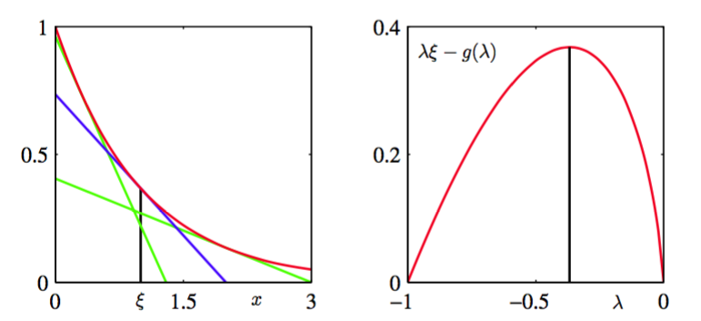
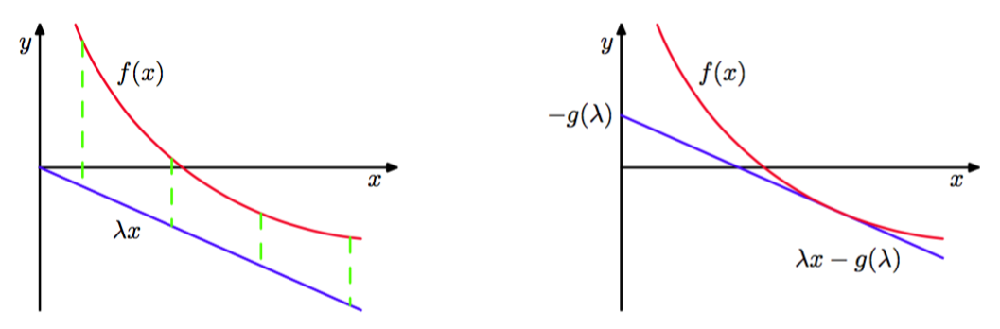
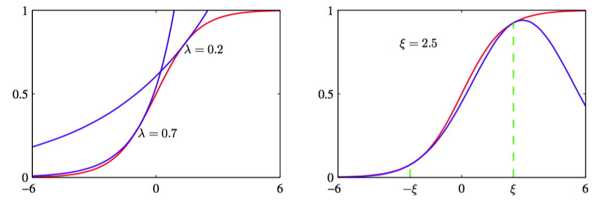

10.1节和10.2节讨论的变分框架，由于它直接寻找所有随机变量上的完整的后验概率分布的近似，所以可以被看做“全局”方法。另一种“局部”的方法涉及到寻找模型中的单独的变量或者变量组上定义的函数的界限。如：我们可能寻找条件概率分布$$ p(y|x)
$$的界限，这个条件概率本身仅仅是一个由有向图模型描述的更大的概率模型中的一个因子。引入界限的目的显然是简化最终得到的概率分布。这个局部近似可以应用于多个变量，直到得到一个可以处理的近似。在10.6.1节，我们会在logistic回归的问题中给出这种方法的一个实际例子。这里，我们关注求解界限本身。    

我们已经看到，在我们对Kullback-Leibler散度的讨论中，对数函数的凸函数性质在求解全局变分方法的下界时起着关键的作用。我们将一个（严格）凸函数定义为每条弦都位于函数上方的函数。凸函数的性质对于局部变分的框架也起着核心的作用。注意，我们的讨论同样适用于凹函数，只需交换“最大值”运算与“最小值”运算，将下界变为上界即可。     

      
图 10.10 在左图中，红色曲线表示函数$$ exp(−x) $$，蓝色直线表示式（10.125）定义的在$$ x = \xi $$处的切线，其中$$ \xi = 1 $$。这条直线的斜率为$$ \eta = f'(\xi) = − exp −\xi $$。注意，任何其它的切线，例如绿色的切线，在$$ x = \xi $$处都会有一个更小的$$ y $$值。右图给出了函数$$ \eta\xi − g(\eta) $$关于$$ \eta $$的图像，其中$$ g(\eta) $$由式（10.131）给出，$$ \xi = 1 $$，此时最大值对应于$$ \eta = − exp(−\xi) = −1/e $$。

让我们首先考虑一个简单的例子，即函数$$ f(x) = exp(−x) $$，它是$$ x $$的一个凸函数，如图10.10的左图所示。我们的目标是使用一个简单的函数来近似$$ f(x) $$，特别的，使用$$ x $$的一个线性函数。根据图10.10，我们看到，如果这个线性函数对应于一条切线，那么它是函数$$ f(x) $$的下界。我们可以得到在一个具体的$$ x $$处的$$ y(x) $$的切线，例如$$ x = \xi $$处，方法是使用一阶泰勒展开式     

$$
y(x) = f(\xi)+ f'(\xi)(x - \xi) \tag{10.125}
$$

从而$$ y(x) \leq f(x) $$，且等号只在$$ x = \xi $$时成立。对于我们的例子，函数$$ f(x) = exp(−x) $$，因此我们得到了切线的形式如下     

$$
y(x) = exp(-\xi) -  exp(-\xi)(x - \xi) \tag{10.126}
$$       

它是一个以$$ \xi $$为参数的线性函数。为了与后续的讨论相容，让我们定义$$ \eta = −exp(−\xi) $$，即    

$$
y(x,\eta) = \eta x - \eta + \eta\ln(-\eta) \tag{10.127}
$$     

不同的$$ \eta $$值对应于不同的切线，并且由于所有的切线都是函数的下界，因此我们有$$ f(x) \geq y(x,\eta) $$。因此我们可以将函数写成下面的形式     

$$
f(x) = \max_\eta\{\eta x - \eta + \eta\ln(-\eta)\} \tag{10.128}
$$     

我们已经成功地用一个简单的线性函数$$ y(x,\eta) $$来近似凸函数$$ f(x) $$。代价是我们引入了一个变分参数$$ \eta $$，并且为了得到最紧致的界限，我们必须关于$$ \eta $$进行最优化。     

我们可以使用凸对偶（convex duality）的框架更加一般地形式化描述这种方法（Rockafellar, 1972; Jordan et al., 1999）。考虑图10.11的左侧图给出的凸函数$$ f(x) $$。在这个例子中，函数$$ \eta x $$是$$ f(x) $$的一个下界，但不是斜率为$$ \eta $$的线性函数能够达到的的最好的下界，因为最紧致的下界由切线给出。让我们将斜率为$$ \eta $$的切线的方程写成$$ \eta x − g(\eta) $$，其中截距（的负值）$$ g(\eta) $$显然依赖于切线的斜率$$ \eta
$$。为了确定截距，我们注意到这条直线必须垂直移动一段距离，这段距离等于直线和函数之间最小的垂直距离，如图10.11所示。

      
图 10.11 在左图中，红色曲线给出了一个凸函数$$ f(x) $$，蓝色曲线表示线性函数$$ \eta x $$,它是$$ f(x) $$的一个下界，因为对于所有的$$ x $$都有$$ f(x) > \eta x $$。对于给定的斜率$$ \eta $$的值，具有相同斜率的切线的接触点可以通过关于$$ x $$最小化差距$$ f(x) − \eta x $$的方式得到，差距用绿色虚线表示。这定义了对偶函数$$ g(\eta) $$,它对应于具有斜率$$ \eta $$的切线的截距（的负值）。

因此    

$$
\begin{eqnarray}
g(\eta) &=& -\min_x\{f(x) - \eta x\} \\
&=& \max_x\{\eta x - f(x) \} \tag{10.129}
\end{eqnarray}
$$      

现在，我们不去固定$$ \eta $$改变$$ x $$，而是可以考虑一个特定的$$ x $$值，然后调节$$ \eta $$，直到切平面在这个特定的$$ x $$处与函数$$ f(x) $$相切。由于在特定的$$ x $$处，当切线的$$ y $$值与它的连接点的$$ y $$值相等时，$$ y $$的值最大，因此我们有    

$$
f(x) = \max_\eta\{\eta x - g(\eta)\} \tag{10.130}
$$     

我们看到函数$$ f(x) $$和$$ g(\eta) $$的角色是对偶的，二者通过式（10.129）和式（10.130）相互关联。    

让我们将这两个对偶关系应用到我们简单的例子$$ f(x) = exp(−x) $$中。根据式（10.129），我们看到$$ x $$的最大值为$$ \xi = − \ln(−\eta) $$，代回式中，我们得到了共轭函数$$ g(\eta) $$，形式为     

$$
g(\eta) = \eta - \eta\ln(-\eta) \tag{10.131}
$$     

与之前得到的结果相同。对于$$ \xi = 1 $$的情况函数$$ \eta\xi − g(\eta) $$的图像如图10.10右侧所示。作为检查，我们可以将式（10.131）代入到式（10.130），这给出了最大值$$ \eta = − exp(−x) $$，代回到式中就恢复出了原始的函数$$ f(x) = exp(−x) $$。     

对于凹函数，我们可以采用类似的推导方式，得到上界，其中“最大化”运算被替换为“最小化”运算，即    

$$
\begin{eqnarray}
f(x) &=& \min_\eta\{\eta x - g(\eta)\} \tag{10.132} \\
g(\eta) &=& \min_x\{\eta x - f(x)\} \tag{10.133}
\end{eqnarray}
$$

如果感兴趣的函数不是凸函数（或凹函数），那么我们不能直接应用这种方法得到上述界限。然而，我们可以首先寻找函数或者参数的一个可逆变换，这个变换将函数或者参数变换为一个凸函数的形式。然后，我们计算共轭函数，之后变换回原始的变量。    

在模式识别中经常出现的一个重要的例子时logistic sigmoid函数，它的定义为     

$$
\sigma(x)＝ \frac{1}{1 + e^{-x}} \tag{10.134}
$$     

这不是凹函数也不是凸函数。然而，如果我们取对数，那么我们就得到了一个凹函数，这一点通过取二阶导数的方式很容易证明。根据式（10.133），对应的共轭函数的形式为     

$$
g(\eta) = \min_x\{\eta x - f(x)\} = -\eta\ln\eta - (1-\eta)\ln(1-\eta) \tag{10.135}
$$     

我们看到，它是一个二值变量的熵，这个变量的取值为$$ 1 $$的概率为$$ \eta $$。使用式（10.132）得到对数sigmoid函数的一个上界     

$$
\ln\sigma(x) \leq \eta x - g(\eta) \tag{10.136}
$$      

然后取指数，得到logistic sigmoid函数的一个上界，形式为     

$$
\sigma(x) \leq exp(\eta x - g(\eta)) \tag{10.137}
$$      

对于两个不同的$$ \eta $$值，图像如图10.12的左图所示。     

      
图 10.12 左图中，红色曲线给出了式（10.134）定义的logistic sigmoid函数$$ \sigma(x) $$。同时给出的还有两个指数上界（10.137）的例子，用蓝色曲线表示。右图再次用红色曲线给出了logistic sigmoid函数。同时给出的还有高斯下界（10.144），用蓝色曲线表示。这里，参数$$ \xi = 2.5 $$，界限在$$ x = \xi $$和$$ x = −\xi $$出事精确的，用绿色曲线标记。

我们也可以得到sigmoid函数的下界，下界的函数形式是高斯形式。为了达到这个目的，我们采用Jaakkola and Jordan(2000)的方法，对输入变量和函数本身都进行变换。首先，我们取logistic函数的对数，然后将其分解，即

$$
\begin{eqnarray}
\ln\sigma(x) &=& -\ln(1+e^{-e}) = -\ln\left\{e^{-x/2}\left(e^{x/2} + e^{-x/2}\right)\right\} \\
&=& \frac{x}{2} - \ln\left(e^{x/2} + e^{-x/2}\right) \tag{10.138}
\end{eqnarray}
$$     

我们现在注意到，函数$$ f(x) = −\ln(e^{x/2} + e^{-e/2}) $$是变量$$ x^2 $$的一个凸函数，这一点可以通过取二阶导数的方式证明。这产生了$$ f(x) $$的下界，它是$$ x^2 $$的一个线性函数，它的共轭函数为    

$$
g(\eta) = \max_{x^2}\left\{\eta x^2 - f\left(\sqrt{x^2}\right)\right\} \tag{10.139}
$$     

根据驻点的条件可得     

$$
0 = \eta - \frac{dx}{dx^2}\frac{d}{dx}f(x) = \eta + \frac{1}{4x}\tanh\left(\frac{x}{2}\right) \tag{10.140}
$$

如果我们将这个值记作$$ x $$，对应于在这个特定的$$ \eta $$值下，函数与切线的接触点，记作$$ \eta $$，那么我们有    

$$
\eta = -\frac{1}{4\xi}\tanh\left((\frac{\xi}{2}\right) = - \frac{1}{2\xi}\left([\sigma(\xi) - \frac{1}{2}\right] \tag{10.141}
$$    

其中，我们定义了$$ \lambda = −\eta $$，保持与Jaakkola and Jordan(2000)的相容性。我们不把$$ \lambda $$看成变分参数，相反，我们可以令$$ \xi $$为变分参数，因为这会产生共轭函数的更简单的表达式，它的形式为     

$$
g(\lambda) = \lambda(\xi)\xi^2 − f(\xi) = \lambda(\xi)\xi^2 + \ln(e^{\xi/2} + e^{−\xi/2}) \tag{10.142}
$$     

这里，$$ f(x) $$的界限可以写成     

$$
f(x) \geq -\lambda(\xi)x^2 - g(\lambda(\xi)) = -\lambda(\xi)x^2 - \lambda(\xi)\xi^2 - \ln(e^{\xi/2} + e^{-\xi/2}) \tag{10.143}
$$     

sigmoid函数的界限就变成了     

$$
\sigma(x) \geq \sigma(\xi)exp\left\{\frac{x - \xi}{2} - \lambda(\xi)(x^2 - \xi^2)\right\} \tag{10.144} 
$$     

其中$$ \lambda(\xi) $$的定义为（10.141）。这个界限如图10.12的右图所示。我们看到，界限的函数形式是$$ x $$的二次函数的指数形式。当我们寻找通过logistic sigmoid函数定义的后验概率分布的高斯表示时，这个界限的形式很有用。    

logistic sigmoid函数在二值变量上的概率模型中经常出现，因为它是将log odds函数转换为后验概率分布的函数。对于多类分布，对应的变换由softmax函数给出。不幸的是，这里推导出logistic sigmoid函数的下界不能直接扩展到softmax函数。Gibbs(1997)提出了一种构建高斯分布的方法，这个高斯分布被猜想为是一个界限（虽然没有给出严格的证明），这可以用于将局部变分方法应用到多分类问题。     

我们会在10.6.1节看到局部变分界限的一个例子。然而，现阶段从一般的角度考虑这些界限如何被使用是很有意义的。假设我们想计算一个形式如下的积分    
$$
I = \int \sigma(a)p(a)da\tag{10.147}
$$    

其中$$ \sigma(a) $$是一个logistic sigmoid函数，$$ p(a) $$是一个高斯概率密度。当我们项计算贝叶斯模型中的预测分布时，这种积分会经常出现，此时$$ p(a) $$表示一个后验参数分布。由于积分是无法直接计算的，因此我们使用变分界限（10.144），我们将它写成$$ \sigma(a) \geq f(a,\xi) $$，其中$$ \xi $$是一个变分参数。积分现在变成了两个指数-二次函数的乘积，因此可以解析地求出积分，给出$$ I $$的界限     

$$
I \geq \int f(a,\xi)p(a)da = F(\xi) \tag{10.146}
$$    

我们可以自由地选择变分参数$$ \xi $$，这里我们选择最大化函数$$ F(\xi) $$的值$$ \xi^* $$。得到的值$$ F(\xi^*) $$表示在所有的界限中最紧致的界限，可以用来近似$$ I $$。然而，这个最优化的界通常不是精确的。虽然logistic sigmoid函数的界限$$ \sigma(a) \geq f(a, \xi) $$可以被精确地最优化，但是$$ \xi $$的最优选择依赖于$$ a $$的值，从而界限只对一个$$ a $$的值是精确的。由于$$ F(\xi) $$可以通过对a的所有值上进行积分的方式得到，因此$$ \xi^*
$$的值表示一个折中，权值为概率分布$$ p(a) $$。    
