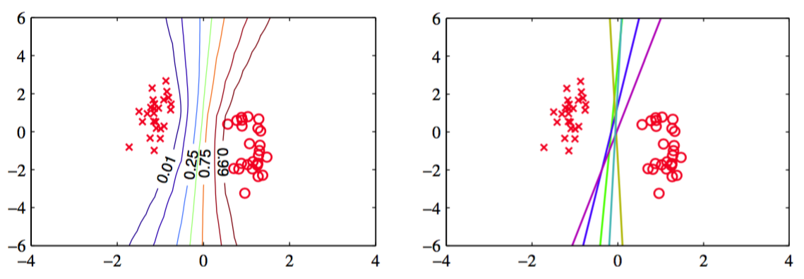

我们现在得到了后验概率分布的一个归一化的高斯近似。我们稍后会使用这个近似得到对于新数据的预测分布。然而，首先我们需要通过最大化边缘似然函数的下界，确定变分参数$$ \{\xi_n\} $$。    

为了完成这一点，我们首先将不等式（10.152）代回到边缘似然函数，可得     

$$
\ln p(t) = \ln \int p(t|w)p(w)dw \geq \ln\int h(w,\xi)p(w)dw = L(\xi) \tag{10.159}
$$    

与3.5节的线性回归模型的超参数$$ \alpha $$的最优化一样，有两种方法确定$$ \xi_n $$。在第一种方法中，我们看到函数$$ L(\xi) $$由$$ w $$上的积分定义，因此我们可以将$$ w $$看成一个潜在变量，然后使用EM算法。在第二种方法中，我们解析的对$$ w $$积分，然后直接关于$$ \xi $$进行最大化。让我们首先考虑EM方法。     

在EM算法中，首先选择参数$$ \{\xi_n\} $$的某个初始值，我们将这些初始值聚集在一起，记作$$ \{\xi\}^{old} $$。然后在EM算法的E步骤中，我们使用这些参数值找到$$ w $$上的后验概率分布，它由式（10.156）给出。之后在M步骤中，我们最大化完整数据似然函数的期望，形式为     

$$
Q(\xi,\xi^{old}) = \mathbb{E}[\ln\{h(w,\xi)p(w)\}] \tag{10.160}
$$    

其中期望是关于使用$$ \xi^{old} $$得到的后验概率分布$$ q(w) $$进行计算的。注意，$$ p(w) $$不依赖于$$ \xi $$，代入$$ h(w, \xi) $$，我们有     

$$
Q(\xi,\xi^{old}) = \sum\limits_{n=1}^N\left\{\ln\sigma(\xi_n) - \frac{\xi_n}{2} - \lambda(\xi_n)(\phi^T\mathbb{E}[ww^T]\phi_n - \xi_n^2)\right\} + const \tag{10.161}
$$    

其中，“常数”表示与$$ \xi $$无关的项。我们现在令关于$$ \xi_n $$的导数等于0。经过简单的代数推导，使用$$ \sigma(\xi) $$和$$ \lambda(\xi) $$，有     

$$
0 = \lambda'(\xi_n)(\phi_n^T\mathbb{E}[ww^T]\phi_n - \xi_n^2) \tag{10.162}
$$     

现在，我们注意到，对于$$ \xi \geq 0,\lambda'(\xi) $$是$$ \xi $$的一个单调函数，并且由于界限在$$ \xi = 0 $$两侧的对称性，我们可以将我们的注意力限制在$$ \xi $$的非负部分而不失一般性。因此，$$ \lambda'(\xi) \neq 0 $$，从而我们得到了下面的重估计方程      

$$
(\xi^{new})^2 = \phi_n^T\mathbb{E}[ww^T]\phi_n = \phi_n^T(S_N + m_Nm_N^T)\phi_n \tag{10.163}
$$     

推导过程中我们使用了式（10.156）。     

让我们总结一下寻找变分后验概率分布的EM算法。首先，我们初始化变分参数$$ \xi^{old} $$。在E步骤中，我们计算由式（10.156）给出的$$ w $$上的后验概率分布，其中均值和协方差分别由式（10.157）和式（10.158）定义。在M步骤中，我们使用这个变分后验概率，计算由式（10.163）给出的一个新的$$ \xi $$值。不断重复E步骤和M步骤，直到满足一个适当的收敛准则，这在实际应用中通常只需要几步迭代。     

我们介绍另一种得到$$ \xi $$的重估计方程的方法。我们注意到，在下界$$ L(\xi) $$的定义（10.159）中的关于$$ w $$的积分中，被积函数的形式类似于高斯分布，因此积分可以解析地计算。计算出这个积分之后，我们可以关于$$ \xi_n $$进行求导。可以证明，这种方法得到的重估计方程与之前用EM方法得到的方程（10.163）完全相同。     

正如我们已经强调过的那样，在变分方法的应用中，能够计算出由式（10.159）给出的下界$$ L(\xi) $$是很有用的。我们注意到$$ p(w) $$是一个高斯分布，$$ h(w, \xi) $$是$$ w $$的二次函数的指数形式，从而我们可以解析地计算$$ w $$上的积分。因此，通过配平方的方法，然后使用高斯分布的标准化系数的标准结果，我们可以得到解的精确形式如下     

$$
\begin{eqnarray}
L(\xi) &=& \frac{1}{2}\ln\frac{|S_N|}{|S_0|} + \frac{1}{2}m_N^TS_N^{-1}m_N - \frac{1}{2}m_0^TS_0^{-1}m_0 \\
& & +\sum\limits_{n=1}^N\left\{\ln\sigma(\xi_n) - \frac{1}{2}\xi_n + \lambda(\xi_n)\xi_n^2\right\} \tag{10.164}
\end{eqnarray}
$$      

变分框架也可以应用于数据顺序到达的情形（Jaakkla and Jordan, 2000）。在这种情况下，我们保持$$ w $$上的一个高斯后验概率分布，它使用先验概率分布$$ p(w) $$进行初始化。随着每个数据点的到达，使用界限（10.151），然后标准化，我们就可以对后验概率进行更新，得到一个更新后的后验概率分布。      

通过对后验概率分布进行积分，我们可以得到预测分布，它的形式与4.5.2节讨论的拉普拉斯近似的形式相同。图10.13给出了人工生成数据集的变分预测分布。

      
图 10.13 logistic回归的贝叶斯方法的例子。数据集是一个简单的线性可分的数据集。左图给出了使用变分推断的方法得到的预测分布。我们看到决策边界大致位于数据点的聚类的中间位置，并且预测分布的轮廓线在远离数据点的位置发生分叉，这反映出了在这些区域进行分类的不确定性。右图给出了对应于从后验概率分布$$ p(w|t) $$中抽取的参数$$ w $$的五个样本点的决策边界。

这个例子为7.1节讨论的“大边缘”的概念提供了一些有趣的认识。“大边缘”的概念与贝叶斯的解有着定性的相似的行为。
