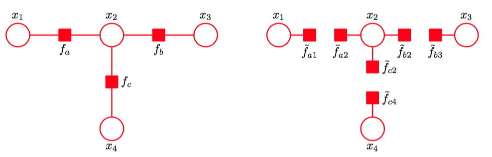

目前为止在我们对于EP的一般的讨论中，我们让概率分布$$ p(\theta) $$中的所有因子$$ f_i(\theta) $$是$$ \theta $$的全部分量的函数，类似的，对于近似分布$$ q(\theta) $$的近似因子$$ \tilde{f}(\theta) $$的情形也相同。我们现在考虑下面的情形：因子只依赖于变量的一个子集。这种限制可以很方便地使用第8章讨论的概率图模型的框架来表示。这里，我们使用因子图表示，因为它同时包含了有向图和无向图。    

我们会把注意力集中于近似概率分布完全分解的情形，我们会证明，在这种情形下，期望传播会简化为循环置信传播（Minka, 2001a）。首先，我们在一个简单的例子中证明这一点，然后我们会研究一般的情形。    

首先，回忆一下，根据式（10.17），如果我们关于一个分解的概率分布$$ q $$来最小化Kullback-Leibler散度$$ KL(p \Vert q) $$，那么对于每个因子，最优解为$$ p $$的对应的边缘概率分布。    

现在，考虑图10.18左手边给出的因子图。    

      
图 10.18 左图是来自图8.51的一张简单的因子图，为了方便，这里重新画出。右图是对应的分解近似。

我们之前在加-乘算法中介绍过这张图。联合概率分布为    

$$
p(x) = f_a(x_1, x_2)f_b(x_2, x_3)f_c(x_2, x_4) \tag{10.225}
$$    

我们寻找具有相同分解方式的一个近似$$ q(x) $$，即    

$$
q(x) \propto \tilde{f}_a(x_1, x_2)\tilde{f}_b(x_2, x_3)\tilde{f}_c(x_2, x_4) \tag{10.226}
$$    

注意，标准化常数被省略，这些可以在计算的最后使用局部标准化的方法计算出来，正如我们在置信传播中经常做的那样。现在，假设我们将注意力集中于近似分布上，其中因子本身可以关于各个变量进行分解，即     

$$
q(x) \propto \tilde{f}_{a1}(x_1)\tilde{f}_{a2}(x_2)\tilde{f}_{b2}(x_2)\tilde{f}_{b3}(x_3)\tilde{f}_{c2}(x_2)\tilde{f}_{c4}(x_4) \tag{10.227}
$$    

它对应于图10.18右手边的因子图。由于各个独立的因子是分解的，因此整体概率分布$$ q(x) $$本身是完全分解的。    

现在，我们使用这个完全分解的近似，应用EP算法。假设我们已经初始化了所有的因子，并且我们选择优化因子$$ \tilde{f}_b(x_2, x_3) = \tilde{f}_{b2}(x_2)\tilde{f}_{b3}(x_3) $$。首先，我们将这个因子从近似分布中移除，得到    

$$
q^{\\b}(x) \propto \tilde{f}_{a1}(x_1)\tilde{f}_{a2}(x_2)\tilde{f}_{c2}(x_2)\tilde{f}_{c4}(x_4) \tag{10.228}
$$    

然后我们乘以精确因子$$ f_b(x_2, x_3) $$，可得     

$$
\hat{p}(x) = q^{\\b}(x)f_b(x_2,x_3) = \tilde{f}_{a1}(x_1)\tilde{f}_{a2}(x_2)\tilde{f}_{c2}(x_2)\tilde{f}_{c4}(x_4)\tilde{f}_b(x_2,x_3) \tag{10.229}
$$    

我们现在通过最小化Kullback-Leibler散度$$ KL(p|q^{new}) $$来寻找$$ q^{new}(x) $$。这个结果，正如之前注意到的那样，是$$ q^{new}(z) $$组成了因子的乘积，每个变量$$ x_i $$对应一个因子，其中每个因子由$$ \hat{p}(x) $$的对应的边缘概率分布组成。这四个边缘概率分布为    

$$
\begin{eqnarray}
\hat{p}(x_1) &\propto& \tilde{f}_{a1}(x_1) \tag{10.230} \\
\hat{p}(x_2) &\propto& \tilde{f}_{a1}(x_2)\tilde{f}_{c2}(x_2)\sum\limits_{x_3}f_b(x_2,x_3) \tag{10.231} \\
\hat{p}(x_3) &\propto& \sum\limits_{x_2}\left\{f_b(x_2, x_3)\tilde{f}_{a2}(x_2)\tilde{f}_{c2}(x_2)\right\} \tag{10.232} \\
\hat{p}(x_4) \propto \tilde{f}_{c4}(x_4) \tag{10.233}
\end{eqnarray}
$$     

$$ q^{new} $$可以通过将这些边缘概率分布相乘的方式得到。我们看到，当更新$$ \tilde{f}_b(x_2, x_3) $$，$$ q(x) $$中唯一改变的因子是涉及到$$ f_b $$中的变量的因子，即涉及到$$ x_2 $$和$$ x_3 $$的因子。为了得到优化的因子$$ \tilde{f}(x_2, x_3) = \tilde{f}_{b2}(x_2)\tilde{f}_{b3}(x_3) $$我们将$$ q^{new}(x) $$除以$$ q^{\\b}(x) $$，结果为    

$$
\begin{eqnarray}
\tilde{f}_{b2}(x_2) &\propto& \sum\limits_{x3}f_b(x_2,x_3) \tag{10.234} \\
\tilde{f}_{b3}(x_3) &\propto& \sum\limits_{x2}\left\{f_b(x_2,x_3)\tilde{f}_{a2}(x_2)\tilde{f}_{c2}(x_2)\right\} \tag{10.235}
\end{eqnarray}
$$    

这些与使用置信传播得到的信息完全相同，其中从变量结点到因子结点的信息已经被整合到从因子结点到变量结点的信息当中。特别的，$$ \tilde{f}_{b2}(x_2) $$对应于由因子结点$$ f_b $$向变量结点$$ x_2 $$发送的信息$$ \mu_{f_b \to x_2}(x2) $$，由式（8.81）给出。类似的，如果我们将式（8.78）代入式（8.79），我们得到式（10.235），其中$$ \tilde{f}_{a2}(x_2) $$对应于$$ \mu_{f_a \to x_2}(x_2) $$，且$$ \tilde{f}_{c2}f(x_2) $$对应于$$ \mu_{f_c \to x_2}(x_2) $$，给出了信息$$ \tilde{f}_{b3}(x_3) $$，它对应于$$
\mu_{b_b \to x_3}(x_3) $$。    

这个结果与标准的置信传播稍微有些不同,因为信息同时向两个方向传递。我们可以很容易地修改EP步骤，给出加-乘算法的标准形式，修改方法为：每次只更新一个因子，例如如果我们只优化$$ \tilde{f}_{b3}(x_3) $$，那么根据定义，$$ \tilde{f}_{b2}(x_2) $$不变，而$$ \tilde{f}_{b3}(x_3) $$的优化版本再次由式（10.235）给出。如果我们每次只优化一项，那么我们可以选择我们所希望进行的优化的顺序。特别的，对于一个树结构的图，我们可以遵循两遍更新的框架，对应于标准的置信传播方法，它会产生对变量和因子的边缘概率分布的精确的推断。这种情况下，近似因子的初始化不再重要。    

现在，让我们考虑一个一般的因子图，它对应于下面的概率分布    

$$
p(\theta) = \prod\limits_if_i(\theta_i) \tag{10.236}
$$    

其中$$ \theta_i $$表示与因子$$ f_i $$关联的变量的子集。我们使用一个完全分解的概率分布来近似它，形式为     

$$
q(\theta) \propto \prod\limits_i\prod\limits_k\tilde{f}_{ik}(\theta_k) \tag{10.237}
$$    

其中$$ \theta_k $$对应于一个单独的变量结点。假设我们希望优化特定的项$$ \tilde{f}_{kl}(\theta_l) $$，保持其他所有的项不变。首先，我们从$$ q(\theta) $$中移除项$$ \tilde{f}_j(\theta_j) $$，可得     

$$
q^{\\j}(\theta) \propto \prod\limits_{i \neq j}\prod\limits_k\tilde{f}_{ik}(\theta_k) \tag{10.238}
$$    

然后乘以精确因子$$ f_j(\theta_j) $$。为了确定优化项$$ \tilde{f}_{jl}(\theta_l) $$，我们只需考虑对$$ \theta_l $$的函数依赖，因此我们只需寻找     

$$
q^{\\j}(\theta)f_j(\theta_j) \tag{10.239}
$$    

对应的边缘概率分布。忽略一个可以做乘法的常数，这涉及到对$$ f_j(\theta_j) $$与任意来自$$ q^{\\j}(\theta) $$中的属于$$ \theta_j $$中任意变量的函数的项进行相乘得到的结果求边缘概率分布。当我们接下来除以$$ q^{\\j}(\theta) $$时，对应于$$ i \neq j $$的其它因子$$ \tilde{f}_i(\theta_i) $$的项会在分子和分母之间消去。因此我们有    

$$
\tilde{f}_{jl}(\theta_l) \propto \sum\limits_{\theta_{m \neq l} \in \theta_j}f_j(\theta_j)\prod\limits_k\prod\limits_{m \neq l}\tilde{f}_{km}(\theta_m) \tag{10.240}
$$    

我们将这个式子看做是加-乘规则的形式，其中，从变量结点到因子结点的信息被消除，正如图8.50中给出的例子那样。$$ \tilde{f}_{jm}(\theta_m) $$对应于信息$$ \mu_{f_j \to \theta_m} (\theta_m) $$，其中因子结点$$ j $$向变量结点$$ m $$发送信息，且式（10.240）中的在$$ k $$上的乘积作用于所有依赖于与因子$$ f_j(\theta_j) $$有相同变量（除了变量$$ \theta_l $$）的变量$$ \theta_m
$$。也就是说，为了计算来自一个因子结点的输出信息，我们对所有来自其它结点的输入信息求乘积，乘以局部因子，然后求和或积分。     

因此，如果我们使用完全分解的近似概率分布，那么加和-乘积算法就可以作为期望传播的一个具体的例子。这表明，更加灵活的近似分布（对应于部分连接的图）可以得到更高的准确率。另一种推广是将因子$$ f_i(\theta_i) $$分成若干组，在一次迭代过程中优化组内的全部因子。这两种方法都可以产生精度的提升（Minka, 2001b）。通常，选择最好的分组和断开连接的方式是一个开放的问题。     

我们已经看到了变分信息传递和期望传播方法对Kullback-Leibler散度的两种不同的形式进行了最优化。Minka（2005）证明，一大类信息传递方法可以从一个涉及到最小化散度的alpha家族的成员的通用框架中推导出来，其中，散度的alpha家族由公式（10.19）给出。这些信息传递方法包括变分信息传递、循环置信传播、期望传播，以及一大类其他的算法，例如树重加权信 息传递（tree-reweighted message passing）（Wainwright et al.， 2005）、分数置信传播（fractional belief propagation）（Wiegerinck and Heskes， 2003）以及强EP（power EP）（Minka， 2004），篇幅所限，我们不会在这里介绍这些算法。
