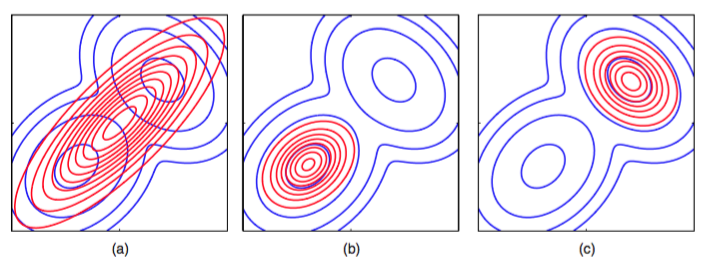

我们的变分推断的方法基于的是真实后验概率分布的分解近似。让我们现在考虑一下使用分解概率分布的方式近似一个一般的概率分布的问题。首先，我们讨论使用分解的高斯分布近似一个高斯分布的问题，这会让我们认识到在使用分解近似时会引入的不准确性有哪些类型。考虑两个相关的变量$$ z = (z_1, z_2) $$上的高斯分布$$ p(z) = \mathcal{N}(z|\mu, \Lambda^{−1}) $$，其中均值和精度的元素为    

$$
\mu = 
\left(
\begin{array}{c}
\mu_1 \\
\mu_2
\end{array}
\right) , 
\Lambda = 
\left(
\begin{array}{cc}
\Lambda_{11} & \Lambda_{12} \\
\Lambda_{21} & \Lambda_{22}
\end{array}
\right) \tag{10.10}
$$    

并且由于精度矩阵的对称性，$$ \Lambda_{21} = \Lambda_{12} $$。现在，假设我们希望使用一个分解的高斯分布$$ q(z) = q_1(z_1)q_2(z_2) $$来近似这个分布。首先，我们使用一般的结果（10.9）来寻找最优因子$$ q_1^*(z_1) $$的表达式。在寻找表达式的过程中，我们注意到，在等式右侧，我们只需要保留哪些与$$ z_1 $$有函数依赖关系的项即可，因为所有其他的项都可以被整合到标准化常数中。因此我们有    

$$
\begin{eqnarray}
\ln q^*_1(z_1) &=& \mathbb{E}_{z_2}[\ln p(z)] + const \\
&=& \mathbb{E}_{z_2}\left[-\frac{1}{2}(z_1 - \mu_1)^2\Lambda_{11} - (z_1 - \mu_1)\Lambda_{12}(z_2 - \mu_2)\right] + const \\
&=& -\frac{1}{2}z_1^2\Lambda_{11} + z_1\mu_1\Lambda_{11} - z_1\Lambda_{12}(\mathbb{E}[z_2] - \mu_2) + const \tag{10.11}
\end{eqnarray}
$$    

接下来，我们观察到这个表达式的右侧是$$ z_1 $$的一个二次函数，因此我们可以将$$ q^*(z_1) $$看成一个高斯分布。值得强调的是，我们不假设$$ q(z_i) $$是高斯分布，而是通过对所有可能的分布$$ q(z_i) $$上 的KL散度的变分最优化推导出了这个结果。还要注意，我们不需要显式地考虑式（10.9）中的可加性常数，因为它表示标准化常数。如果需要的话，这个常数可以在计算的最后阶段通过观察的方式得到。使用配平方的方法，我们可以得到这个高斯分布的均值和方差，有     

$$
q_1^*(z_1) = \mathcal{N}(z_1|m_1,\Lambda_{11}^-1) \tag{10.12}
$$    

其中     

$$
m_1 = \mu_1 - \Lambda_{11}^{-1}\Lambda_{12}(\mathbb{E}[z_2] - \mu_2) \tag{10.13}
$$     

根据对称性，$$ q_2^*(z_2) $$也是一个高斯分布，可以写成     

$$
q_2^*(z_2) = \mathcal{N}(z_2|m_2,\Lambda_{22}^{-1} \tag{10.14}
$$     

其中    

$$
m_2 = \mu_2 - \Lambda_{22}^{-1}\Lambda_{21}(\mathbb{E}[z_1] - \mu_1) \tag{10.15}
$$    

注意，这些解是相互偶合的，即$$ q^*(z_1) $$依赖于关于$$ q^*(z_2) $$计算的期望，反之亦然。通常，我们这样解决这个问题：将变分解看成重估计方程，然后在变量之间循环，更新这些解，直到满足某个收敛准则。我们稍后会给出一个例子。但是这里，我们注意到这个问题是相当简单的，因为可以找到一个解析解。特别地，由于$$ \mathbb{E}[z_1] = m_1 $$且$$ \mathbb{E}[z_2] = m_2 $$，因此我们看到，如果我们取$$ \mathbb{E}[z_1] = \mu_1 $$且$$ \mathbb{E}[z_2] = \mu_2
$$，那么这两个方程会得到满足。并且很容易证明，只要概率分布非奇异，那么这个解是唯一解。这个结果如图10.2(a)所示。

      
图 10.2 两种形式的KL散度的对比。绿色轮廓线对应于两个变量$$ z_1 $$和$$ z_2 $$上的相关高斯分布$$ p(z) $$的1、2、3个标准差的位置，红色轮廓线表示相同变量上的近似分布$$ q(z) $$的同样位置。近似分布$$ q(z) $$由两个独立的一元高斯分布的乘积给出，(a)图中，参数通过最小化Kullback-Leibler散度$$ KL(q \Vert p) $$的方式获得，(b)图中，参数通过最小化相反的Kullback-Leibler散度$$ KL(p \Vert q) $$的方式获得。

我们看到，均值被正确地描述了，但是$$ q(z) $$的方差由$$ p(z) $$的最小方差的方向所确定，沿着垂直方向的方差被强烈地低估了。这是一个一般的结果，即分解变分近似对后验概率分布的近似倾向于过于紧凑。      

作为比较，假设我们最小化相反的Kullback-Leibler散度$$ KL(p \Vert q) $$。正如我们将看到的那样，这种形式的KL散度被用于另一种近似推断的框架中，这种框架被称为期望传播（expectation propagation）。于是，我们考虑一般的最小化$$ KL(p \Vert q) $$的问题，其中$$ q(Z) $$是形式为（10.5）的分解近似。这样，KL散度可以写成     

$$
KL(p \Vert q) = -\int p(Z)\left[\sum\limits_{i=1}^M\ln q_i(Z_i)\right]dZ + const \tag{10.16}
$$     

其中，常数项就是$$ p(Z) $$的熵，因此不依赖于$$ q(Z) $$。我们现在可以关于每个因子$$ q_j(Z_j) $$进行最优化。使用拉格朗日乘数法，很容易得到结果      

$$
q_j^* = \int p(Z)\prod\limits_{i \neq j}dZ_i = p(Z_j)  \tag{10.17}
$$     

在这种情况下，我们看到$$ q_j(Z_j) $$的最优解等于对应的边缘概率分布$$ p(Z) $$。注意，这是一个解析解，不需要迭代。     

为了将这个结果应用到向量$$ z $$上的高斯分布$$ p(z) $$这个例子上，我们可以使用式（2.98），它给出了图10.2(b)的结果。我们再一次看到，对均值的近似是正确的，但是它把相当多的概率质量放到了实际上具有很低的概率的变量空间区域中。     

这两个结果的区别可以用下面的方式理解。我们注意到，$$ Z $$空间中$$ p(Z) $$接近等于零的区域对于Kullback-Leibler散度     

$$
KL(q \Vert p) = - \int q(Z)\ln\left\{\frac{p{Z}}{q{Z}}\right\}dZ \tag{10.18}
$$      

有一个大的正数的贡献，除非$$ q(Z) $$也接近等于零。因此最小化这种形式的KL散度会使得概率分布$$ q(Z) $$避开$$ p(Z) $$很小的区域。相反的，使得Kullback-Leibler散度$$ KL(p \Vert q) $$的散度取得最小值的概率分布$$ q(Z) $$在$$ p(Z) $$非零的区域中也是非零的。     

如果我们考虑用一个单峰分布近似多峰分布的问题，我们会更深刻地认识两个KL散度的不同行为，如图10.3所示。    

      
图 10.3 两种形式的Kullback-Leibler散度的另一个对比。(a)蓝色轮廓线展示了由两个高斯分布混合而成的双峰概率分布$$ p(Z) $$，红色轮廓线对应于一个高斯分布$$ q(Z) $$，它最小化了Kullback-Leibler散度$$ KL(p \Vert q) $$， 在这种意义上最好地近似了$$ p(Z) $$。(b)与(a)相同，但是此时红色轮廓线对应的高斯分布$$ q(Z) $$是通过使用数值方法最小化Kullback-Leibler散度$$ KL(q \Vert p)
$$的方式得到的。(c)与(b)相同，但是给出了Kullback-Leibler散度的另一个局部最小值。

在实际应用中，真实的后验概率分布经常是多峰的，大部分后验概率质量集中在参数空间中的某几个相对较小的区域中。这些多个峰值可能是由于潜在空间的不可区分性所造成的，也可能是由于对参数的复杂的非线性依赖关系造成的。我们在第9章中讨论高斯混合模型的时候遇到过这两种类型的多峰性质，那里，这些峰值以似然函数的多个极大值的形式显现出来。基于最小化$$ KL(q \Vert p)
$$的变分方法倾向于找到这些峰值中的一个。相反，如果我们最小化$$ KL(p \Vert q) $$，那么得到的近似会在所有的均值上取平均。在混合模型问题中，这种方法会给出较差的预测分布（因为两个较好的参数值的平均值通常不是一个较好的参数值）。可以使用$$ KL(p \Vert q) $$定义一个有用的推断步骤，但是这需要一种与这里讨论的内容相当不同的方法。当我们讨论期望传播的时候，我们会仔细讨论这一点。     

两种形式的Kullback-Leibler散度都是散度的alpha家族（alpha family）的成员（Ali and Silvey, 1966; Amari, 1985; Minka, 20005）定义为     

$$
D_{\alpha}(p \Vert q) = \frac{4}{1 - \alpha^2}\left( 1 - \int p(x)^{(1 + \alpha) / 2}q(x)^{(1 + \alpha) / 2}dx\right) \tag{10.19}
$$      

其中$$ −\infty < \alpha < \infty $$是一个连续参数。Kullback-Leibler散度$$ KL(p \Vert q) $$对应于极限$$ \alpha \to 1 $$，而$$ KL(q \Vert p) $$对应于极限$$ \alpha \to −1 $$。对于所有$$ \alpha $$的值，我们有$$ D_\alpha(p \Vert q) \geq 0 $$，当且仅当$$ p(x) = q(x) $$时等号成立。假设$$ p(x) $$是一个固定的分布，我们关于某个概率分布$$ q(x) $$的集合最小化$$ D_\alpha(p \Vert q) $$。那么对于$$ \alpha \leq −1 $$的情况，散度是零强制的（zero forcing），即对于使得$$ p(x)
= 0 $$成立的任意$$ x $$值，都有$$ q(x) = 0 $$，通常$$ q(x) $$会低估$$ p(x) $$的支持，因此倾向于寻找具有最大质量的峰值。相反，对于$$ \alpha \geq 1 $$的情况，散度是零避免的（zero avoiding），即对于使得$$ p(x) > 0 $$成立的任意$$ x $$值，都有$$ q(x) > 0 $$，通常$$ q(x) $$会进行拉伸来覆盖到所有的$$ p(x) $$值，从而高估了$$ p(x) $$的支持。当$$ \alpha = 0 $$时，我们得到了一个对称的散度，它与Hellinger距离线性相关，定义为     

$$
D_H(p \Vert q) = \int \left(p(x)^{1/2} - q(x)^{1/2}\right)^2dx \tag{10.20}
$$      

Hellinger距离的平方根是一个合法的距离度量。     

