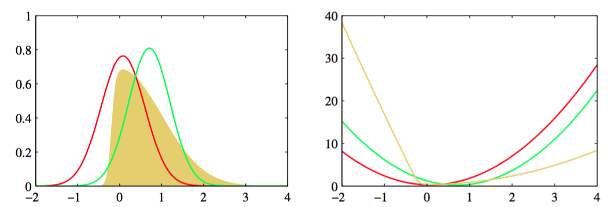

变分的方法起源于18世纪的欧拉、拉格朗日，以及其他的关于变分法（calculus of variations）的研究。标准的微积分关注的是寻找函数的导数。我们可以将函数想象为一个映射。这个映射以一个变量的值作为输入，返回函数值作为输出。函数的导数描述了当输入变量有一个无限小的变化时，输出值如何变化。类似地，我们可以将泛函（functional）作为一个映射，它以一个函数作为输入，返回泛函的值作为输出。一个例子是熵$$ H[p] $$，它的输入是一个概率分布$$ p(x) $$，返回下面的量    

$$
H[p] = - \int p(x)\ln p(x) dx \tag{10.1}
$$    

作为输出。我们可以引入泛函的导数（functional derivative）的概念，它表达了输入函数产生无穷小的改变时，泛函的值的变化情况（Feynman et al., 1964）。变分法的规则与标准的微积分规则很相似，在附录D中讨论。许多问题可以表示为最优化问题，其中需要最优化的量是一个泛函。研究所有可能的输入函数，找到最大化或者最小化泛函的函数就是问题的解。变分方法有很广泛的适用性，包括有限元方法（Kapur, 1989）和最大熵方法（Schwarz, 1988）。    

虽然变分方法本质上没有任何近似的东西，但是它们通常会被用于寻找近似解。寻找近似解的过程可以这样完成：限制需要最优化算法搜索的函数的范围，例如只考虑二次函数，或考虑由固定的基函数线性组合而成的函数，其中只有线性组合的系数可以发生变化。在概率推断的应用中，限制条件的形式可以是可分解的假设（Jordan et al., 1999; Jaakkola, 2001）。     

现在，让我们详细讨论变分最优化的概念如何应用于推断问题。假设我们有一个纯粹的贝叶斯模型，其中每个参数都有一个先验概率分布。这个模型也可以有潜在变量以及参数，我们会把所有潜在变量和参数组成的集合记作$$ Z $$。类似的，我们会把所有观测变量的集合记作$$ X $$。例如，我们可能有$$ N $$个独立同分布的数据，其中$$ X = \{x_1,...,x_N\} $$且$$ Z = \{z_1,...,z_N\} $$。我们的概率模型确定了联合概率分布$$ p(X, Z) $$，我们的目标是找到对后验概率分布$$ p(Z|X) $$以及模型证据$$ p(X)
$$的近似。与我们关于EM的讨论相同，我们可以将对数边缘概率分解，即     

$$
\ln p(x) = L(q) + KL(q \Vert p) \tag{10.2}
$$    

其中我们定义了    

$$
\begin{eqnarray}
L(q) &=& \int q(Z)\ln\frac{p(X,Z)}{q(Z)}dZ \tag{10.3} \\
KL(q |Vert p) &=& - \int q(Z)\ln\frac{p(Z|X)}{q(Z)}dZ \tag{10.4}
\end{eqnarray}
$$

这与我们关于EM的讨论的唯一的区别是，因为参数现在是随机变量，被整合到了Z中，所以参数向量$$ \theta $$不再出现。由于本章中我们主要感兴趣的是连续变量，因此我们在这个分解的公式中使用了积分而不是求和。但是，如果某些变量或全部的变量都是离散变量，那么分析过程不变，只需根据需要把积分替换为求和即可。同样的，我们可以通过关于概率分布$$ q(Z) $$的最优化来使下界$$ L(q) $$达到最大值，这等价于最小化KL散度。如果我们允许任意选择$$ q(Z) $$，那么下界的最大值出现在KL散度等于零的时刻，此时$$ q(Z)
$$等于后验概率分布$$ p(Z|X) $$。然而，我们假定在需要处理的模型中，对真实的概率分布进行操作是不可行的。    

于是，我们转而考虑概率分布$$ q(Z) $$的一个受限制的类别，然后寻找这个类别中使得KL散度达到最小值的概率分布。我们的目标是充分限制$$ q(Z)
$$可以取得的概率分布的类别范围，使得这个范围中的所有概率分布都是可以处理的概率分布。同时，我们还要使得这个范围充分大、充分灵活，从而它能够提供对真实后验概率分布的一个足够好的近似。需要强调的是，施加限制条件的唯一目的是为了计算方便，并且在这个限制条件下，我们应该使用尽可能丰富的近似概率分布。特别的，对于高度灵活的概率分布来说，没有“过拟合”现象。使用灵活的近似仅仅使得我们更好地近似真实的后验概率分布。     

限制近似概率分布的范围的一种方法是使用参数概率分布$$ q(Z| \omega) $$，它由参数集合$$ \omega $$控制。 这样，下界$$ L(q) $$变成了$$ \omega $$的函数，我们可以利用标准的非线性最优化方法确定参数的最优值。图10.1给出了这种方法的一个例子，其中变分分布是一个高斯分布，并且我们已经关于均值和协方差进行了最优化。     

      
图 10.1 对于之前在图4.14中考虑过的例子进行变分近似的结果。左图给出了原始的概率分布（黄色）以及拉普拉斯近似（红色）和变分近似（绿色），右图给出了对应曲线的负对数。

