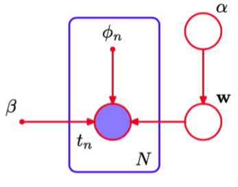

作为变分推断的第二个例子，我们回到3.3节的贝叶斯线性回归模型中。在模型证据框架中，我们通过使用最大化似然函数的方法进行点估计，从而近似了在$$ \alpha $$和$$ \beta $$上的积分。一个纯粹的贝叶斯方法会对所有的超参数和参数进行积分。虽然精确的积分是无法计算的，但是我们可以使用变分方法来找到一个可以处理的近似。为了简化讨论，我们会假设噪声精度参数$$ \beta
$$已知，并且固定于它的真实值，虽然这个框架很容易扩展来包含$$ \beta $$上的概率分布。对于线性回归模型来说，可以证明变分方法等价于模型证据的框架。尽管这样，这个例子给我们提供了使用变分方法的一个很好的练习，也是我们在10.6节讨论贝叶斯逻辑回归的变分方法的基础。    

回忆一下，$$ w $$的似然函数和$$ w $$上的先验概率分布为    

$$
\begin{eqnarray}
p(t|w) &=& \prod\limits_{n=1}^N\mathcal{N}(t_n|w^T\phi_n,\beta^{-1}) \tag{10.87} \\
p(w|\alpha) &=& \mathcal{N}(w|0,\alpha^{-1}I) \tag{10.88}
\end{eqnarray}
$$    

其中$$ \phi_n = \phi(x_n) $$。我们现在引入参数$$ \alpha $$上的先验概率分布。根据我们在2.3.6节的讨论，我们知道高斯分布的精度的共轭先验为Gamma分布，因此我们选择     

$$
p(\alpha) = Gam(\alpha|a_0,b_0) \tag{10.89}
$$     

其中$$ Gam(\dot|\dot,\dot) $$由式（B.26）定义。因此所有变量上的联合概率分布为    

$$
p(t,w,\alpha) = p(t|w)p(w|\alpha)p(\alpha) \tag{10.90}
$$

这可以表示为图10.8中所示的有向图模型。

      
图 10.8 表示贝叶斯线性回归模型的联合概率分布（10.90）的图模型。
