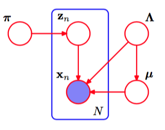

我们现在回到我们对于高斯混合模型的讨论，并且使用前一节讨论的变分推断的方法。这会很好地说明变分方法的应用，也会展示出贝叶斯方法是如何优雅地解决最大似然方法中的许多困难之处的（Attias, 1999b）。我们建议读者仔细研究这个例子，因为这个例子给出了变分方法在实际应用中的许多重要的思想。许多贝叶斯模型，对应于复杂得多的概率分布，可以通过对本节中的分析进行简单的扩展进行求解。      

我们的起始点是高斯混合模型的似然函数。高斯混合模型如图9.6给出的图模型所示。对于每个观测$$ x_n $$，我们有一个对应的潜在变量$$ z_n $$，它是一个“1-of-K”的二值向量，元素为$$ z_{nk} $$，其中$$ k = 1,...,K $$。与之前一样，我们将观测数据集记作$$ X = \{x_1,...,x_N\} $$，类似地，我们将潜在变量记作$$ Z = \{z_1,...,z_N\} $$。给定混合系数$$ \pi $$，根据式（9.10），我们可以写出$$ Z $$的条件概率分布，形式为    

$$
p(Z|\pi) = \prod\limits_{n=1}^N\prod\limits_{k=1}^K\pi_k^{z_{nk}} \tag{10.37}
$$     

类似的，给定潜在变量和分量参数，根据式（9.11），我们可以写出观测数据向量的条件概率分布，形式为     

$$
p(X|Z,\mu,\Lambda) = \prod\limits_{n=1}^N\prod\limits_{k=1}^K\mathcal{N}(x_n|\mu_k,\Lambda_k^{-1})^{z_{nk}} \tag{10.38}
$$      

其中$$ \mu = \{\mu_k\} $$且$$ \Lambda = \{\Lambda_k\} $$。注意，我们计算时使用的时精度矩阵而不是协方差矩阵，因为这在一定程度上简化了数学计算的复杂度。    

接下来，我们引入参数$$ \mu, \Lambda, \pi $$上的先验概率分布。如果我们使用共轭先验分布，那么分析过程会得到极大的简化。于是，我们选择混合系数$$ \pi $$上的狄利克雷分布。    

$$
p(\pi) = Dir(\pi|\alpha_0) = C(\alpha_0)\prod\limits_{k=1}^K\pi_k^{\alpha_0 - 1} \tag{10.39}
$$     

其中，根据对称性，我们为每个分量选择了同样的参数$$ \alpha_0, C(\alpha_0) $$是狄利克雷分布的标准化常数，由式（B.23）定义。正如我们已经看到的那样，参数$$ \alpha_0 $$可以看成与混合分布的每个分量关联的观测的有效先验数量。如果$$ \alpha_0 $$的值很小，那么后验概率分布会主要被数据集影响，而受到先验概率的影响很小。      

类似的，我们引入一个独立的高斯-Wishart先验分布，控制每个高斯分布的均值和精度，形式为     

$$
\begin{eqnarray}
p(\mu,\Lambda) &=& p(\mu|\Lambda)p(\Lambda) \\
&=& \prod\limits_{k=1}^K\mathcal{N}(\mu_k|m_0, (\beta_0\Lambda_k)^{-1})W(\Lambda_k|W_0,v_0) \tag{10.40}
\end{eqnarray}
$$

这是由于当均值和精度均未知的时候，它表示共轭先验分布。通常根据对称性，我们选择$$ m_0 = 0 $$。     

生成的模型可以表示为图10.5所示的有向图。

      
图 10.5 表示高斯模型的贝叶斯混合的有向图，其中，方框表示一组$$ N $$个独立同分布的观测。这里$$ \mu $$表示$$ \{\mu_k\} $$，$$ \Lambda $$表示$$ \{\Lambda_k\} $$。

注意，从$$ \Lambda $$到$$ \mu $$之间存在一个链接，这是由于式（10.40）中的$$ \mu $$上的概率分布的方差为$$ \Lambda $$的函数。      

这个例子很好地说明了潜在变量和参数之间的区别。像$$ z_n $$这样出现在方框内部的变量被看做隐含变量，因为这种变量的数量随着数据集规模的增大而增大。相反，像$$ \mu $$这样出现在方框外的变量的数量与数据集的规模无关，因此被当做参数。然而，从图模型的观点来看，它们之间没有本质的区别。

