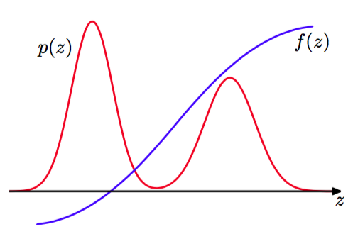

对于大多数实际应用中的概率模型来说，精确推断是不可行的，因此我们不得不借助与某种形式的近似。在第10章中，我们讨论了基于确定性近似的推断方法，它包括诸如变分贝叶斯方法以及期望传播。这里，我们考虑基于数值采样的近似推断方法,也被称为蒙特卡罗（Monte Carlo）方法。    

虽然对于一些应用来说，我们感兴趣的是非观测变量上的后验概率分布本身，但是在大部分情况下，后验概率分布的主要用途是计算期望，例如在做预测的情形下就是这样。因此，本章中，我们希望解决的基本的问题涉及到关于一个概率分布$$ p(z) $$寻找某个函数$$ f(z) $$的期望。这里，$$ z $$的元素可能是离散变量、连续变量或者二者的组合。因此，在连续变量的情形下，我们希望计算下面的期望     

$$
\mathbb{E}[f] = \int f(z)p(z)dz \tag{11.1}
$$     

在离散变量的情形下，积分被替换为求和。图11.1图形化地说明了单一连续变量的情形。    

      
图 11.1 函数$$ f(z) $$的期望的图形化表示，$$ f(z) $$的期望是关于概率分布$$ p(z) $$计算得到的。

我们假设，使用解析的方法精确地求出这种期望是十分复杂的。    

采样方法背后的一般思想是得到从概率分布$$ p(z) $$中独立抽取的一组变量$$ z(l) $$，其中$$ l = 1,...,L $$。这使得期望可以通过有限和的方式计算，即    

$$
\hat{f} = \frac{1}{L}\sum\limits_{l=1}^L f(z^{(l)}) \tag{11.2}
$$     

只要样本$$ z^{(l)} $$是从概率分布$$ p(z) $$中抽取的，那么$$ \mathbb{E}[\hat{f}] = \mathbb{E}[f] $$，因此估计$$ \hat{f} $$具有正确的均值。估计$$ f $$的方差为     

$$
var[\hat{f}] = \frac{1}{L}\mathbb{E}[(f - \mathbb{E}[f])^2] \tag{11.3}
$$     

它是函数$$ f(z) $$在概率分布$$ p(z) $$下的方差。因此，值得强调的一点是，估计的精度不依赖于$$ z $$的维度，并且原则上，对于数量相对较少的样本$$ z(l) $$，可能会达到较高的精度。在实际应用中，10个或者20个独立的样本就能够以足够高的精度对期望做出估计。    

然而，问题在于样本$$ \{z(l)\} $$可能不是独立的，因此有效样本大小可能远远小于表面上的样本大小。并且，回到图11.1，我们注意到如果$$ f(z) $$在$$ p(z) $$较大的区域中的值较小，反之亦然，那么期望可能由小概率的区域控制，表明为了达到足够的精度，需要相对较大的样本大小。    

对于许多模型来说，联合概率分布$$ p(z) $$可以使用图模型很容易地确定。在没有观测变量的有向图的情形，从联合概率分布中采样是很容易的（假设可以从每个节点处的条件概率分布中采样），方法是使用8.1.2节简短讨论过的祖先采样方法（ancestral sampling approach）。联合概率分布为    

$$
p(z) = \prod\limits_{i=1}^Mp(z_i|pa_i) \tag{11.4}
$$    

其中，$$ z_i $$是与结点$$ i $$关联的一组变量，$$ pa_i $$表示与结点$$ i $$的父结点关联的变量的集合。为了从联合概率分布中得到一个样本，我们按照$$ z_1,...,z_M $$的顺序遍历一次变量集合，这些变量是从条件概率分布$$ p(z_i|pa_i) $$中抽取的。这总是可行的，因为在每一步，所有的父结点的值都已经被初始化。在对图遍历一次之后，我们会得到来自联合概率分布的一个样本。    

现在，考虑某些结点被观测值进行初始化的有向图的情形。原则上，我们可以推广上述的步骤，至少在结点表示离散变量的情形下我们可以这样做。对上述步骤的推广给出了逻辑采样（logic sampling）的方法（Henrion, 1988），它可以被看做11.1.4节讨论的重要采样（importance sampling）的一种特殊情况。在每一个步骤中，当我们得到了变量$$ z_i $$的一个采样值，它的值被观测，并且将采样值与观测值进行比较。如果它们相符，那么采样值被保留，算法继续运行，处理下一个变量。然而如果采样值与观测值不相符，那么目前为止得到的采样被丢弃，算法从图中的第一个结点重新开始。算法可以从后验概率分布中正确地采样，因为它对应于从隐含变量和数据变量的联合概率分布中采样然后丢弃那些与观测数据不相符的样本（稍微保留了一些从联合概率分布中采样的不连续性，只要观测到矛盾的值）。然而，接受一个来自后验概率分布的样本的整体概率会随着观测变量的数量的增加以及变量可以取得的状态数量的增加而迅速减小，因此这种方法在实际中很少被使用。     

在由无向图定义的概率分布的情形中，如果我们希望从没有观测变量的先验概率分布中采样，那么不存在一遍采样的方法。相反，我们必须使用计算量更大的方法，例如11.3节讨论的吉布斯采样。    

除了从条件概率分布中采样之外，我们可能也需要从边缘概率分布中采样。如果我们已经有 了一种从联合概率分布$$ p(x, v) $$中采样的方法，那么得到从边缘概率分布$$ p(u) $$中的样本是很容易的，只需忽略每个样本中的$$ v $$的值即可。    

有许多讨论蒙特卡罗方法的文献。从统计推断的角度进行研究的文献包括Chen et al.(2001)、Gamerman(1997)、Liu(2001)、Neal(1996) 和Robert and Casella(1999)。并且有一些综述性的文章为统计推断的采样方法提供了额外的信息，例如Besag et al.(2005)、Brooks(1998)、Diaconis and Saloff-Coste(1998)、Jerrum and Sin- clair(1996)、Neal(1993)、Tierney(1994)和Andrieu et al.(2003)。    

Robert and Casella(1999)总结了马尔科夫链蒙特卡罗算法的收敛性检测。
