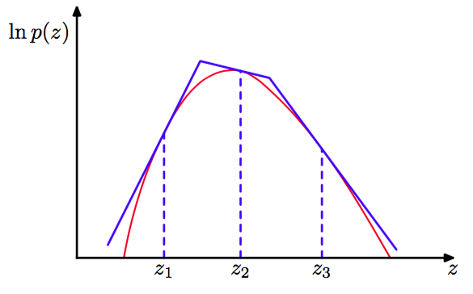

在许多我们希望应用拒绝采样的情形中，确定概率分布$$ q(z) $$的一个合适的解析形式是很困难的。另一种确定其函数形式的方法是基于概率分布$$ p(z) $$的值直接构建函数形式（Gilks and Wild, 1992）。对于$$ p(z) $$是对数凹函数的情形，即$$ \ln p(z) $$的导数是$$ z $$的单调非增函数时，界限函数的构建是相当简单的。图11.6给出了一个合适的界限函数的构建的例子。    

      
图 11.6 在对数凹函数的情形下，拒绝采样中用到的界限函数可以使用在一组格点处计算的切线来构造。如果一个样本点被拒绝，那么它被添加到格点集合中，被用于优化界限函数。

函数$$ \ln p(z) $$和它的切线在某些初始的格点处进行计算，生成的切线的交点被用于构建界限函数。接下来，我们从界限分布中抽取一个样本值。这很容易，因为界限函数的对数是一系列的线性函数，因此界限函数本身由一个分段指数分布组成，形式为     

$$
q(z) = k_i\lambda_i exp\{-\lambda_i(z-z_i)\} \hat{z}_{i - 1, i} < z \leq \hat{z}_{i,i+1} \tag{11.17}
$$     

其中$$ \hat{z}_{i - 1, i} $$是在点$$ z_{i - 1} $$和$$ z_i $$处的切线的交点，$$ \lambda_i $$是切线在$$ z_i $$处的斜率，$$ k_i $$表示对应的偏移量。一旦一个样本点被抽取完毕，我们就可以应用通常的拒绝准则了。如果样本被接受，那么它就是所求的概率分布中的一个样本。然而，如果样本被拒绝，那么它被并入格点的集合中，计算出一条新的切线，从而界限函数被优化。随着格点数量的增加，界限函数对所求的概率分布的近似效果逐渐变好，拒绝的概率就会减小。     

这个算法存在一种变体，这种变体中不用计算导数（Gilks, 1992）。可调节的拒绝采样的框架也可以扩展到不是对数凹函数的概率分布中，只需将每个拒绝采样的步骤中使用Metropolis-Hasting阶梯函数（将在11.2.2节讨论）即可，这就产生了可调节拒绝Metropolis采样（adaptive rejection Metropolis sampling）方法（Gilks et al., 1995）。    

显然，对于具有实际价值的拒绝采样来说，我们要求对比函数要接近所求的概率分布，从而拒绝率要保持一个最小值。现在，让我们考察当我们试图在高维空间中使用拒绝采样的方法会出现什么现象。为了说明的方便，考虑一个多少有些人造感觉的问题，其中我们想要从一个零均值多元高斯分布中采样，这个高斯分布的协方差为$$ \sigma_p^2I $$，其中$$ I $$是单位矩阵。根据拒绝采样方法，提议分布本身就是一个均值为0，协方差为$$ \sigma_q^2I $$的高斯分布。很明显，为了使$$
kq(z) \geq p(z) $$的$$ k $$值存在，我们必须有$$ \sigma_q^2 \geq \sigam_p^2 $$。在D维的情形中，$$ k $$的值为$$ k = \left(\frac{\sigma_q}{\sigma_p}\right)^D $$，图11.7给出了$$ D = 1 $$的情形。接受率是$$ p(z) $$和$$ kq(z) $$下方的体积的比值。由于分布是标准化的，这个比值就是$$ 1 / k $$。因此，接受率随着维度的增大而指数地减小。即使$$ \sigma_q $$只比$$ \sigma_p $$高一个百分点，对于$$ D = 1000 $$，接受率大约为$$ 1 / 20,000
$$。在这个说明的例子中，对比函数接近于所求的概率分布。对于更实际的例子来说，所求的概率分布可能是多峰的，并且具有尖峰，从而找到一个较好的提议分布和比较函数是一件相当困难的事情。此外，接受率随着维度的指数下降是拒绝采样的一个一般特征。虽然拒绝采样在一维或二维空间中是一个有用的方法，但是它不适用于高维空间。然而，对于高维空间中的更加复杂的算法来说，它起着子过程的作用。     

