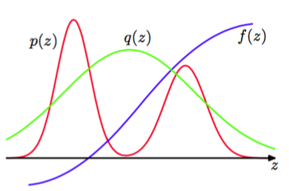

想从复杂概率分布中采样的一个主要原因是能够使用式（11.1）计算期望。重要采样（importance sampling）的方法提供了直接近似期望的框架，但是它本身并没有提供从概率分布$$ p(z) $$中采样的方法。    

式（11.2）给出的期望的有限和近似依赖于能够从概率分布$$ p(z) $$中采样。然而，假设直接从$$ p(z) $$中采样无法完成，但是对于任意给定的$$ z $$值，我们可以很容易地计算$$ p(z) $$。一种简单的计算期望的方法是将$$ z $$空间离散化为均匀的格点，将被积函数使用求和的方式计算，形式为    

$$
\mathbb{E}[f] \simeq \sum\limits_{l=1}^Lp(z^{(l)})f(z^{(l)}) \tag{11.18}
$$     

这种方法的一个明显的问题是求和式中的项的数量随着$$ z $$的维度指数增长。此外，正如我们已经注意到的那样，我们感兴趣的概率分布通常将它们的大部分质量限制在$$ z $$空间的一个很小的区域，因此均匀地采样非常低效，因为在高维的问题中，只有非常小的一部分样本会对求和式产生巨大的贡献。我们希望从$$ p(z) $$的值较大的区域中采样，或理想情况下，从$$ p(z)f(z) $$的值较大的区域中采样。    

与拒绝采样的情形相同，重要采样基于的是对提议分布$$ q(z) $$的使用，我们很容易从提议分布中采样，如图11.8所示。    

      
图 11.8 重要采样解决了计算函数$$ f(z) $$关于分布$$ p(z) $$的期望的问题，其中，从$$ p(z) $$中直接采样比较困难。相反，样本$$ \{z^{(l)}\} $$从一个简单的概率分布$$ q(z) $$中抽取，求和式中的对应项的权值为$$ p(z^{(l)})/q(z^{(l)}) $$。 

之后，我们可以通过$$ q(z) $$中的样本$$ \{z(l)\} $$的有限和的形式来表示期望    

$$
\begin{eqnarray}
\mathbb{E} &=& \int f(z)p(z)dz \\
&=& \int f(z)\frac{p(z)}{q(z)}q(z)dz \\
&\simeq& \frac{1}{L}\sum\limits_{l=1}^L\frac{p(z^{(l)})}{q(z^{(l)})}f(z^{(l)}) \tag{11.19}
\end{eqnarray}
$$    

其中$$ r_l = p(z^{(l)}) / q(z^{(l)}) $$被称为重要性权重（importance weights），修正了由于从错误的概率分布中采样引入的偏差。注意，与拒绝采样不同，所有生成的样本都被保留。    

常见的情形是，概率分布$$ p(z) $$的计算结果没有标准化，即$$ p(z) = \tilde{p}(z) / Z_p $$，其中$$ \tilde{p}(z) $$可以很容易地计算出来，而$$ Z_p $$未知。类似的，我们可能希望使用重要采样分布$$ q(z) = \tilde{q}(z) / Z_q $$，它具有相同的性质。于是我们得到     

$$
\begin{eqnarray}
\mathbb{E}[f] &=& \int f(z)p(z)dz \\
&=& \frac{Z_q}{Z_p}\int f(z)\frac{\tilde{p}(z)}{\tilde{q}(z)}q(z)dz \\
&\simeq& \frac{Z_q}{Z_p}\frac{1}{L}\sum\limits_{l=1}^L\tilde{r}_lf(z^{(l)}) \tag{11.20}
\end{eqnarray}
$$    

其中$$ \tilde{r}_l = \tilde{p}(z^{(l)}) / \tilde{q}(z^{(l)}) $$。我们可以使用同样的样本集合来计算比值$$ Z_p / Z_q $$，结果为    

$$
\begin{eqnarray}
\frac{Z_p}{Z_q} &=& \frac{1}{Z_q}\int\tilde{p}(z)dz = \int\frac{\tilde{p}(z)}{\tilde{q}(z)}q(z)dz \\
&\simeq& \frac{1}{L}\sum\limits_{l=1}^L\tilde{r}_l \tag{11.21}
\end{eqnarray}
$$     

因此    

$$
\mathbb{E}[f] \simeq \sum\limits_{l=1}^Lw_lf(z^{(l)}) \tag{11.22}
$$    

其中我们已经定义    

$$
w_l = \frac{\tilde{r}_l}{\sum_m\tilde{r}_m} = \frac{\tilde{p}(z^{(l)})/q(z^{(l)})}{\sum_m\tilde{p}(z^{(l)})/q(z^{(l)})} \tag{11.23}
$$     

与拒绝采样的情形相同，重要采样方法的成功严重依赖于采样分布$$ q(z) $$与所求的概率分布$$ p(z) $$的匹配程度。经常出现的情形是$$ p(z) $$变化剧烈，且大部分的质量集中于z空间的一个相对较小的区域中，此时重要性权重$$ \{r_l\} $$由几个具有较大值的权值控制，剩余的权值相对较小。因此，有效的样本集大小会比表面上的样本集大小$$ L $$小得多。如果没有样本落在$$ p(z)f(z) $$较大的区域中，那么问题会更加严重。此时，$$ r_l $$和$$ r_lf(z^{(l)})
$$的表面上的方差可能很小，即使期望的估计可能错得离谱。因此，重要性采样方法的一个主要的缺点是它具有产生任意错误的结果的可能性，并且这种错误无法检测。这也强调了采样分布$$ q(z) $$的一个关键的要求，即它不应该在$$ p(z) $$可能较大的区域中取得较小的值或为0的值。    

对于根据图模型定义的概率分布，我们可以用多种方式使用重要采样。对于离散变量，一个简单的方法被称为均匀采样（uniform sampling）。有向图的联合概率分布由式（11.4）定义。联合概率分布中的每个样本都按照下面的方式获得：首先令证据集合中的变量$$ z_i $$等于它们的观测值。之后，每个剩余的变量从可能的实例空间中的均匀分布中独立地抽取。为了确定与一个样本$$ z^{(l)} $$相关联的对应的权值，我们注意到采样分布$$ \tilde{q}(z) $$是$$ z $$的可能选择上的均匀分布，且$$ \tilde{p}(z|x) =
\tilde{p}(z) $$，其中$$ x $$表示观测变量的子集，等式来源于下面的事实：每个产生的样本$$ z $$都与证据相容。因此，权值$$ r_l $$简单地正比于$$ p(z) $$。注意，变量可以以任意顺序采样。如果后验概率分布与均匀分布的差距较大，那么这种方法会产生较差的结果，而这正是实际应用中经常出现的情形。    

这种方法的一个重要的提升被称为似然加权采样（likelihood weighted sampling）（Fung and Chang,1990; Shachter and Peot,1990)，基于对变量的祖先采样。反过来对于每个变量，如果变量在证据集合中，那么它被简单地设置为它的实例值。如果它没在证据集合中，那么它从条件 概率分布$$ p(z_i| pa_i) $$中采样，其中条件变量被设置为它们当前的采样值。于是，与最终的样本$$ z $$关联的权值为    

$$
r(z) = \prod\limits_{z_i \not\in e}\frac{p(z_i|pa_i)}{p(z_i|pa_i)}\prod\limits_{z_i \in e}\frac{p(z_i|pa_i)}{1} = \prod\limits_{z_i \in e}p(z_i|pa_i) \tag{11.24}
$$    

这种方法可以进一步扩展，使用自重要采样（self-importance sampling）（Shachter and Peot, 1990），其中重要采样分布连续地更新，反映当前估计的后验概率分布。
