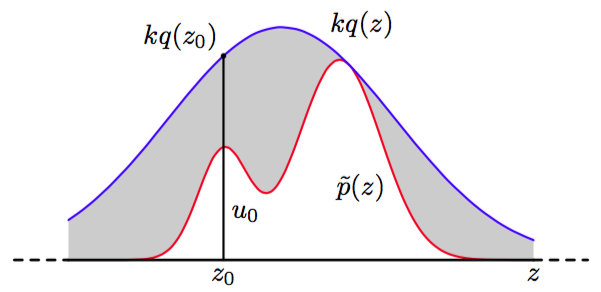
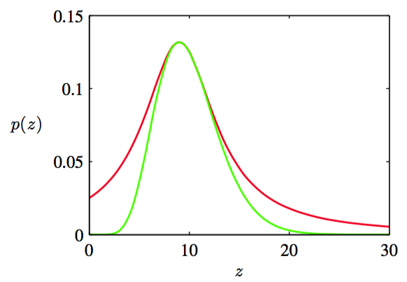

拒绝采样框架使得我们能够在满足某些限制条件的情况下，从相对复杂的概率分布中采样。首先，我们考虑单变量分布，然后接下来讨论对于多维情形的推广。    

假设我们希望从概率分布$$ p(z) $$中采样，这个概率分布不是我们目前为止讨论过的简单的标准的概率分布中的一个，从而直接从$$ p(z) $$中采样是很困难的。此外，正如经常出现的情形那样，我们假设我们能够很容易地计算对于任意给定的$$ z $$值的$$ p(z) $$（不考虑标准化常数$$ Z $$），即    

$$
p(z) = \frac{1}{Z_p}\tilde{p}(z) \tag{11.13}
$$    

其中$$ \tilde{p}(z) $$可以很容易地计算，但$$ Z_p $$未知。    

为了应用拒绝采样方法，我们需要一些简单的概率分布$$ q(z) $$，有时被称为提议分布（proposal distribution），并且我们已经可以从提议分布中进行采样。接下来，我们引入一个常数$$ k $$，它的值的选择满足下面的性质：对所有的$$ z $$值，都有$$ kq(z) \geq \tilde{p}(z) $$。函数$$ kq(z) $$被称为比较函数，且图11.4给出了单变量概率分布的说明。    

      
图 11.4 在拒绝采样的方法中，样本从一个简单的概率分布$$ q(z) $$中抽取。如果样本落到了未标准化的概率分布$$ \tilde{p}(z) $$与放缩的概率分布$$ kq(z) $$之间的灰色区域，那么样本会被拒绝。得到的样本服从$$ p(z) $$的分布，它是$$ \tilde{p}(z) $$的归一化版本。

拒绝采样器的每个步骤涉及到生成两个随机数。首先，我们从概率分布$$ q(z) $$中生成一个数$$ z_0 $$。接下来，我们在区间$$ [0, kq(z_0)] $$上的均匀分布中生成一个数$$ u_0 $$。这对随机数在函数$$ kq(z) $$的曲线下方是均匀分布。最后，如果$$ u_0 > \tilde{p}(z_0) $$，那么样本被拒绝，否则$$ u_0 $$被保留。因此，如果它位于图11.4的灰色阴影部分，它就会被拒绝。这样，剩余的点对在曲线$$ \tilde{p}(z) $$下方是均匀分布的，因此对应的$$ z
$$值服从概率分布$$ p(z) $$，正如我们所需的那样。    

$$ z $$的原始值从概率分布$$ q(z) $$中生成，这些样本之后被接受的概率为$$ \tilde{p}(z) / kq(z) $$，因此一个样本会被接受的概率为    

$$
\begin{eqnarray}
p(accept) &=& \int\left\{\frac{\tilde{p}(z)}{kq(z)}\right\}q(z)dz \\
&=& \frac{1}{k}\int\tilde{p}(z)dz \tag{11.14}
\end{eqnarray}
$$    

因此，被这种方法拒绝的点的比例依赖于曲线$$ kq(z) $$下方的未标准化概率分布$$ \tilde{p}(z) $$的面积的比例。于是，我们看到，常数$$ k $$应该尽量小，同时满足下面的限制条件：$$ kq(z) $$一定处处不小于$$ \tilde{p}(z) $$。    

作为拒绝采样的一个例子，我们考虑从Gamma分布中采样的任务，Gamma分布的形式为    

$$
Gam(z|a,b) = \frac{b^az^{a-1}exp(-bz)}{\Gamma(a)} \tag{11.15}
$$    

对于$$ a > 1 $$的情形，它的形状是钟形曲线，如图11.5所示。    

于是，一个合适的提议分布为柯西分布（11.8），因为这个分布也是一个钟形曲线，并且因为我们可以使用之前讨论的变换方法从这个分布中进行采样。我们需要对柯西分布稍稍进行推广，来确保它处处的值都不小于Gamma分布。可以这样做：对一个均匀分布的变量$$ y $$，使用$$ z = b \tan y + c $$进行变换，它给出了服从概率分布：   

$$
q(z) = \frac{k}{1 + \frac{(z - c)^2}{b^2}} \tag{11.16}
$$

的随机数。最小的拒绝率在下面的条件下得到：令$$ c = a − 1, b^2 = 2a − 1 $$，并且将常数$$ k $$选得尽可能小，同时满足$$ kq(z) \geq \tilde{p}(z) $$的要求。函数的对比也在图11.5中给出。

      
图 11.5 绿色曲线表示式（11.15）给出的Gamma分布的图像，红色曲线表示放缩后的柯西提议分布。从Gamma分布中抽取的样本可以通过从柯西分布中采样然后使用拒绝采样准则的方法得到。     
