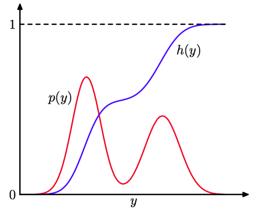
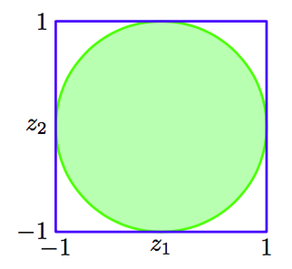

授信，我们考虑如何从简单的非均匀分布中生成随机数，假定我们已经有了一个均匀分布的随机数的来源。假设$$ z $$在区间$$ (0, 1) $$上均匀分布，我们使用某个函数$$ f(\dot) $$对$$ z $$的值进行变换，即$$ y = f(z) $$。$$ y $$上的概率分布为

$$
p(y) = p(z)\left|\frac{dz}{dy}\right| \tag{11.5}
$$    

其中，在这种情况下，$$ p(z) = 1 $$。我们的目标是选择一个函数$$ f(z) $$使得产生出的$$ y $$值具有某种所需的具体的分布形式$$ p(y) $$，对式（11.5）进行积分，我们有     

$$
z = h(y) \equiv \int_{-\infty}^y p(\hat{y})d\hat{y} \tag{11.6}
$$    

它是$$ p(y) $$的不定积分。因此，$$ y = h^{−1}(z) $$，因此我们必须使用一个函数来对这个均匀分布的随机数进行变换，这个函数是所求的概率分布的不定积分的反函数，如图11.2所示。    

      
图 11.2 生成非均匀分布的随机数的变换方法的几何表示。$$ h(y) $$是所求概率分布$$ p(y) $$的不定积分。如果一个均匀分布的随机变量$$ z $$使用$$ y = h^{−1}(z) $$进行变换，那么$$ y $$会服从概率分布$$ p(y) $$。

考虑指数分布（exponential distribution）    

$$
p(y) = \lambda exp(-\lambda y) \tag{11.7}
$$    

其中$$ 0 \leq y < \infty $$。在这种情况下，式（11.6）的积分下界为0，因此$$ h(y) = 1 − exp(−\lambda y) $$。从而，如果我们将均匀分布的变量$$ z $$使用$$ y = −\lambda^{−1} \ln(1 − z) $$进行变换，那么$$ y $$就会服从指数分布。    

另一种可以应用变换方法的概率分布是柯西分布    

$$
p(y) = \frac{1}{\pi}\frac{1}{1 + y^2} \tag{11.8}
$$    

这种情况下，不定积分的反函数可以用$$ \tan $$函数表示。    

对于多个变量情形的推广是很容易的，涉及到变量变化的Jacobian行列式，即     

$$
p(y_1,...,y_M) = p(z_1,...,z_M)\left|\frac{\partial(z_1,...,z_M)}{\partial(y_1,...,y_M)}\right| \tag{11.9}
$$    

作为变换方法的最后一个例子，我们考虑Box-Muller方法,用于生成高斯概率分布的样本。首先，假设我们生成一对均匀分布的随机变量$$ z_1,z_2 \in (−1,1) $$，我们可以这样生成：对$$ (0,1) $$上的均匀分布的变量使用$$ z \to 2z − 1 $$的方式进行变换。接下来，我们丢弃那些不满足$$ z_1^2 + z_2^2 \leq 1 $$的点对。这产生出单位圆内部的一个均匀分布，且$$ p(z_1, z_2) = 1 / pi $$，如图11.3所示。    

      
图 11.3 Box-Muller方法用于生成高斯分布的随机数，方法在开始时使用的是单位圆内部均匀分布的样本。

然后，对于每对$$ z_1, z _2 $$，我们计算    

$$
\begin{eqnarray}
y_1 &=& z_1\left(\frac{-2\ln r^2}{r^2}\right)^{1/2} \tag{11.10} \\
y_2 &=& z_2\left(\frac{-2\ln r^2}{r^2}\right)^{1/2} \tag{11.11}
\end{eqnarray}
$$     

其中$$ r^2 = z_1^2 + z_2^2 $$。这样，$$ y_1, y_2 $$的联合概率分布为    

$$
\begin{eqnarray}
p(y_1,y_2) &=& p(z_1,z_2)\left|\frac{\partial(z_1,z_2)}{\partial(y_1,y_2)}\right| \\
&=& \left[\frac{1}{\sqrt{2\pi}}exp\left(\frac{-y_1^2}{2}\right)\right]\left[\frac{1}{\sqrt{2\pi}}exp\left(\frac{-y_2^2}{2}\right)\right] \tag{11.12}
\end{eqnarray}
$$

因此$$ y_1, y_2 $$是独立的，且每个都服从高斯分布，均值为0，方差为1。     

如果$$ y $$服从高斯分布，且均值为0，方差为1，那么$$ \sigma y + \mu $$也服从高斯分布，均值为$$ \mu $$，方差为$$ \sigma^2 $$。为了生成向量值的变量，且这个变量服从多元高斯分布，均值为$$ \mu $$，协方差为$$ \Sigma $$，我们可以使用Cholesky分解，它的形式为$$ \Sigma = LL^T $$（Press et al., 1992）。这样，如果$$ z $$是一个向量值的随机变量，且它的元素是独立的，并且服从均值为0、方差为1的高斯分布，那么$$ y = \mu + Lz $$的均值为$$ \mu
$$，协方差为$$ \Sigma $$。    

显然，变换方法依赖于它能够进行计算所需的概率分布，并且能够求所需的概率分布的不定积分的反函数。这样的计算只对于一些非常有限的简单的概率分布可行，因此我们必须寻找一些更加一般的方法。这里，我们考虑两种方法，即拒绝采样（rejection sampling）和重要采样（importance sampling）。虽然这些方法主要限制在单变量概率分布，因此无法直接应用于多维的复杂问题，但是这些方法确实是更一般的方法的重要成分。    

