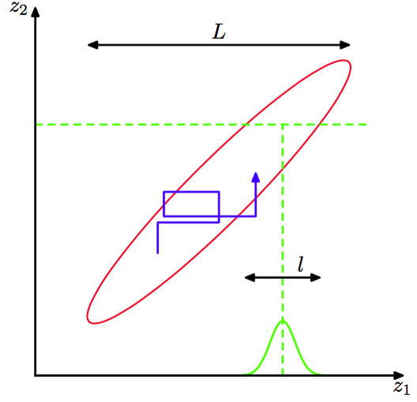
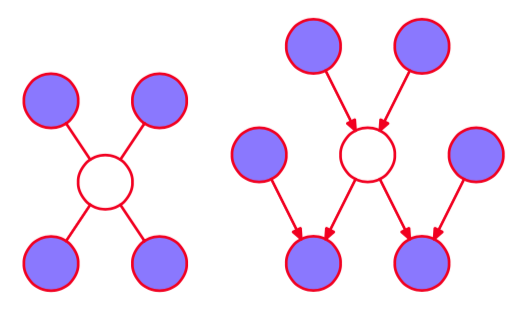

Gibbs采样(Geman and Geman, 1984)是一个简单的并且广泛应用的马尔科夫链蒙特卡罗算法，可以被看做Metropolis-Hastings算法的一个具体的情形。    

考虑我们想采样的概率分布$$ p(z) = p(z_1,...,z_M) $$，并且假设我们已经选择了马尔科夫链的某个初始的状态。Gibbs采样的每个步骤涉及到将一个变量的值替换为以剩余变量的值为条件，从这个概率分布中抽取的那个变量的值。因此我们将$$ z_i $$替换为从概率分布$$ p(z_i|z_{\\i}) $$中抽取的值，其中$$ z_i $$表示$$ z $$的第$$ i $$个元素，$$ z_{\\i} $$表示$$ z_1,...,z_M $$去掉$$ z_i
$$这一项。这个步骤要么按照某种特定的顺序在变量之间进行循环，要么每一步中按照某个概率分布随机地选择一个变量进行更新。    

例如，假设我们有一个在三个变量上的概率分布$$ p(z_1, z_2, z_3) $$，在算法的第$$ \tau $$步，我们已经选择了$$ z_1^{(\tau)}, z_2^{(\tau)}, z_3^{(\tau)} $$的值。首先，我们将$$ z_1^{(\tau)} $$替换为新值$$ z_1^{(\tau + 1)} $$，这个新值是从条件概率分布    

$$
p(z_1|z_2^{(\tau)},z_3^{(\tau)}) \tag{11.46}
$$    

中采样得到的。接下来，我们将$$ z_2^{(\tau)}) $$替换为$$ z_2^{(\tau + 1)}) $$，这个新值是从条件概率分布     

$$
p(z_2| z_1^{(\tau + 1)}), z_3^{(\tau)})) \tag{11.47}
$$    

中采样得到的，即$$ z_1 $$的新值可以在接下来的采样步骤中直接使用。然后，我们使用样本$$ z_3^{(\tau + 1)})) $$更新$$ z_3 $$，其中$$ z_3^{(\tau + 1)})) $$是从    

$$
p(z_3| z_1^{(\tau + 1)}), z_2^{(\tau + 1)})) \tag{11.48}
$$    

中抽取的。以此类推，在这三个变量之间进行循环。     

1. 初始化$$ \{z_i:i = 1,...,M\} $$。     
2. 对于$$ \tau = 1,...,T $$:     
  * 采样$$ z_1^{(\tau+1)} \sim p(z_1| z_2^{(\tau)},z_3^{(\tau)},...,z_M^{(\tau)}) $$。    
  * 采样$$ z_2^{(\tau+1)} \sim p(z_2| z_1^{(\tau + 1)},z_3^{(\tau)},...,z_M^{(\tau)}) $$。    
  * $$ \vdots $$     
  * 采样$$ z_j^{(\tau+1)} \sim p(z_j| z_1^{(\tau + 1)},...,z_{j-1}^{(\tau + 1)},z_{j+1}^{(\tau)},...,z_M^{(\tau)}) $$。    
  * $$ \vdots $$     
  * 采样$$ z_M^{(\tau+1)} \sim p(z_M| z_1^{(\tau + 1)},z_2^{(\tau + 1)},...,z_{M - 1}^{(\tau + 1)}) $$。    

为了证明这个步骤能够从所需的概率分布中采样，我们首先注意到对于Gibbs采样的每个步骤来说，概率分布$$ p(z) $$是不变的，因此对于整个马尔科夫链来说也是不变的。这是由于当我们从$$ p(z_i|z_{\\i}) $$中采样时，边缘概率分布$$ p(z_{\\i}) $$显然是不变的，因为$$ z_{\\i} $$的值是不变的。并且，根据定义，对于每个步骤中来自正确条件概率分布$$ p(z_i|z_{\\i}) $$的样本，条件概率分布都是不变的。由于条件概率分布和边缘概率分布共同确定的联合概率分布，因此我们看到联合概率分布本身是不变的。    

为了让Gibbs采样能够从正确的概率分布中得到样本，第二个需要满足的要求为各态历经性。各态历经性的一个充分条件是没有条件概率分布处处为零。如果这个要求满足，那么$$ z $$空间中的任意一点都可以从其他的任意一点经过有限步骤达到，这些步骤中每次对一个变量进行更新。如果这个要求没有满足，即某些条件概率分布为0，那么在这种情况下应用Gibbs采样时，必须显式地证明各态历经性。     

为了完成算法，初始状态的概率分布也应该被指定，虽然在多轮迭代之后，样本与初始状态的分布无关。当然，马尔科夫链中的连续的样本是高度相关的，因此为了得到近似独立的样本，需要对序列进行下采样。    

我们可以将Gibbs采样步骤看成Metropolis-Hastings算法的一个特定的情况，如下所述。考虑一个Metropolis-Hastings采样的步骤，它涉及到变量$$ z_k $$，同时保持剩余的变量$$ Z_{\\k} $$不变，并且对于这种情形来说，从$$ Z $$到$$ Z^* $$的转移概率为$$ q_k(Z^*|Z) = p(z_k^*|Z_{\\k}) $$。我们注意到$$ Z_{\\k}^* = Z_{\\k} $$，因为在采样的步骤中，向量的各个元素都不改变。并且，$$ p(Z) = p(z_k|Z_{\\k})p(Z_{\\k})
$$。因此，确定Metropolis-Hastings算法中的接受概率的因子（11.44）为     

$$
A(Z^*,Z) = \frac{p(Z^*)q_k(Z|Z^*)}{p(Z)q_k(Z^*|Z)} = \frac{p(z_k^*|Z_{\\k}^*)p(Z_{\\k}^*)p(z_k|Z_{\\k}^*)}{p(z_k|Z_{\\k})p(Z_{\\k})p(z_k|Z_{\\k})} = 1 \tag{11.49}
$$    

推导时我们用到了$$ z_{\\k}^* = z_{\\k} $$。因此Metropolis-Hastings步骤总是被接受的。 与Metropolis算法一样，我们可以通过研究Gibbs采样算法在高斯分布上的应用，更深刻的认识算法的原理。考虑两个相关变量上的一个高斯分布，如图11.11所示。

      
图 11.11 通过交替更新两个变量的方式进行Gibbs采样。这两个变量服从一个相关的高斯分布。步长由条件概率分布（绿色曲线）的标准差控制，值为$$ O(l) $$。在联合概率分布较长的方向上的速度很慢。得到这个分布的独立样本所需的步骤数量为$$ O((L/l)^2) $$。    

这个高斯分布的条件概率分布的宽度为$$ l $$，边缘概率分布的宽度为$$ L $$。典型的步长由条件概率分布确定，从而量级为 $$ l $$。由于状态按照随机游走的方式进行转移，因此得到这个分布中的独立样本所需的步骤数量的量级为$$ (L/l)^2 $$。当然，如果高斯分布不是相关的，那么Gibbs采样的效率是最高的。对于这个简单的问题，我们可以将坐标系旋转，从而解除变量之间的相关关系。然而，在实际应用中，通常找到这种变换是不可行的。     

一种减小Gibbs采样过程中的随机游走行为的方法被称为过松弛（over-relaxation）（Adler，
1981）。在这种方法的最初的形式中，它被用于处理条件概率分布是高斯分布的情形，这种情形要比多元高斯分布更一般，因为诸如非高斯分布$$ p(z, y) \proto exp(−z^2y^2) $$具有高斯条件分布的形式。在Gibbs采样算法的每个步骤中，对于一个特定的分量$$ z_i $$，条件概率分布具有均值$$ \mu_i $$和方差$$ \sigma_i^2 $$。在过松弛框架中，$$ z_i $$被替换为    

$$
z_i' = \mu_i + \alpha(z_i - \mu_i) + \sigma_i(1 - \alpha^2)^{1/2}\nu \tag{11.50}
$$

其中$$ \nu $$是一个高斯随机变量，均值为0，方差为1，$$ \alpha $$是一个满足$$ −1 < \alpha < 1 $$的参数。对于$$ \alpha = 0 $$的情形，方法等价于标准的Gibbs采样，对于$$ \alpha < 0 $$，步骤会偏向于与均值相反的一侧。这个步骤使得所求的概率分布具有不变性，因为如果$$ z_i $$的均值为$$ \mu_i $$，方差为$$ \sigma_i^2 $$，那么$$ z_i' $$也是。过松弛的效果是当变量高度相关时，鼓励在状态空间中的直接移动。有序过松弛（ordered
over-relaxation）框架(Neal，1999)将这种方法推广到了非高斯分布的情形。    

Gibbs采样的实际应用依赖于哪个样本可以从条件概率分布$$ p(z_k | z_{\\k}) $$中抽取。在概率分布使用图模型表示的情况下，各个结点的条件概率分布只依赖于对应的马尔科夫毯中的变量，如图11.12所示。    

      
图 11.12 Gibbs采样方法要求样本从一个变量的条件概率分布中抽取，条件是其他的变量。对于图模型来说，条件概率分布只是马尔科夫毯中的结点状态的函数。对于无向图来说，马尔科夫毯由相邻结点的集合组成，如左图所示。而对于有向图来说，马尔科夫毯由父结点、子结点、同父结点组成，如右图所示。

对于有向图来说，以某个结点的父结点为条件，这个结点的一大类条件概率分布 都会使得用于Gibbs采样的概率分布是对数凹函数。于是，11.1.3节讨论的可调节拒绝采样方法提供了有向图的蒙特卡罗采样方法的一个框架，这种方法具有广泛的适用性。    

如果图是使用指数族分布构建的，并且父结点-子结点关系保持共轭，那么Gibbs采样中的完整的条件概率分布会与定义在每个结点的原始的条件概率分布（以父结点为条件）具有相同的函数形式，因此可以使用标准的采样方法。通常，完整的条件概率分布的形式会很复杂，从而无法使用标准的采样方法。然而，如果这些条件概率分布是对数凹函数，那么使用可调整的拒绝采样方法，采样可以高效地完成（假设对应的变量是标量）。    

如果在Gibbs采样算法的每个阶段，我们不从对应的条件概率分布中抽取样本，而是对变量进行一个点估计，这个点估计由条件概率分布的最大值给出，那么我们就得到了8.3.3节讨论的迭代条件峰值(ICM)算法。因此，ICM可以看成是Gibbs采样的一种贪心近似。    

由于基本的Gibbs采样方法每次只考虑一个变量，因此它在连续样本之间具有很强的依赖性。在另一个极端情况下，如果我们直接从联合概率分布中采样（我们一直假定这种操作无法完成），那么连续的样本点之间就是独立的。我们可以采用一种折中的方法来提升简单的Gibbs采样的效果，即我们连续地对一组变量进行采样，而不是对一个变量进行采样。这就是分块Gibbs（blocking Gibbs）采样算法。这种算法中，将变量集合分块（未必互斥），然后在每个 块内部联合地采样，采样时以剩余的变量为条件(Jensen et al.，1995)。

