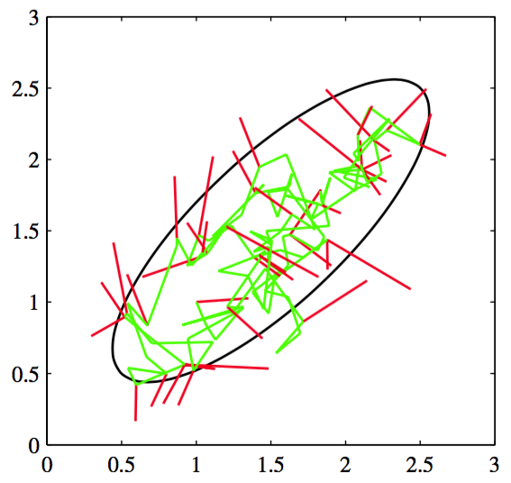

前一节中，我们讨论了计算函数期望的拒绝采样方法和重要采样方法，我们看到在高维空间中，这两种方法具有很大的局限性。因此，我们在本节中讨论一个非常一般的并且强大的框架，被称为马尔科夫链蒙特卡罗（Markov chain Monte Carlo， MCMC），它使得我们可以从一大类概率分布中进行采样，并且可以很好地应对样本空间维度的增长。马尔科夫链蒙特卡罗方法起源于物理学（Metropolis and Ulam， 1949），直到20世纪80年代，这种方法才开始对统计学领域产生巨大的影响。    

与拒绝采样和重要采样相同，我们再一次从提议分布中采样。但是这次我们记录下当前状
态$$ z^{(\tau)} $$，以及依赖于这个当前状态的提议分布$$ q(z|z^{(\tau)}) $$，从而样本序列$$ z^{(1)}，z^{(2)},... $$组成了一个马尔科夫链。同样的，如果我们有$$ p(z) = \tilde{p}(z) / Z_p $$，那么我们会假定对于任意的$$ z $$值都可以计算$$ \tilde{p}(z) $$，虽然$$ Z_p
$$的值可能位置。提议分布本身被选择为足够简单，从而直接采样很容易。在算法的每次迭代中，我们从提议分布中生成一个候选样本$$ z^* $$，然后根据一个恰当的准则接受这个样本。    

在基本的Metropolis算法中(Metropolis et al.， 1953)，我们假定提议分布是对称的，即$$ q(z_A|z_B) = q(z_B|z_A) $$对于所有的$$ z_A $$和$$ z_B $$成立。这样，候选的样本被接受的概率为    

$$
A(z^*, z^{(\tau)} = \min\left(1, \frac{\tilde{p}(z^*)}{\tilde{p}(z^{(\tau)})}\right) \tag{11.33}
$$

可以这样实现：在单位区间$$ (0，1) $$上的均匀分布中随机选择一个数$$ u $$，然后如果$$ A(z^*, z^{(\tau)}) > u $$就接受这个样本。注意，如果从$$ z^\tau $$到$$ z^* $$引起了$$ p(z) $$的值的增大，那么这个候选样本当然会被保留。    

如果候选样本被接受，那么$$ z^{(τ+1)} = z^* $$，否则候选样本点$$ z^* $$被丢弃，$$ z^{(\tau+1)} $$被设置为$$ z^{(\tau)} $$，然后从概率分布$$ q(z|z^{(\tau+1)})
$$中再次抽取一个候选样本。这与拒绝采样不同，那里拒绝的样本被简单地丢弃。在Metropolis算法中，当一个候选点被拒绝时，前一个样本点会被包含到最终的样本的列表中，从而产生了样本点的多个副本。当然，在实际实现中，每个保留的样本只会有一个副本，以及一个整数的权因子，记录状态出现了多少次。正如我们将看到的那样，只要对于任意的$$ z_A $$和$$ z_B $$都有$$ q(z_A|z_B) $$为正（这是一个充分条件但不是必要条件），那么当$$ \tau \to \infty
$$时，$$ z(\tau) $$趋近于$$ p(z) $$。然而，应该强调的是，序列$$ z^{(1)}, z^{(2)},... $$不是来自$$ p(z) $$的一组独立的样本，因为连续的样本是高度相关的。如果我们希望得到独立的样本，那么我们可以丢弃序列中的大部分样本，每个样本中保留一个样本。对于充分大的$$ M $$，保留的样本点对于所有的实际用途来说都是独立的。图11.9给出了一个简单的例子，这个例子使用Metropolis算法从一个二维高斯分布中采样，其中提议分布是一个各向同性的高斯分布。    

      
图 11.9 使用Metropolis算法从一个高斯分布中采样的简单例子，这个高斯分布的一个标准差的位置用椭圆表示。提议分布是一个各向同性的高斯分布，标准差为0.2。被接受的步骤用绿线表示，被拒绝的步骤用红线表示。总共生成了150个候选样本，其中有43个被拒绝。

通过考察一个具体的例子，即简单的随机游走的例子，我们可以对马尔科夫链蒙特卡罗算法的本质得到更深刻的认识。考虑一个由整数组成的状态空间z，概率为    

$$
\begin{eqnarray}
p(z^{(\tau + 1)} = z^{(\tau)}) &=& 0.5 \tag{11.34} \\
p(z^{(\tau + 1)} = z^{(\tau)} + 1) &=& 0.25 \tag{11.35} \\
p(z^{(\tau + 1)} = z^{(\tau)} - 1) &=& 0.25 \tag{11.36}
\end{eqnarray}
$$    

其中$$ z^{(τ)} $$表示在步骤$$ \tau $$的状态。如果初始状态是$$ z^{(0)} = 0 $$，那么根据对称性，在时刻$$ \tau $$的期望状态也是0，即$$ \mathbb{E}[z^{(τ)}] = 0 $$，类似地很容易看到$$ \mathbb{E}[(z^{(\tau)})^2] = \tau / 2 $$。因此，在$$ \tau $$步骤之后，随机游走所经过的平均距离正比于$$ \tau $$的平方根。这个平方根依赖关系是随机游走行为的一个典型性质，表明了随机游走在探索状态空间时是很低效的。正如我们会看到的那样，设计马尔科夫链蒙特卡罗方法的一个中心目标就是避免随机游走行为。
