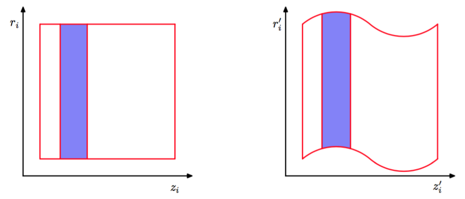

正如我们在前一节讨论的那样，对于一个非零的步长$$ \epsilon $$，蛙跳算法的离散化会在哈密顿动力学方程的积分过程中引入误差。混合蒙特卡罗（hybrid Monte Carlo）（Duane et al.， 1987; Neal， 1996）将哈密顿动态系统与Metropolis算法结合在一起，因此消除了与离散化过程关联的任何偏差。
具体来说，算法使用了一个马尔科夫链，它由对动量变量r的随机更新以及使用蛙跳算法对哈密顿动态系统的更新交替组成。在每次应用蛙跳算法之后，基于哈密顿函数$$ H $$的值，确定Metropolis准则，确定生成的候选状态被接受或者拒绝。因此，如果$$ (z, r) $$是初始状态，$$ (z^*, r^*) $$是蛙跳积分后的状态，那么候选状态被接受的概率为    

$$
\min(1,exp\{H(z,r) - H(z^*,r^*)\}) \tag{11.67}
$$

如果蛙跳积分完美地模拟了哈密顿动态系统，那么每个这种候选状态都会自动地被接受，因为$$ H $$的值会保持不变。由于数值误差，$$ H $$的值有时可能会减小，因此我们希望Metropolis准则将这种效果引发的任何偏差都消除，并且确保得到的样本确实是从所需的概率分布中抽取的。为了完成这件事，我们需要确保对应于蛙跳积分的更新方程满足细节平衡（11.40）。通过按照下 面的方式修改蛙跳方法，这个目标很容易实现。    

在开始蛙跳积分序列之前，我们等概率地随机选择是沿着时间向前的方向积分（步长为$$ \epsilon $$）还是沿着时间向后的方向积分（步长为$$ −\epsilon $$）。我们首先注意到，蛙跳积分方法（11.64）、 （11.65）和（11.66）是时间可翻转的，即$$ L $$步使用步长为$$ −\epsilon $$的积分会抵消L步使用步长为\epsilon的积分。接下来我们证明蛙跳积分精确地保持了相空间的体积不变性。这是因为，蛙跳方法中的每一步对$$ z_i $$或$$ r_i $$的更新都只是另一个变量的函数。如图11.14所示，这个现象产生的效果是将相空间的一个区域进行形变而不改变它的体积。    

      
图 11.14 蛙跳算法（11.64）到（11.66）中的每一步修改位置变量$$ z_i $$或动量变量$$ r_i $$中的一个。由于对一个变量的修改只是另一个变量的函数，因此相空间的任意区域在形变时不会改变体积。

最后，我们使用这些结果证明细节平衡是成立的。考虑相空间的一个小区域$$ R $$，它在$$ L $$次步长为$$ \epsilon $$的蛙跳迭代序列之后被映射到了区域$$ R' $$。使用在蛙跳迭代下的体积的不变性，我们看到如果$$ R $$的体积为$$ \delta V $$，那么$$ R' $$的体积也是。如果我们从概率分布（11.63）中选择一个初始点，然后使用$$ L $$次蛙跳进行更新，那么从区域$$ R $$转移到$$ R' $$的概率为    

$$
\frac{1}{Z_H}exp(-H(R))\delta V\frac{1}{2}\min\{1,exp(H(R) - H(R'))\} \tag{11.68}
$$

其中，因子$$ 1 / 2 $$来自于选择用一个正的步长而不是负的步长进行积分的概率。类似地，从区域$$ R' $$开始，沿着时间的反方向回到区域$$ R $$的概率为    

$$
\frac{1}{Z_H}exp(-H(R'))\delta V\frac{1}{2}\min\{1,exp(H(R') - H(R))\} \tag{11.69}
$$    

很容易看到，两个概率（11.68）和（11.69）是相等的，因此满足细节平衡。注意，这个证明忽略了区域$$ R $$和$$ R' $$之间有重叠的情况，但是很容易进行推广使其适用于这种存在重叠的情形。    

不难构造蛙跳算法在有限次迭代之后返回起始点的例子。在这种情况下，每次蛙跳迭代之前对动量值的随机替换对确保各态历经性是不充分的，因为位置变量永远不会被更新。通过在蛙跳积分之前随机地从某个小区间中选择步长的大小，这种现象很容易避免。    

通过考察混合蒙特卡罗算法在多元高斯分布上的应用，我们可以更深刻地理解算法的行为。为了方便，考虑具有独立分量的高斯分布$$ p(z) $$，它的哈密顿函数为    

$$
H(z,r) = \frac{1}{2}\sum\limits_i\frac{1}{\sigma_i^2}z_i^2 + \frac{1}{2}\sum\limits_ir_i^2 \tag{11.70}
$$

我们的结论对于分量之间具有相关性的高斯分布同样适用，因为混合蒙特卡罗算法具有旋转不变性。在蛙跳积分阶段，每对相空间变量$$ z_i, r_i $$独立变化。然而，对候选样本点接受或是拒绝基于的是$$ H $$的值，它依赖于所有变量的值。因此，任何变量的一个较大的积分误差会产生一个较高的拒绝概率。为了让离散蛙跳积分对真实的连续时间动态系统产生一个较好的近似，有必要让蛙跳积分的标度$$ \epsilon $$小于势函数变化的最短的长度标度。这由$$ \sigma_i
$$的最小值控制，我们将其记作$$ \sigma_\min $$。回忆一下，混合蒙特卡罗算法中的蛙跳积分的目标是在相空间中移动较大的距离到达新状态，这个新状态与初始状态相对独立，同时还能达到较高的接受率。为了实现这个目标，蛙跳积分必须连续进行多次迭代，迭代的次数是$$ \sigma_\max / \sigma_\min $$的量级。    

相反，考虑之前讨论过的一个简单的Metropolis算法的行为，它具有各向同性的高斯提议分布，方差为$$ s^2 $$。为了避免高拒绝率，$$ s $$的值必须设置为$$ \sigma_\min $$的量级。这样，对状态空间的探索通过随机游走的方式进行，达到近似独立的状态所需的步骤数是$$ (\sigma_\max / \sigma_\min)^2 $$量级的。
