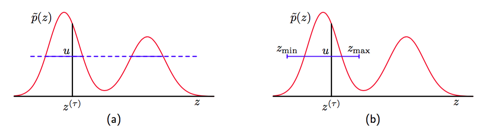

我们已经看到，Metropolis算法的一个困难之处是它对于步长的敏感性。如果步长过小，那么由于随机游走行为，算法会很慢。而如果步长过大，那么由于较高的拒绝率，算法会很低效。切片采样（slice sampling）方法（Neal， 2003）提供了一个可以自动调节步长来匹配分布特征的方法。同样的，它需要我们能够计算未标准化的概率分布$$ \tilde{p}(z) $$。    

首先考虑一元变量的情形。切片采样涉及到使用额外的变量$$ u $$对$$ z $$进行增广，然后从联合的$$ (z, u) $$空间中采样。当我们在11.5节讨论混合蒙特卡罗方法时，我们会看到这种方法的另一个例子。目标是从下面的概率分布    

$$
\hat{p}(z,u) = 
\begin{cases}
1 / Z_p if 0 \leq u \leq \tilde{p}(z)
0, otherwise
\end{cases} \tag{11.51}
$$

中均匀地进行采样，其中$$ Z_p = \tilde{p}(z)dz $$。$$ z $$上的边缘概率分布为    

$$
\int\hat{p}(z,u)du = \int_0^{\tilde{p}(z)}\frac{1}{Z_p}du = \frac{\tilde{p}(z)}{Z_p} = p(z) \tag{11.52}
$$

因此，我们可以通过从$$ \hat{p}(z,u) $$中采样，然后忽略$$ u $$值的方式得到$$ p(z) $$的样本。通过交替的对$$ z $$和$$ u $$进行采样即可完成这一点。给定$$ z $$的值，我们可以计算$$ \tilde{p}(z) $$的值，然后在$$ 0 \leq u \leq \tilde{p}(z) $$上均匀的对$$ u $$进行采样，这很容易。然后，我们固定$$ u $$，在由$$ \{z:\tilde{p}(z) > u\} $$定义的分布的“切片”上，对$$ z $$进行均匀的采样。图11.13(a)给出了说明。    

      
图 11.13 切片采样的例子。(a)对于给定的$$ z^{(\tau)} $$，$$ u $$的值从$$ 0 \leq u \leq \tilde{p}(z^{(\tau)}) $$区域中均匀采样，它之后定义了穿过这个概率分布的一个“切片”。(b)由于直接从切片中采样是不可行的，因此$$ z $$的一个新的样本被从区域$$ z_{\min} \leq z \leq z_{\max} $$中抽取，它包含了前一个值$$ z^{(\tau)} $$。

在实际应用中，直接从穿过概率分布的切片中采样很困难，因此我们定义了一个采样方法，它保持$$ \hat{p}(z,u) $$下的均匀分布具有不变性，这可以通过确保满足细节平衡的套件来实现。假设$$ z $$的当前值记作$$ z^{(\tau)} $$，且我们已经得到了一个对应的样本$$ u $$。$$ z $$的下一个值可以通过考察包含$$ z^{(\tau)} $$的区域$$ z_\min \leq z \leq z_\max
$$来获得。根据概率分布的特征长度标度来对步长进行的调节就发生在这里。我们希望区域包含尽可能多的切片，从而使得$$ z $$空间中能进行较大的移动，同时希望切片外的区域尽可能小，因为切片外的区域会使得采样变得低效。    

一种选择区域的方法是，从一个包含$$ z^{(\tau)} $$的具有某个宽度$$ w $$的区域开始，然后测试每个端点，看它们是否位于切片内部。如果有端点没在切片内部，那么区域在增加$$ w $$值的方向上进行扩展，知道端点位于区域外。然后，$$ ' $$的一个样本被从这个区域中均匀抽取。如果它位于切片内，那么它就构成了$$ z^{(\tau
+ 1)} $$。如果它位于切片外，那么区域收缩，使得$$ z' $$组成一个端点，并且区域仍然包含$$ z^{(\tau)} $$。然后，另一个样本点从这个缩小的区域中均匀抽取，以此类推，直到找到位于切片内部的一个$$ z $$值。    

切片采样可以应用于多元分布中，方法是按照Gibbs采样的方式重复地对每个变量进行采样。这要求对于每个元素$$ z_i $$，我们能够计算一个正比于$$ p(z_i | z_{\\i}) $$的函数。
