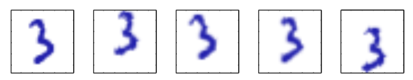

在第9章中，我们讨论了具有离散潜在变量的概率模型，例如高斯混合模型。我们现在研究某些潜在变量或者全部潜在变量为连续变量的模型。研究这种模型的一个重要的动机是许多数据集具有下面的性质：数据点几乎全部位于比原始数据空间的维度低得多的流形中。为了说明 为什么会出现这种现象，考虑一个人造的数据集，这个数据集将一个$$ 64 \times 64 $$ 的灰度图像表 示的手写数字嵌入到一个$$ 100 \times 100 $$的更大的图像中，用灰度值为零的像素（对应于白色像素）填充，并且数字的位置和方向被随机改变，如图12.1所示。

      
图 12.1 一个人工生成的数据集，以手写数字图像为输入，创建出多个副本，每个副本中，数字都在一个更大的图像中进行了一个随机的平移和旋转。每个生成的图像都有$$ 100 \times 100 = 10,000 $$个像素。

每个生成的图像都可以表示 为$$ 100 \times 100 = 10,000 $$维数据空间内的一个点。然而，对于这种图像的数据集，只有三个变化的自由度（degrees of freedom），对应于垂直平移、水平平移和旋转。于是，数据点会位于数据空间的一个子空间中，它的本质维度（intrinsic dimensionality）等于3。注意，这个流形是非线性的，因为例如如果我们把数字移过一个特定的像素，那么像素值会从0（白色）变为1（黑 色），然后再回到0，这显然是数字位置的一个非线性函数。在这个例子中，平移和旋转变量是潜在变量，因为我们值观测到图像向量，不知道创建它们所使用的平移或者旋转变量。    

对于真实的手写数字图像数据，会存在另外一个自由度，这个自由度产生于图像的缩放。并且还会存在更多的自由度，这些自由度与更加复杂的形变有关，这些复杂的形变来自一个人的各次书写之间的变化，以及不同人之间的书写风格的差异。尽管这样，这种自由度与数据集的 维度相比仍然很小。    

另一个例子来源于石油流数据集，其中（对于给定的天然气、水、石油的几何配置）只有两个自由度，对应于管道中石油的比例和硕的比例（之后就可以确定天然气的比例）。虽然数据空间由12个度量组成，但是一组数据点会近似位于这个空间内的一个二维流形当中。在这种情况下，流形由几个不同的片段组成，对应于不同的流的形式，每一个片段都是一个（带有噪声 的）连续二维流形。如果我们的目标是数据压缩，或者对概率密度建模，那么利用这个流形结 构是很有用的。    

在实际应用中，数据点不会被精确限制在一个光滑的低维流形中，我们可以将数据点关于流形的偏移看做噪声。这就自然地引出了这种模型的生成式观点，其中我们首先根据某种潜在变量的概率分布在流形中选择一个点，然后通过添加噪声的方式生成观测数据点。噪声服从给定 潜在变量下的数据变量的某个条件概率分布。    

最简单的连续潜在变量模型对潜在变量和观测变量都作出了高斯分布的假设，并且使用了观测变量对于潜在变量状态的线性高斯依赖关系。这就引出了一个著名的技术——主成分分析（PCA）的概率表示形式，也引出了一个相关的模型，被称为因子分析。    

本章中，我们首先介绍标准的、非概率的PCA方法，然后我们会说明，当求解线性高斯潜在变量模型的一种特别形式的最大似然解时，PCA如何自然地产生。这种概率形式的表示方法会带来很多好处，例如在参数估计时可以使用EM算法，对混合PCA模型的推广，以及主成分的数量可以从数据中自动确定的贝叶斯公式。最后，我们简短地讨论潜在变量概念的几个推广，使 得潜在变量的概念不局限于线性高斯假设。这种推广包括非高斯潜在变量，它引出了独立成分分析（independent conponent analysis）的框架。这种推广还包括潜在变量与观测变量的关系是 非线性关系的模型。
