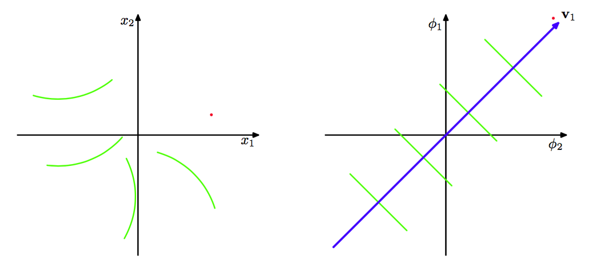
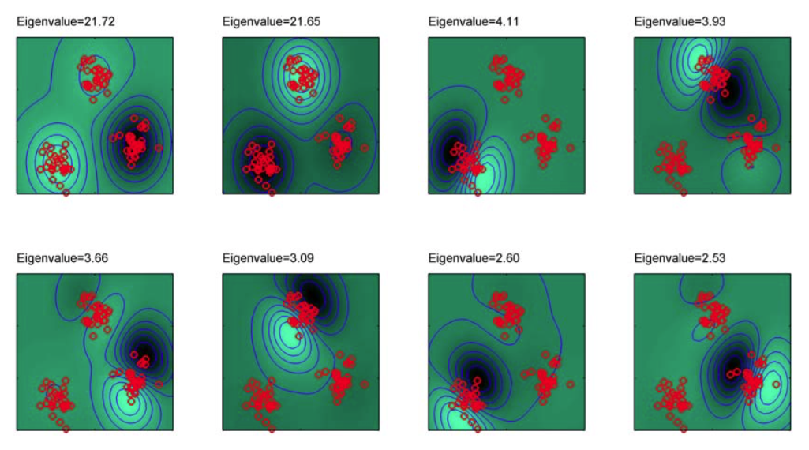

在第6章中，我们看到了核替换的方法让我们能够使用形如$$ x^Tx' $$的标量积表示的算法，并且通过使用一个非线性核替换标量积的方式来对算法进行推广。这里，我们将核替换的方法应用到主成分分析中，从而得到了一个非线性的推广，被称为核PCA(kernel PCA)(Scholkopf etal.， 1998)。    

考虑$$ D $$维空间中的一个观测数据集$$ x_n $$，其中$$ n = 1,...,N $$。为了保持记号的简洁，我们假设我们已经从每个$$ x_n $$中减去了样本的均值，从而$$ \sum_n x_n = 0 $$。第一步是将传统的PCA表示为这样的形式：数据向量$$ \{x_n\} $$只以标量积$$ x_n^Tx_m $$的形式出现。回忆一下，主成分由协方差矩阵的特征向量$$ u_i $$定义，即     

$$
Su_i = \lambda_iu_i \tag{12.71}
$$    

其中$$ i = 1,...,D $$。这里$$ D \times D $$的样本协方差矩阵$$ S $$的定义为    

$$
S = \frac{1}{N}\sum\limits_{n=1}^Nx_nx_n^T \tag{12.72}
$$    

特征向量被标准化，从而$$ u_i^Tu_i = 1 $$。现在考虑到一个$$ M $$维特征空间的一个非线性变换$$ \psi(x) $$，从而每个数据点$$ x_n $$被投影到一个数据点$$ \psi(x_n) $$上。我们现在可以在特征空间上进行标准的PCA，它隐式地在原始数据空间中定义了一个非线性的主成分模型，如图12.16所示。    

      
图 12.16 核PCA的图形化说明。原始数据空间中的数据集(左图)被非线性变换$$ \psi(x) $$投影到特征空间中(右图)。通过在特征空间中执行PCA，我们得到了主成分，其中第一主成分用蓝色表示，记作向量$$ v_1 $$。特征空间中的绿色直线表示特征空间中在第一主成分上的线性投影，它对应于原始数据空间中的非线性投影。注意，通常不可能在$$ x $$空间中表示非线性主成分。

现阶段，让我们假设投影数据集的均值也为0，从而$$ \sum_n\psi(x_n) = 0 $$。我们稍后会回到这里。特征空间中的$$ M \times M $$样本协方差矩阵为    

$$
C = \frac{1}{N}\sum\limits_{n=1}^N\psi(x_n)\psi(x_n)^T \tag{12.73}
$$    

它特征向量展开式被定义为    

$$
Cv_i= \lambda_iv_i \tag{12.74}
$$    

其中$$ i = 1,...,M $$。我们的目标是求解这个特征值问题，而无需显示的在特征空间中计算。根据$$ C $$的定义，特征向量方程告诉我们$$ v_i $$满足    

$$
\frac{1}{N}\sum\limits_{n=1}^N\psi(x_n)\{\psi(x_n)^Tv_i\} = \lambda_iv_i \tag{12.75}
$$    

因此我们看到（假设$$ \lambda_i > 0 $$）向量$$ v_i $$由$$ \psi(x_n) $$的特征值给出，因此可以写成    

$$
v_i = \sum\limits_{n=1}^Na_{in}\psi(x_n) \tag{12.76}
$$    

将这个表达式代回到特征向量方程中，我们有    

$$
\frac{1}{N}\sum\limits_{n=1}^N\psi(x_n)\psi(x_n)^T\sum\limits_{m=1}^Na_{im}\psi(x_m) = \lambda_i\sum\limits_{n=1}^Na_{in}\psi(x_n) \tag{12.77}
$$

现在关键的步骤是用核函数$$ k(x_n，x_m) = \psi(x_n)^T\psi(x_m) $$表示上式。我们可以将两侧乘以$$ \psi(x_l)^T $$，得到

$$
\frac{1}{N}\sum\limits_{n=1}^Nk(x_l,x_n)\sum\limits_{m=1}^Na_{im}k(x_n,x_m) = \lambda_i\sum\limits_{n=1}^Na_{in}k(x_l,x_n)\tag{12.78}
$$    

这可以用矩阵的记号表示为    

$$
K^2a_i = \lambda_iNKa_i \tag{12.79}
$$

其中$$ a_i $$是一个$$ N $$维列向量，元素为$$ a_{in} $$，其中$$ n = 1,...,N $$。我们可以通过求解下面的特征值方程    

$$
Ka_i = \lambda_iNa_i \tag{12.80}
$$     

来找到$$ a_i $$的解，其中我们已经从方程（12.79）两侧去掉了一个因子$$ K $$。注意，方程（12.79）和（12.80）的解的唯一差别在于$$ K $$的那些特征值为零的特征向量，这些特征向量不会影响主成分投影。    

系数$$ a_i $$的标准化条件可以通过要求特征空间的特征向量被归一化的方式得到。使用式（12.76）和（12.80），我们有    

$$
1 = v_i^Tv_i = \sum\limits_{n=1}^N\sum\limits_{m=1}^Na_{in}a_{im}\psi(x_n)^T\psi(x_m) = a_i^TKa_i = \lambda_iNa_i^Ta_i \tag{12.81}
$$    

解出了特征向量方程之后，得到的主成分投影也可以根据核函数进行转化。使用式（12.76），点x在特征向量$$ i $$上的投影为    

$$
y_i(x) = \psi(x)^Tv_i = \sum\limits_{n=1}^Na_{in}\psi(x)^T\psi(x_n) = \sum\limits_{n=1}^Na_{in}k(x,x_n) \tag{12.82}
$$    

从而我们又一次得到了根据核函数进行表示的形式。 在原始的$$ D $$维$$ x $$空间中，有$$ D $$个正交的特征向量，因此我们最多可以找到$$ D $$个线性主成分。然而特征空间的维度$$ M $$可以比$$ D $$大得多，甚至可以是无穷大，因此我们可以找到多于$$ D $$个非线性主成分。但是注意，非零特征值的数量不能超过数据点的数量$$ N $$，因为（即使$$ M > N $$）特征空间中的协方差矩阵的秩最大等于$$ N $$。这可以从下面的事实中反映出来：核PCA涉及到对$$ N
\times N $$矩阵$$ K $$的特征向量展开。    

目前为止，我们假设由$$ \psi(x_n) $$给出的投影数据集的均值为0，通常的情况并非如此。我们不能简单地计算然后减去均值，因为我们希望避免直接在特征空间中进行计算，因此我们完全根据核函数来建立算法的公式。在中心化之后，投影的数据点（记作$$ \tilde{\psi}(x_n) $$）为    

$$
\tilde{\psi}(x_n) = \psi(x_n) - \frac{1}{N}\sum\limits_{l=1}^N\psi(x_l) \tag{12.83}
$$    

从而Gram矩阵的对应元素为    

$$
\begin{eqnarray}
\tilde{K}_{nm} &=& \tilde{\psi}(x_n)^T\tilde{\psi}(x_m) \\
&=& \psi(x_n)^T\psi(x_m) - \frac{1}{N}\sum\limits_{l=1}^N\psi(x_n)^T\psi(x_l) \\
& & -\frac{1}{N}\sum\limits_{l=1}^N\psi(x_l)^T\psi(x_m) + \frac{1}{N^2}\sum\limits_{j=1}^N\sum\limits_{l=1}^N\psi(x_j)^T\psi(x_l) \\
&=& k(x_n,x_m) - \frac{1}{N}\sum\limits_{l=1}^Nk(x_l,x_m) \\
& & -\frac{1}{N}\sum\limits_{l=1}^Nk(x_n,x_l) + \frac{1}{N^2}\sum\limits_{j=1}^N\sum\limits_{l=1}^Nk(x_j,x_l) \tag{12.84}
\end{eqnarray}
$$    

使用矩阵的记号，这个结果可以表示为    

$$
\tilde{K} = K - 1_NK - K1_N + 1_NK1_N \tag{12.85}
$$    

其中$$ 1_N $$表示$$ N \times N $$的矩阵，它的每个元素的值都是$$ 1 / N $$。因此，我们可以只使用核函数来计算$$ \tilde{K} $$，然后使用$$ \tilde{K} $$确定特征值和特征向量。注意，如果我们使用线性核$$ k(x, x') = x^Tx' $$，那么我们就恢复出了标准的PCA算法。图12.17给出了核PCA应用于人工生成数据集的一个例子（Scholkopf et al.， 1998）。    

      
图 12.17 使用高斯核的核PCA用于二维空间的人工生成数据集的例子，图中画出了前8个特征函数以及对应的特征值。轮廓线表示沿着曲线的方向，在对应的主成分上的投影是常数的轮廓线。注意前两个特征向量将三个聚类划分开，接下来的三个特征向量将每个聚类分成一两半，再接下来的三个特征向量再次将聚类划分为两半，方向是沿着与之前的划分正交的方向。

这里，我们将一个“高斯”核    

$$
k(x,x') = exp\left(-\frac{\Vert x - x' \Vert^2}{0.1}\right) \tag{12.86}
$$    

应用于人工生成数据集。图中的曲线对应于沿着曲线方向，在对应的主成分上投影为常数的等高线，投影的定义为    

$$
\psi(x)^Tv_i = \sum\limits_{n=1}^Na_{in}k(x,x_n) \tag{12.87}
$$    

核PCA的一个明显的缺点是它涉及到寻找$$ N \times N $$矩阵$$ \tilde{K} $$的特征向量，而不是传统的线性PCA中$$ D \times D $$的矩阵$$ S $$的特征向量，因此在实际应用中，对于较大的数据集，我们经常会使用近似。    

最后，我们注意到在标准的线性PCA中，我们通常保留$$ L < D $$个特征向量，然后使用数据向量$$ x_n $$在$$ L $$为主子空间上的投影$$ x_n $$来近似数据向量$$ x_n $$，投影的定义为    

$$
\hat{x}_n = \sum\limits_{i=1}^L(x_n^Tu_i)u_i \tag{12.88}
$$    

在核PCA中，这通常是不可能的。为了说明这一点，我们注意到映射$$ \psi(x) $$将$$ D $$维$$ x $$空间映射到了$$ M $$维特征空间$$ \psi $$中的一个$$ D $$维流形（manifold）中。向量x被称为对应点$$ \psi(x) $$的原像（preimage）。然而，特征空间中的点在特征空间的线性PCA子空间中的投影通常不会位于非线性$$ D $$维流形中，因此在数据空间中不会存在一个对应的原像。于是，研究者们提出了一些寻找近似原像的方法(Bakir et al.，2004)。
