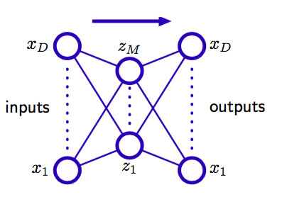
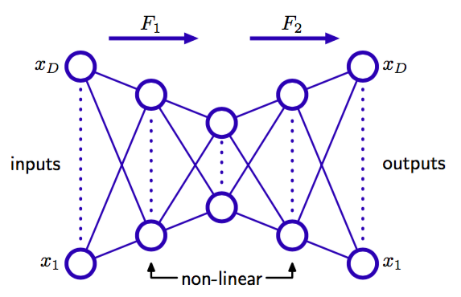
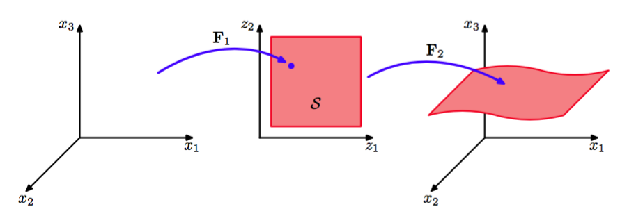

在第5章中，我们在有监督学习的环境中研究了神经网络，其中网络的左右是在给定输入变量值的条件下预测输出。然而，神经网络也被应用于无监督学习，此时神经网络用于维度降低。使用输出结点与输入结点数量相同的神经网络，通过最优化权值来最小化某种度量，这种度量描述了在训练数据集上，输入和输出之间的重建误差。    

首先，考虑图12.18所示的多层感知器网络，它有$$ D $$个输入，$$ D $$个输出，以及$$ M $$个隐含单元， 其中$$ M < D $$。用来训练网络所使用的目标棉量仅仅是输入向量本身，因此网络试图将输入向量映射到它本身上。    

      
图 12.18 一个自相关的多层感知器网络，具有两层权值。这样的一个网络通过最小化平方和误差的方式 进行训练，得到从输入向量到其自身的一个映射。即使隐含层是非线性单元，这样一个网络也等价于线性主成分分析。为了清晰，表示偏置参数的链接已经被略去。

这样的网络构成了一个自相关映射（autoassociative
mapping）。由于隐含单元的数量小于输入的数量，因此将所有的变量进行一个完美的重建通常是不可能的。于是，我们通过最小化一个误差函数的方式来确定网络的参数$$ w $$，这个误差函数描述了输入向量和它们的重建之间的不匹配程度。特别地，我们会现在一个平方和误差函数，形式为    

$$
E(w) = \frac{1}{2}\sum\limits_{n=1}^N\Vert y(x_n,w) - x_n \Vert^2 \tag{12.91}
$$    

如果隐含单元具有线性激活函数，那么可以证明误差函数有唯一的全局最小值，在这个最小值处，网络实现了到一个M维子空间上的投影，这个子空间由数据的前M个主成分张成（Bourland and Kamp，1988; Baldi and Hornik，1989）。因此，图12.18的隐含单元的权向量构成了张成主子空间的基的集合。但是，注意，这些向量不需要正交或标准化。这个结果毫不令人惊讶，因为主成分分析和神经网络都使用了线性维度降低、并且最小化相同的误差函数。    

可能我们会认为，线性维度降低的局限性可以在网络的隐含单元中使用图12.18中的非线性（sigmoid）激活函数的方式来克服。但是，即使使用非线性隐含单元，误差函数的最小值同样通过在主子空间上投影的方式获得（Bourlard and Kamp，1988）。于是使用两层神经网络在维度降低方面没有优势。主成分分析的标准方法（基于奇异值分解）保证在有限时间内给出正确的解，并且这种方法也产生了特征值的一个有序集合，对应于单位正交的特征向量。    

然而，如果网络中有额外的隐含层，情况就会有所不同。考虑图12.19给出的四层自相关网络。    

      
图 12.19 增加额外的非线性单元组成的隐含层产生了一个能够进行非线性维度降低的自相关网络。

与之前一样，输出单元是线性的，在第二个隐含层的$$ M $$个单元也可以是线性的，但是第一个隐含层和第三个隐含层具有sigmoid非线性激活函数。网络同样用最小化误差函数（12.91）的方式确定。我们可以将这个网络看成两个连续的函数映射$$ F_1 $$和$$ F_2 $$，如图12.19所示。第一个映射$$ F_1 $$将原始的$$ D $$维数据映射到$$ M $$为子空间$$ S
$$上，这个子空间由第二个隐含层的单元的激活所定义。由于第一个非线性单元隐含层的存在，因此这个映射非常一般，并且特别地，这个映射不限于线性映射。类似地，网络的第二部分定义了从$$ M $$维空间到原始$$ D $$为输入空间中的一个任意的函数映射。这种映射有一个很简单的几何意义，图12.20给出了$$ D = 3 $$和$$ M = 2 $$的情形。    

      
图 12.20 图12.19的网络表示的映射的集合表示，其中输入单元的数量为$$ D = 3 $$，中间隐含层单元的数量为$$ M = 2 $$。函数$$ F_2 $$表示从$$ M $$维空间$$ S $$到$$ D $$维空间的一个映射，因此定义了空间$$ S $$嵌入到原始$$ x $$空间的方式。由于映射$$ F_2 $$可以是非线性的，因此$$ S $$嵌入的空间可以不是平面，如图所示。这样，映射$$ F_1 $$定义了原始$$ D $$维空间中的一个点到$$ M $$维子空间$$ S $$中的投影。

这样的网络能够有效地完成非线性主成分分析。它的优点在于，不局限于线性变换，虽然标准的主成分分析是它的一个具体的例子。然而，现在训练这个神经网络涉及到非线性最优化问题，因为误差函数（12.91）不再是网络参数的二次函数。我们必须使用需要大量计算的非线性最优化方法，并且有找到误差函数的局部极小值的风险。并且，子空间的维度必须在训练网络之前指定。
