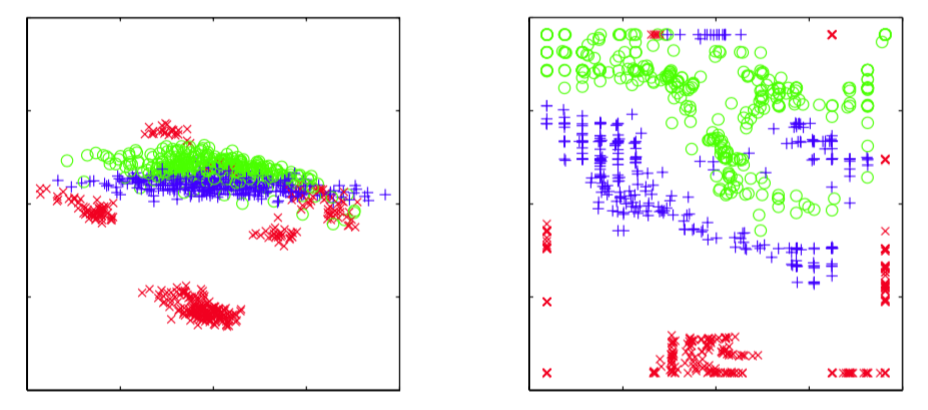

正如我们已经注意到的那样，许多自然的数据源对应于低维的可能带有噪声的非线性流形，这些流形镶嵌在更高维的观测数据空间中。显式地利用这个性质可以产生与一般的方法相比更好的概率密度模型。这里，我们简要讨论尝试完成这一点的几种方法。    

对这种非线性结构建模的一种方法是通过线性模型的组合，从而我们对流形做了一个分段线性的近似。这个近似可以通过使用诸如K均值的聚类方法，基于欧几里得距离，将数据集划分为若干个局部的分组，对每个分组分别使用标准的PCA。一种更好的方法是使用聚类分配的重建误差（Kambhatla and Leen， 1997; Hinton et al.，
1997），然后在每个阶段优化一个共同的代价函数。然而，这些方法会由于我们无法得到整体的概率密度模型而产生局限性。通过使用概率PCA，很容易定义一个完整的概率模型，只需考虑一个混合的概率分布，每个分量都是概 率PCA即可（Tipping and Bishop， 1999a）。这样的模型既包含离散潜在变量，对应于离散的混合，也包含连续的潜在变量，以及可以使用EM算法最大化的似然函数。基于变分推断的纯粹的 贝叶斯方法（Bishop and Winn，
2000）使得混合分量的个数以及各个模型的有效维度可以从数据中进行推断。这个模型有很多变体，例如将诸如$$ W $$矩阵或噪声方差之类的参数与混合分量相关联，或者将各向同性噪声概率分布替换为对角的噪声概率分布，这就引出了因子分析的混合（Ghahramani and Hinton， 1996a; Ghahramani and Beal， 2000）。概率PCA模型的混合也可以层次化地扩展，产生了一个很有吸引力的数据可视化算法（Bishop and Tipping， 1998）。    

另一种处理方式是直接考虑一个单一的非线性模型，而不是将线性模型混合。回忆一下，传统的PCA寻找一个线性子空间，这个子空间在最小平方的意义下能够以最近的距离通过 数据集。这个概念可以推广到一维非线性曲面，被称为主曲线（principal curve）（Hastie and Stuetzle， 1989）。我们可以使用一个向量值的函数$$ f(\lambda) $$来描述$$ D $$维数据空间中的一条曲线。这个函数的函数值是一个向量，向量的元素是标量$$ \lambda
$$的一个函数。有许多种可能的方式来参数化这条曲线，其中一种自然的选择是沿着曲线的弧的长度。对于数据空间中的任意给定的点$$ \hat{x} $$，我们可以在曲线上寻找一个点，它距离数据点的欧几里得距离最小。我们将这个点记作$$ \lambda = g_f(x) $$，因为它依赖于一个特定的曲线$$ f(\lambda) $$。对于一个连续的数据概率密度$$ p(x) $$，一个主曲线被定义为这样的曲线：曲线上的每个点都是数据空间中那些投影到这个点的所有点的均值，即    

$$
\mathbb{E}[x|g_f(x) = \lambda] = f(\lambda) \tag{12.92}
$$    

对于一个给定的连续概率密度，可能存在多个主曲线。在实际应用中，我们感兴趣的是有限的数据集，并且我们还希望将注意力集中于光滑的曲线。Hastie and Stuetzle（1989）提出了一个两阶段的迭代步骤来寻找这种主曲线，与用于PCA的EM算法有些相似。曲线使用第一主成分进行初始化，然后算法在数据投影步骤和曲线重估计步骤之间交替进行。在投影步骤中，每个数据点被赋一个$$ \lambda
$$值，对应于曲线上距离最近的点。然后，在重估计步骤中，曲线上的每个点都是那些投影到曲线上附近点的一个加权平均，距离曲线最近的点的权重最大。在子空间是线性的情况下，算法收敛于第一主成分，等价于寻找协方差矩阵最大特征向量的幂方法。主曲线可以推广到多维流形中，这个流形被称为主曲面（principal surface），但是主曲面的用途很有限，因为高维空间的数据平滑很困难，即使对于二维流形也是如此。    

PCA经常被用于将数据集投影到低维空间中，例如二维空间中，用于数据的可视化。另一个目的很相似的线性方式是多维放缩（multidimensional scaling）或者被称为MDS（Cox and Cox， 2000）。这种方法寻找数据的一个低维投影，同时使得数据点之间的距离尽可能的近。这种方法需要寻找距离矩阵的特征向量。在距离的度量是欧几里得距离的情况下，它等价 于PCA。MDS的概念可以推广到相当广泛的一大类数据类型中，这些数据类型根据相似度矩阵 定义，得到了非度量MDS（nonmetric MDS）。    

维度降低和数据可视化的另外两个非概率方法很值得一提。局部线性嵌入（locally linear embedding）或者LLE（Roweis and Saul，2000）首先计算系数的集合，这些系数能够最好地从每个数据点中重建出它的相邻点。这些系数的设置使其对于数据点和相邻点的旋转、平移、缩放 具有不变性，因此系数描述了相邻点的几何性质的特征。然后，LLE将高维数据点映射到低维空间中，同时保持这些邻域的系数。如果对于一个特定的数据点，局部的邻域可以被当做线性的，那么变换可以使用平移、旋转、缩放的组合来实现，从而保持数据点和它们的邻域之间的角度。由于权值对于这些变换具有不变性，因此我们预计重建低维空间的数据点和高维空间的数据点所需的权值相同。尽管具有非线性性质，对于LLE的优化不会有局部的极小值。    

在等尺度特征映射（isometric feature mapping）或者isomap（Tenenbaum et al.， 2000）中，目标是将数据点使用MDS投影到低维空间中，但是不相似度根据在流形上测量的曲面距离 （geodesic distance）定义。例如，如果两个数据点位于一个圆上，那么曲面距离是沿着圆周测量的弧的长度，而不是沿着连接两点的弦的直线距离。首先，算法定义每个数据点的邻域，方法是寻找$$ K $$个最近邻，或者寻找在一个半径为ε的球体内部的点。然后，通过将所有的邻域点进行连接，然后使用欧几里得距离标记这些距离，就可以构建出一个图。之后，任意点对之间的 曲面距离通过对沿着连接它们的最短路径的弧的长度进行求和的方式得到。最后，有度量的MDS被应用于曲面距离矩阵上，用来寻找低维的投影。    

我们在本章中关注的对象是观测变量为连续变量的模型。我们也可以考虑具有连续潜在变量以及离散官色变量的模型，这就产生了潜在特征模型（latent trait model）（Bartholomew， 1987）。在这种情况下，连续潜在变量上的积分无法解析地计算，即使潜在变量与观测变量之间具有线性关系的时候也是如此，因此我们需要更复杂的技术。Tipping（1999）在一个具有二维潜在空间的模型中使用变分推断方法，使用一个二值的数据集可以进行可视化，这与使用PCA对连续数据可视化的情形类似。注意，这个模型是4.5节讨论的贝叶斯logistic回归问题的对偶问题。在logistic回归的情形中，我们有特征向量φn的N次观测，特征向量使用一个单一的权向量w进行参数描述，而在潜在空间可视化模型中，存在一个单一的潜在空间变量x（类似 于φ）以及潜在变量wn的N个副本。Collins et al.（2002）将概率潜在变量模型推广到了一般的 指数族分布的情形。    

我们已经注意到，通过使用一个恰当的非线性变换作用于高斯随机变量上，我们可以建立任意的概率分布。这个结论被用于更一般的潜在变量模型中，被称为密度网络（density network） （MacKay， 1995; MacKay and Gibbs， 1999），其中非线性函数由多层神经网络控制。如果网络有足够多的隐含结点，那么它能够以任意的精度近似给定的非线性函数。如此灵活的模型的一个负面效果是，似然函数所需的潜在变量上的积分无法解析地计算。相反，似然函数可以通过从高斯先验概率分布中采样，使用蒙特卡罗方法近似。这样，在潜在变量上的积分变成了一个简单的求和，求和式中的每一项对应于一个样本。然而，由于为了得到边缘概率分布的一个准 确的表示，我们需要相当多的数据点，因此这个方法的计算代价很高。    

如果我们考虑非线性函数的一个更加受限的形式，并且恰当地选择离散变量概率分布，那么我们可以建立一个离散变量模型，这个模型是非线性的，并且训练上很高效。生成式地形映 射（generative topographic mapping）或者GTM（Bishop et al.， 1996; Bishop et al.， 1997a; Bishop et al.， 1998b）使用一个潜在的概率分布，这个概率分布由潜在空间（通常是二维的）上的delta函数的有限个正规格点定义。这样，在这个潜在空间中的积分只需对每个格点位置上的贡献进行求和即可。非线性映射由一个线性回归模型给出，这个线性模型允许一般的非线性性质，同时使得映射是可调节参数的一个线性函数。注意，由于维度灾难造成的线性回归模型的局限性在GTM中没有出现，因为流形通常具有两个维度，与数据空间的维度无关。这两种选择的一个结果是似然函数可以用封闭的形式解析地表示，可以使用EM算法高效地最优化。生成的GTM模型将一个二维的非线性流形按照数据集进行调节，并且通过计算数据点的潜在空间上的后验概率分布，数据点可以映射回潜在空间，用于数据的可视化。图12.21给出了使用线性PCA和非线性GTM对石油流数据进行可视化的对比。     

      
图 12.21 使用PCA(左图)和GTM(右图)对石油流数据集进行可视化。对于GTM模型，每个数据点都画在了潜在空间的后验概率分布的均值位置。GTM模型的非线性性质使得数据点分组之间的划分可以更明显地看出。

GTM可以被看成一个更早的模型的概率化版本，这个模型被称为自组织映射（self
organizing map），或者SOM（Kohonen， 1982; Kohonen， 1995），它也将二维非线性流形表示为离散点的正规数组。SOM与K均值算法有些相似，因为数据点被分配到附近的代表向量中，然后被更新。初始阶段，代表向量被随机分布。在训练阶段，它们“自组织”，来近似一个光滑的流形。然而，与K均值不同，SOM没有优化任何具有良好定义的代价函数（Erwin et al.， 1992），使得设置模型的参数以及评估收敛变得十分困难。并且不能保证“自组织”会发生，因为它依赖于对于特定数据集的恰当的参数选择。    

相反，GTM最优化对数似然函数，得到的模型定义了数据空间的一个概率密度。事实上，它对应于一个受限的高斯混合，其中各个分量共享一个相同的方差，均值被限制在一个光滑的二维流形中。概率的基础也使得定义GTM的推广形式很容易（Bishop et al.， 1998a），例如处理 缺失值的贝叶斯方法，对离散变量的一个系统化的推广，使用高斯过程来定义流形，或者层次化GTM模型（Tino and Nabney， 2002）。    

由于GTM中的流形被定义为连续曲面，而不像SOM那样仅仅定义一个代表向量，因此可以 计算放大因子（magnification factor），对应于拟合数据集时所需的对流形的局部放大或压缩 （Bishop et al.， 1997b），也可以计算方向曲率（directional curvature）（Tino et al.， 2001）。可 以使用投影数据进行可视化，并且使我们能够更深刻地认识这个模型。
