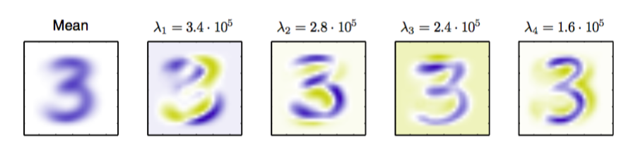
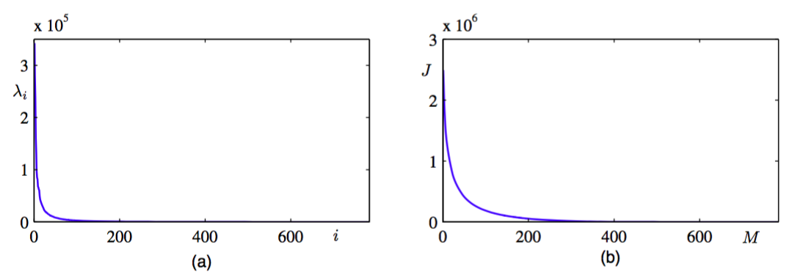
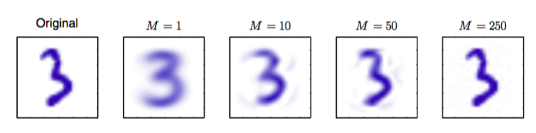
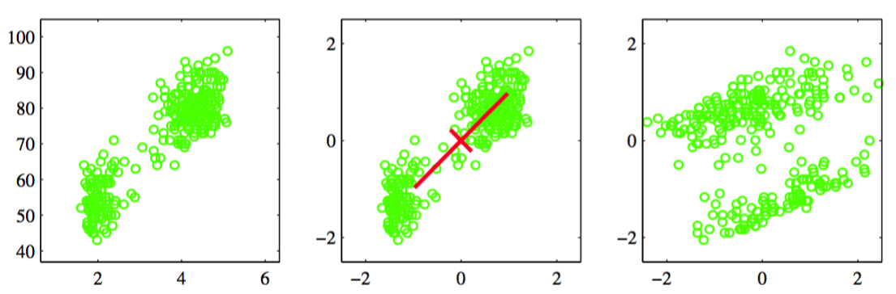
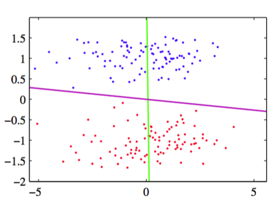
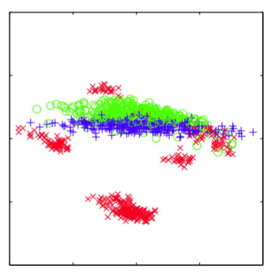

我们通过考虑离线手写数字数据集来说明PCA对于数据压缩的应用，其中我们关注与数字“3”的图像。由于协方差矩阵的每个特征向量是原始D维空间的一个向量，因此我们可以将特征向量表示为与数据点具有相同大小的图像。图12.3给出了前四个特征向量以及对应的特征值。    

      
图 12.3 对于离线手写数字数据集中的数字“3”，图中给出了均值向量$$ x $$以及前四个PCA特征向量$$ u_1,...,u_4 $$还有对应的特征值。蓝色对应于正值，白色对应于0，黄色对应于负值。

完整的特征值的图像，按照降序排序，如图12.4(a)所示。

      
图 12.4 (a)对于离线手写数字数据集里的数字“3”的特征值谱线。(b)丢弃的特征值的加和的图像，它表示将数据投影到$$ M $$维主成分子空间中引入的平方和失真$$ J $$。

选择$$ M $$的一个特定的值造成的失真度量$$ J $$由$$ M + 1 $$到$$ D $$的特征值的求和给出。对于不同的$$ M $$值，图像如图12.4(b)所示。    

如果我们将式（12.12）和（12.13）代入（12.10），我们可以写出对数据向量$$ x_n $$的PCA近似，形式为     

$$
\begin{eqnarray}
\tilde{x}_n &=& \sum\limits_{i=1}^M(x_n^Tu_i)u_i + \sum\limits_{i=M+1}^D(\bar{x}^Tu_i)u_i \tag{12.19} \\
&=& \bar{x} + \sum\limits_{i=1}^M(x_n^Tu_i - \bar{x}^Tu_i)u_i \tag{12.20}
\end{eqnarray}
$$    

其中我们使用了关系    

$$
\bar{x} = \sum\limits_{i=1}^D(\bar{x}^Tu_i)u_i \tag{12.21}
$$    

这个关系来自于$$ \{ui\} $$的完整性。这种方法表示了对数据集的一个压缩，因为对于每个数据点，我们将$$ D $$维向量$$ x_n $$替换为$$ M $$维向量，元素为$$ (x_n^Tu_i − \bar{x}^Tu_i) $$。$$ M $$的值越小，压缩的程度越大。对于手写数字数据集里的数字“3”的数据点，使用PCA重建的例子如图12.5所示。     

      
图 12.5 来自离线手写数字数据集的原始样本，以及对于不同的$$ M $$值，保留M个主成分得到的PCA重建。 随着$$ M $$的增加，重建变得越来越精确。当$$ M = D = 28 \times 28 = 784 $$时，会得到一个完美的重建。

主成分分析的另一个应用是数据预处理。在这种情况下，目标不是维度降低，而是对数据集进行变换，使得数据集的某些属性得到标准化。这对于后续将模式识别算法成功应用于数据集来说很重要。通常，当原始变量使用不同的单位进行测量，或者变化情况相当不同的时候，我们会对数据集进行这样的变换。例如，在忠老泉数据集里，两次喷发的间隔时间通常要比喷发的持续时间大若干个数量级。当我们将K均值算法应用于这个数据集时，我们首先对各个变量进行单独的重新标度，使得每个变量的均值为0，方差为单位方差。这被称为对数据的标准化（standardize），并且标准化的数据的协方差矩阵的元素为    

$$
\rho_{ij} = \frac{1}{N}\sum\limits_{n=1}^N\frac{(x_{ni}-\bar{x}_i)}{\sigma_i}\frac{(x_{nj}-\bar{x}_j)}{\sigma_j} \tag{12.22}
$$    

其中$$ \sigma_i $$是$$ x_i $$的标准差。这被称为原始数据集的相关性矩阵（correlation matrix），具有下面的性质：如果数据的两个分量$$ x_i $$和$$ x_j $$完全相关，那么$$ \rho_{ij} = 1 $$，如果它们不相关，那么$$ rho_{ij} = 0 $$。    

然而，使用PCA，我们可以对数据进行更显著的标准化，得到零均值和单位方差的数据，从而不同的变量之间的相关性关系被消除。为了完成这一点，我们首先将特征向量方程（12.17）写成下面的形式    

$$
SU = UL
$$ 

其中，$$ L $$是一个$$ D \times D $$的对角矩阵，元素为$$ \lambda_i $$，$$ U $$是一个$$ D \times D $$的正交矩阵，列为$$ u_i $$。然后对于每个数据点$$ x_n $$，我们定义一个变换，值为    

$$
y_n = L^{-1/2}U^T(x_n - \bar{x}) \tag{12.24}
$$     

其中$$ \bar{x} $$是式（12.1）定义的样本均值。很明显，集合$$ \{y_n\} $$的均值为0 ，协方差是单位矩阵 ，因为        

$$
\begin{eqnarray}
\frac{1}{N}\sum\limits_{n=1}^Ny_ny_n^T &=& \frac{1}{N}\sum\limits_{n=1}^NL^{-1/2}U^T(x_n - \bar{x})(x_n - \bar{x})^TUL^{-1/2} \\
&=& L^{-1/2}U^TSUL^{-1/2} = L^{-1/2}LL^{-1/2} = I \tag{12.25}
\end{eqnarray}
$$

这个操作被称为对数据的白化（whitening）或球形化（sphereing）。图12.6使用忠老泉数据说明了这一点。    

      
图 12.6 对忠老泉数据集进行线性预处理的效果。左图给出的原始的数据。中图给出了将各个变量标准化为零均值单位方差的结果。同时画出的还有这个归一化数据集的主轴，画出了$$ \pm\lambda 1/2 $$的范围。右图给出了对数据进行白化的结果，得到了零均值单位协方差的数据。

将PCA与4.1.4节讨论的Fisher线性判别分析进行对比是很有趣的。两种方法都可以看成线性维度降低的例子。然而，PCA是无监督的，值依赖于$$ x_n $$的值，而Fisher线性判别分析还使用了 类别标签的信息。图12.7给出的例子强调了这个区别。    

      
图 12.7 用于线性维度降低的主成分分析与Fisher线性判别分析的对比。这里，数据位于二维空间中，属于两个类别，用红色和蓝色表示。数据要被投影到一维空间中。PCA选择了最大方差的方向，由紫色直线表示，它产生了严重的类别覆盖。而Fisher线性判别分析考虑类别标签,产生了在绿色直线上的投影。 这种投影对类别的区分效果要好得多。

主成分分析的另一个常见应用是数据可视化。这里，每个数据点被投影到二维$$ (M = 2) $$的主子空间中，从而数据点$$ x_n $$被画在了一个笛卡尔坐标系中，坐标系由$$ x_n^Tu_1 $$和$$ x_n^Tu_2 $$定义，其中$$ u_1 $$和$$ u_2 $$是特征向量，对应于最大的和第二大的特征值。对于石油流数据集，这种图的一个例 子如图12.8所示。

      
图 12.8 石油流数据的可视化，通过将数据投影到前两个主成分上的方式实现。红色、蓝色和绿色点分别对应“薄片状”、“同质状”和“环状”的石油流配置。
