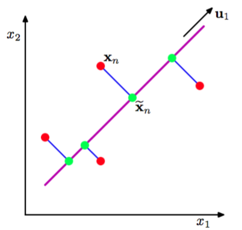

主成分分析，或称为PCA，是一种被广泛使用的技术，应用的领域包括维度降低、有损数据压缩、特征抽取、数据可视化（Jolliffe, 2002）。它也被称为Karhunen-Loeve变换。    

有两种经常使用的PCA的定义，它们会给出同样的算法。PCA可以被定义为数据在低维线性空间上的正交投影，这个线性空间被称为主子空间（principal subspace），使得投影数据的方差被最大化（Hotelling, 1933）。等价地，它也可以被定义为使得平均投影代价最小的线性投影。平均投影代价是指数据点和它们的投影之间的平均平方距离（Pearson, 1901）。正交投影的过程如图12.2所示。    

      
图 12.2 主成分分析寻找一个低维空间，被称为主子平面,用紫色的线表示，使得数据点（红点）在子空间上的正交投影能够最大化投影点（绿点）的方差。PCA的另一个定义基于的是投影误差的平方和的最小值，用蓝线表示。

我们依次讨论这些定义。
