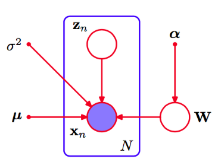
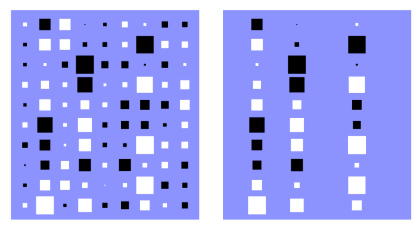
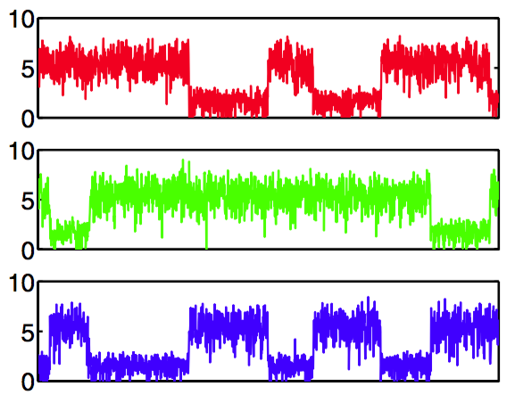

目前在我们关于PCA的讨论中，我们假定主子空间的维度$$ M $$是给定的。在实际应用中，我们必须根据应用选择一个合适的值。为了数据可视化，我们一般选择$$ M = 2 $$，而对于其他的应用，$$ M
$$的合适的选择就没有这么明显了。一种方法是画出数据集的特征值谱线，类似于离线手写数字数据集的图12.4的例子，然后看特征值是否自然地分成了两组，一组由很小的值组成，另一组由相对较大的值组成，两组之间有一个很明显的区分，表示$$ M $$的选择存在一个很自然的值。在实际应用中，这种明显的区分通常无法看到。    

由于概率PCA模型有一个具有良好定义的似然函数，因此我们可以使用交叉验证的方法，通过选择在验证数据集上的对数似然函数最大的模型来确定维度的值。然而，这种方法计算量很大，特别是如果我们考虑PCA混合概率模型时更是如此（Tipping and Bishop， 1999a）。在PCA混合概率模型中，我们要为每个混合分量单独确定合适的维度。    

我们已经有了PCA模型的概率形式，似乎寻找贝叶斯模型选择的方法是很自然的。为了完成这件事，我们需要关于合适的先验概率分布，将模型参数$$ \mu, W $$和$$ \sigma^2 $$积分出去。可以使用变分框架来近似这个无法解析求解的积分（Bishop， 1999b）。这样，由变分下界给出的边缘似然函数的值就可以在不同的$$ M $$值之间进行比较，然后选择具有最大边缘似然函数的$$ M $$值。    

这里，我们考虑一个更简单的方法，基于证据近似（evidence approximation），它适用于数据点的数量相对较大以及对应的后验概率分布有尖峰的情形（Bishop， 1999a）。它涉及到对$$ W $$上的先验概率分布的一个具体的选择，使得主子空间中多余的维度可以从模型中剪枝掉。 这对应于7.2.2节讨论的自动相关性确定（automatic relevance determination, ARD）的一个例子。 具体来说，我们在$$ W
$$的每个列上定义一个独立的高斯先验，这些列表示定义了主子空间的响亮。每个这样的高斯分布有一个独立的方差，由精度超参数$$ \alpha_i $$控制，从而    

$$
p(W|\alpha) = \prod\limits_{i=1}^M\left(\frac{\alpha_i}{2\pi}\right)^{D/2}exp\left\{-\frac{1}{2}\alpha_iw_i^Tw_i\right\} \tag{12.60}
$$    

其中$$ w_i $$是$$ W $$的第$$ i $$列。生成的模型可以使用图12.13的有向图表示。    

      
图 12.13 贝叶斯PCA的概率图模型，其中参数矩阵$$ W $$上的概率分布由超参数向量$$ \alpha $$控制。

$$ \alpha_i $$的值可以通过最大化边缘似然函数的方式迭代地求解，其中$$ W $$被积分出去。作为最优化的结果，某个$$ \alpha_i $$可能趋于无穷大，对应的参数向量$$ w_i $$趋于0（后验概率分布变成了原点处的delta函数），得到了一个稀疏解。这样，主子空间的有效的维度由有限的$$ \alpha_i $$的值确定，对应的向量$$ w_i
$$可以被认为对于数据分布的建模是“有关系的”。通过这种方式，贝叶斯方法自动地在提升数据拟合程度（使用较多的向量$$ w_i $$以及对应的根据数据调节的特征值$$ \lambda_i $$）和小模型复杂度（压制某些$$ w_i $$向量的值）之间进行了折中。这种稀疏性的来源之前在相关向量机的问题中已经讨论过。    

$$ \alpha_i $$的值在训练阶段通过最大化似然函数的方式被重新估计，形式为    

$$
p(X|\alpha,\mu,\sigma^2) = \int p(X|W,\mu,\sigma^2)p(W|\alpha)dW \tag{12.61}
$$    

其中，$$ p(X | W, \mu, \sigma^2) $$的对数由式（12.43）给出。注意，为了简化起见，我们也将$$ \mu $$和$$ \sigma^2 $$看成待估计的参数，而没有在这些参数上定义先验概率分布。    

由于积分无法直接计算，因此我们使用拉普拉斯近似。如果我们假设后验概率分布有尖峰，这种情况对于足够大的数据集确实会发生，那么重估计方程可以通过关于$$ \alpha_i $$最大化边缘似然函数的方式得到，形式为    

$$
\alpha_i^{new} = \frac{D}{w_i^Tw_i} \tag{12.62}
$$    

这可以从式（3.98）中推导出来，只需注意到$$ w_i $$的维度是$$ D $$即可。这些重新估计过程与确定$$ W $$和$$ \sigma^2 $$的EM算法的更新过程交织在一起。与之前一样，E步骤方程由式（12.54）和（12.55）给出。类似的，$$ \sigma^2 $$的M步骤方程由式（12.57）给出。在M步骤中的唯一的改变是$$ W $$的方程，它修改后的形式为    

$$
W_{new} = \left[\sum\limits_{n=1}^N(x_n - \bar{x})\mathbb{E}[z_n]^T\right]\left[\sum\limits_{n=1}^N\mathbb{E}[z_nz_n^T] + \sigma^2A\right]^{-1} \tag{12.63}
$$    

其中$$ A = diag(\alpha_i) $$。与之前一样，$$ \mu $$的值为样本均值。    

如果我们令$$ M = D − 1 $$，那么如果所有的$$ \alpha_i $$是有限值，那么模型表示一个具有完整协方差的高斯模型，而如果所有的$$ \alpha_i $$区域无穷大，那么模型等价于各向同性的高斯模型，从而模型可以涵盖主子空间的有效维度的所有可能的值。也可以考察较小的$$ M $$值，这会降低计算量，但是也限制了子空间的最大维度。这个算法与标准的概率PCA算法的对比如图12.14所示。    

      
图 12.14 矩阵$$ W $$的Hinton图，其中矩阵的每个元素被表示为一个正方形，白色表示正值，黑色表示负值，正方形的面积正比于那个元素的大小。人工生成的数据集由300个数据点构成，数据点从一个$$ D = 10 $$维的高斯分布中采样，高斯分布在3个方向上的标准差为1.0，在剩余的7个方向上的标准差为0.5。数据空间的维度为$$ D = 10 $$，在$$ M = 3 $$个方向上的方差大于剩余的7个方向上的方差。左图给出了使用最大似然方法的概率PCA的结果，右图给出了贝叶斯PCA的对应的结果。我们看到通过压制6个多余的自由度的方式来发现维度的合适的值。

贝叶斯PCA使得我们有机会来说明11.3节讨论的Gibbs采样算法。图12.15给出了对超参数$$ \ln \alpha_i $$采样的例子，数据集的维度为$$ D = 4 $$，潜在空间的维度为$$ M = 3 $$，但是数据集通过一个概率PCA模型生成，这个模型在一个方向上的方差较大，剩余方向由较低方差的噪声组成。    

      
图 12.15 用于贝叶斯PCA的吉布斯采样。图中给出了对于三个不同的$$ \alpha $$值，$$ \ln \alpha_i $$关于迭代次数的图像。可以看出在后验概率分布的三个峰值之间的变化。

结果很明显地展示了后验概率分布中三个不同峰值的存在。在每轮迭代中，一个超参数具有较小的值，剩下的两个具有较大的值，因此三个潜在变量中的两个被压制。在吉布斯采样的过程中， 解在三个峰值之间会发生很明显的转移。    

这里描述的模型仅仅涉及到矩阵$$ W $$上的先验概率分布。关于PCA的完整的贝叶斯方法，包括$$ \mu, \sigma^2, \alpha $$上的先验概率分布，以及使用变分方法的解，可以参考Bishop(1999b)。关于确定PCA模型的合适维度的不同的贝叶斯方法的讨论，可以参考Minka(2001c)。
