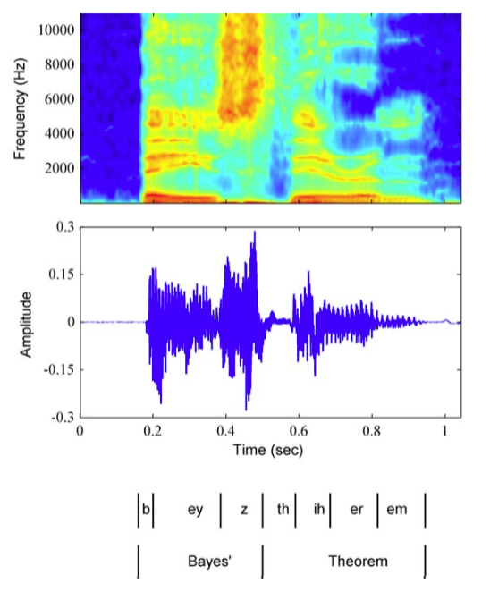

本书目前为止，我们主要的注意力集中在数据集里的数据点是独立同分布的情形。这个假设使得我们将似然函数表示为在每个数据点处计算的概率分布在所有数据点上的乘积。然而，对于许多应用来说，独立同分布的假设不成立。这里，我们考虑这样的数据集中的一个重要的类型，即描述了顺序数据的数据集。这些数据集通常产生于沿着时间序列进行的测量，例如某个特定位置的连续若干天的降水量测量，或者每天汇率的值，或对于语音识别任务，在连续的时间框架下的声学特征。图13.1给出了一个涉及到语音数据的例子。    

      
图 13.1 单词“Bayes' theorem”的声音分析图,画出了谱系数的强度与时间的关系。

顺序数据也可以在时间序列以外的问题中出现，例如一段DNA上的碱基对序列，或者一个英语句子中的字符序列。方便起见，我们有时会用“过去”观测或者“未来”观测来称呼某个观测。然而，本章中研究的模型同样适 用于所有形式的顺序数据，而不仅仅是时间序列数据。    

区分静止顺序分布和非静止顺序分布是很有用的。在静止分布中，数据会随着时间发生变化，但是生成数据的概率分布保持不变。对于更复杂的非静止分布的情形，生成概率本身会随 着时间变化。这里，我们关注的是静止分布的情形。    

对于许多应用来说，例如金融预测，我们希望能够在给定时间序列中的前一个观测值的条件下，预测下一个观测值。直觉上讲，我们会猜想，与历史的观测相比，当前的观测值会为预测 未来值提供更多的信息。图13.1的例子表明，语音谱的连续观测确实具有高度的相关性。此外，考虑未来的观测对所有之前的观测的一个一般的依赖关系是不现实的，因为这样一个模型的 复杂度会随着观测数量的增加而无限制地增长。这使得我们要考虑马尔科夫模型（Markov model），其中我们假定未来的预测仅与最近的观测有关，而独立于其他所有的观测。    

虽然这样的模型可以计算，但是仍然具有很严重的局限性。通过引入潜在变量，我们可以得到一个更加一般的框架，同时仍然保持计算上的可处理性，这就引出了状态空间模型（state space model）。与第9章和第12章一样，我们会看到复杂的模型可以从简单的成分中构建，特别地，从指数族分布中构建，并且可以使用概率图模型的框架进行描述。这里，我们关注状态空 间模型的两个最重要的例子，即隐马尔可夫模型（hidden Markov model），其中潜在变量是离散的，以及线性动态系统（linear dynamical system），其中潜在变量服从高斯分布。这两个模型都使用具有树结构（没有环）的有向图描述，这样就可以使用加-乘算法来高效地进行推断。
