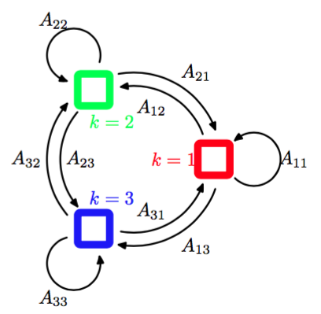
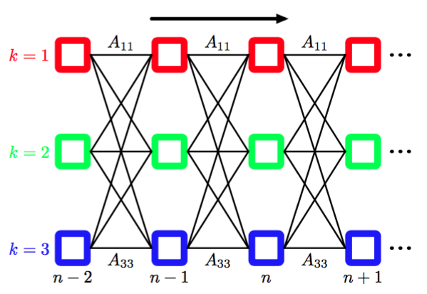
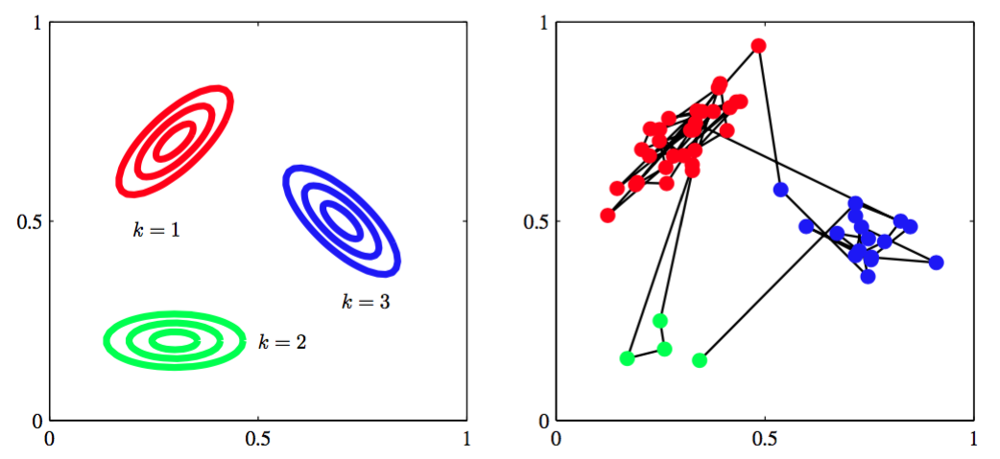
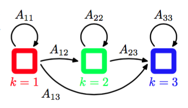
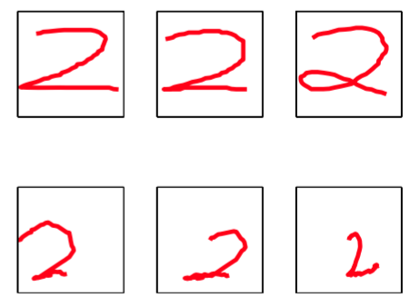

隐马尔科夫模型可以被看成图13.5所示的状态空间模型的一个具体实例，其中潜在变量是离散的。

      
图 13.5 我们可以使用潜在变量的马尔科夫链来表示顺序数据，每个观测都以对应的潜在变量的状态为条件。这个重要的图结构组成了隐马尔科夫模型和线性动态系统的基础。

然而，如果我们考察模型的一个单一的时间切片，那么我们看到它对应于一个混合概率 分布，对应的分量密度为$$ p(x|z) $$。于是，它也可以表述为混合概率模型的一个推广，其中每个观测的混合系数不是独立地选择的，而是依赖于对于前一次观测的分量的选择。HMM广泛 用于语音识别（Jelinek， 1997; Rabiner and Juang， 1993）、自然语言建模（Manning and Schütze， 1999）、在线手写识别(Nag et al.，
1986)以及生物序列（如蛋白质和DNA）的分析（Krogh et al.， 1994; Durbin et al.， 1998; Baldi and Brunak， 2001）。    

与标准的混合模型的情形相同，潜在变量是离散的服从多项式分布的变量$$ z_n $$，描述了那个混合分量用于生成对应的观测$$ x_n $$。与之前一样，比较方便的做法是使用1-of-K表示方法，就像第9章那样。我们现在让$$ z_n $$的概率分布通过条件概率分布$$ p(z_n | z_{n−1}) $$对前一个潜在变量$$ z_{n−1}
$$产生依赖。由于潜在变量是K维二值变量，因此条件概率分布对应于数字组成的表格，记作$$ A $$，它的元素被称为转移概率（transition prob abilities）。元素为$$ A_{jk} \equiv p(z_{nk} = 1|z_{n−1}, j = 1) $$。由 于它们是概率值，因此满足$$ 0 \leq A_{jk} \leq 1 $$且$$ \sum_k A_{jk} = 1 $$，从而矩阵$$ A $$有$$ K(K − 1) $$个独立的参数。这样，我们可以显式地将条件概率分布写成    

$$
p(z_n|z_{n-1},A) = \prod\limits_{k=1}^K\prod\limits_{j=1}^KA_{jk}^{z_{n-1, j}z_{nk}} \tag{13.7}
$$    

初始潜在结点$$ z_1 $$很特别，因为它没有父结点，因此它的边缘概率分布$$ p(z_1) $$由一个概率向量$$ \pi $$表示，元素为$$ \pi_k \equiv p(z_{1k} = 1) $$，即    

$$
p(z_1 | \pi) = \prod\limits_{k=1}^K\pi_k^{z_{1k}} \tag{13.8}
$$    

其中$$  \sum_k\pi_k = 1 $$。     

有时可以将状态画成状态转移图中的一个结点，这样就可以图形化地表示出转移矩阵。图13.6给出了K = 3的情形。    

      
图 13.6 转移图表示一个模型，它的潜在变量有三种可能的状态，对应于三个方框。黑线表示转移矩阵的元素$$ A_{jk} $$。

注意，这不是一个概率图模型，因为结点不是单独的变量而是一个变量的各个状态，因此我们用方框而不是圆圈来表示状态。    

有时比较有用的做法是将图13.6所示的状态转移图在时间上展开。这给出了潜在变量之间转移的另一种表示方法，被称为晶格图（lattice diagram）或格子图（trellis diagram）。图13.7给出了隐马尔科夫模型的晶格图。    

      
图 13.7 如果我们将图13.6所示的状态转移图在时间上展开，那么我们旧得到了潜在状态的晶格图表示或格子图表示。图的每一列对应于一个潜在变量$$ z_n $$。

可以通过定义观测变量的条件概率分布$$ p(x_n| z_n,\psi) $$来确定一个概率模型，其中$$ \psi $$是控制概率分布的参数集合。这些条件概率被称为发射概率(emission probabilities)，可以是例如（9.11）这样的高斯分布（$$ x $$是连续变量），也可以是条件概率表格（$$ x $$是离散变量）。由于$$ x_n $$是观测值，因此对于一个给定的$$ \psi $$值，概率分布$$ p(x_n|z_n,\psi) $$由一个$$ K $$维的向量组成，对应于二值向量$$ z_n $$的$$ K $$个可能的状态。我们可以将发射概率表示为    

$$
p(x_n|z_n,\psi) = \prod\limits_{k=1}^Kp(x_n|\phi_k)^{z_{nk}} \tag{13.9}
$$    

我们将注意力集中在同质的（homogeneous）模型上，其中所有控制潜在变量的条件概率分布都共享相同的参数$$ A $$，类似地所有发射概率分布都共享相同的参数$$ \psi $$（推广到更一般的情形很容易）。注意，对于一个独立同分布的数据集，一个混合模型对应于参数$$ A_{jk} $$对于所有的$$ j $$值都相同的情况，从而条件概率分布$$ p(z_n|z_{n−1}) $$与$$ z_{n−1} $$无关。这对应于将图13.5所示的图模型中的水平链接都删除。    

从而观测变量和潜在变量上的联合概率分布为    

$$
p(X,Z|\theta) = p(z_1|\pi)\left[\prod\limits_{n=2}^N p(z_n|z_{n−1},A)\right]\prod\limits_{m=1}^Np(x_m|z_m,\phi) \tag{13.10}
$$    

其中$$ X = \{x_1,...,x_N\}, Z = \{z_1,...,z_N\} $$和$$ \theta = \{\pi,A,\psi\} $$表示控制模型参数的集合。我们关于隐马尔科夫模型的大部分讨论与发射概率的特定选择无关。事实上，模型对于一大类发射概率的选择都是可以计算的，包括离散表格、高斯以及混合高斯。也可以利用判别式模型例如神经网络。这些可以用来直接对发射概率密度$$ p(x|z) $$建模，也可以用来给出$$ p(z|x)
$$的一个表达式，这个表达式可以使用贝叶斯定理转化为所需的发射概率密度$$ p(x|z) $$（Bishop et al.，2004）。    

从生成式的观点考虑隐马尔科夫模型，我们可以更好地理解隐马尔科夫模型。回忆一下，为了从一个混合高斯分布中生成样本，我们首先随机算侧一个分量，选择的概率为混合系数$$ \pi_k $$，然后从对应的高斯分量中生成一个样本向量$$ x $$。这个过程重复$$ N $$次，产生$$ N $$个独立样本组成的数据集。在隐马尔科夫模型的情形，这个步骤修改如下。首先我们选择初始的潜在变量$$ z_1 $$，概率由参数$$ \pi_k $$控制，然后采样对应的观测$$ x_1
$$。现在我们使用已经初始化的$$ z_1 $$的值，根据转移概率$$ p(z_2|z_1) $$来选择变量$$ z_2 $$的状态。从而我们以概率$$ A_{jk} $$选择$$ z_2 $$的状态$$ k $$，其中$$ k = 1,...,K $$。一旦我们知道了$$ z_2 $$，我们就可以对$$ x_2 $$采样，从而也可以对下一个潜在变量$$ z_3 $$采样，以此类推。这是有向图模型的祖先采样的一个例子。例如，如果我们有一个模型，其中对角转移元素$$ A_{kk} $$比非对角的元素大得多，那么一个典型的数据序列中，会有连续很长的一系列点由同一个概率分布生成，而从一个分量转移到另一个分量不会经常发生。图13.8说明了从隐马尔科夫模型生成样本的过程。    

      
图 13.8 从一个隐马尔科夫模型中进行采样的例子，这个模型的潜在变量z有三个状态，发射概率$$ p(x|z) $$是高斯概率，其中$$ x $$是二维的。(a)发射概率密度为常数的轮廓线，对应于潜在变量的三个状态。(b)从隐马尔科夫模型中抽取的50个样本点，数据点的颜色对应于生成它们的分量的颜色，数据点之间的连线表示连续的观测。这里，转移矩阵是固定的。在任何状态，都有5%的概率转移到每个其他的状态，有90%的概率保持相同的状态。

这个标准的HMM模型有很多变体，例如可以通过对转移矩阵$$ A $$的形式进行限制的方式进行限制（Rabiner， 1989）。这里我们介绍一种在实际应用中很重要的变体，被称为从左到右HMM（left-to-right HMM），它将$$ A $$中$$ k < j $$的元素$$ A_{jk} $$设置为0。图13.9给出了具有三个状态的这种HMM变体的状态转移图。    

      
图 13.9 三状态隐马尔科夫模型的状态转移图的例子。注意，一旦离开了某个状态，就无法再次回到这个状态。

通常对于这种模型，初始状态概率$$ p(z_1) $$被修改，使得$$ p(z_{11}) = 1 $$且$$ p(z_{1j}) = 0, j \neq 1 $$，也就是说，每个序列被限制为从状态$$ j = 1 $$开始。转移矩阵可以进一步被限制，来确保状态的下标不会发生过大的变化，即如果$$ k > j + \Delta $$，那么$$ A_{jk} = 0 $$。 图13.10给出了这种模型的晶格图。    

      
图 13.10 三状态从左到右HMM的晶格图，其中状态下标$$ k $$在每轮迭代时最多允许加1。

隐马尔科夫模型的许多应用，例如语音识别或在线字符识别都使用了这种从左到右的结构。作为从左到右隐马尔科夫模型的一个例子，我们考虑手写数字识别的一个例子。这个例子使用在线的数据，即每个手写数字由钢笔的轨迹与时间的函数表示，函数的形式是钢笔坐标的一个序列，这与附录A介绍的离线手写数字的例子不同，那个数据集由二维像素化的图像组成。图13.11给出了在线手写数字的例子。     

      
图 13.11 第一行：在线手写数字的例子。第二行：生成式地采样得到的数字，模型时一个从左到右的隐马尔科夫模型，在45个手写数字组成的数据集上进行训练。

这里，我们在由45个数字“2”的例子组成的数据子集上训练一 个马尔科夫模型。有$$ K = 16 $$种状态，每个状态可以生成可以生成固定长度的线段，它具有16种可能的角度中的一个，因此发射概率是一个$$ 16 \times 16 $$的概率表，与每个状态下标的值所允许的角度值相关联。除了那些使得状态下标$$ k $$不变或加$$ 1 $$的转移概率之外，其他的转移概率全部被设置为0。模型使用了25轮的EM迭代进行最优化。通过生成式地运行这个算法，我们可以获得对模型的一些更深刻的认识，如图13.11所示。    

隐马尔科夫模型的一个强大的性质是它对于时间轴上局部的变形（压缩和拉伸）具有某种程度的不变性。为了理解这一点，考虑在线手写数字例子中，数字“2”的书写方式。一个通常的手写数字由两个不同的部分组成，两个部分连接处有一个转折点。数字的第一部分从左上方开始，有一个光滑的圆弧，然后向下到转折点，或者在左下角转一个圈，接下来是第二个近似于直线的部分，扫到右下方。书写风格的自然的变化会使得这两个部分的相对大小发生变化。从生成式的观点来看，这种变化可以整合到隐马尔科夫模型中，方法是改变状态模型中保持在同一个状态的转移的数量和在连续的状态之间转移的数量。但是注意，如果数字“2”用相反的顺序书写，即从右下角开始，结束于左上角，那么即使笔迹的坐标与训练集里的一个例子完全相同，在这个模型下的观测的概率会非常小。在语音识别的问题中，对时间轴的变形与语速的自然变化相关，隐马尔科夫模型可以适应这种变形，不会对这种变形赋予过多的惩罚。
