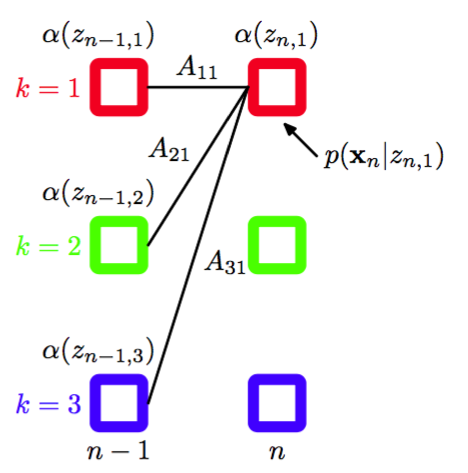
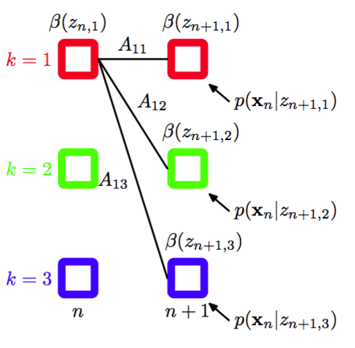

接下来我们寻找计算$$ \gamma(z_{nk}) $$和$$ \xi(z_{n−1,j}, z_{nk})
$$的高效的方法，对应于EM算法中的E步骤。图13.5给出的隐马尔科夫模型的图表示是一棵树，因此我们知道潜在变量的后验概率分布可以使用两阶段的信息传递算法高效地求出。在隐马尔可夫模型这一特定的问题中，这个被称为前向后向算法（forward-backward）算法（Rabiner，1989），或Baum-Welch算法（Baum，1972）。事实上，基本算法有几种变体，每个变体都可以根据沿着链传播的信息的精确形式，得到精确的边缘概率（Jordan，
2007）。我们会关注这些变体中使用最广泛的一个，被称为alpha-beta算法。    

前向后向算法除了本身具有重要的实际应用价值以外，还很好地说明了之前章节中介绍的许多概念。因此我们在本节中会给出前向后向算法的一个“传统的”推导，使用概率的加法和乘积规则，并且利用由d-划分从对应的图模型中得到的条件独立性质。之后在13.2.3节，我们会看到前向后向算法如何作为8.4.4节讨论的加-乘算法的一个具体事例的方式简单地得到。    

值得强调的是，潜在变量的后验概率分布的计算与发射概率密度$$ p(x|z) $$的形式无关，事实上与观测变量是连续的或者离散的也无关。我们所需要的全部东西是对于所有$$ n $$的每个$$ z_n $$值的概率$$ p(x_n | z_n) $$。并且，在本节和下一节中，我们会省略对于模型参数$$ \theta^{old} $$的显式依赖关系，因为模型参数始终是固定的。    

首先，我们写出下面的条件独立性质(Jordan， 2007)。    

$$
\begin{eqnarray}
p(X|z_n) &=& p(x_1,...,x_n|z_n)p(x_{n+1},...,x_N|z_n) \tag{13.24} \\
p(x_1,...,x_{n-1}|x_n,z_n) &=& p(x_1,...,x_{n-1}|z_n) \tag{13.25} \\
p(x_1,...,x_{n-1}|z_{n-1},z_n) &=& p(x_1,...,x_{n-1}|z_{n-1}) \tag{13.26} \\
p(x_{n+1},...,x_N|z_n,z_{n+1}) &=& p(x_{n+1},...,x_N|z_{n+1}) \tag{13.27} \\
p(x_{n+2},...,x_N|z_{n+1},x_{n+1}) &=& p(x_{n+2},...,x_N | z_{n+1}) \tag{13.28} \\
p(X|z_{n−1},z_n) &=& p(x_1,...,x_{n−1}|z_{n−1})p(x_n|z_n)p(x_{n+1},...,x_N|z_n) \tag{13.29} \\
p(x_{N+1}|X, z_{N+1}) &=& p(x_{N+1}|z_{N+1}) \tag{13.30} \\
p(z_{N+1}|z_N, X) = p(z_{N+1}, z_N) \tag{13.31} 
\end{eqnarray}
$$    

其中$$ X = \{x_1,...,x_n\} $$。这些关系很容易使用d-划分证明。例如在第二个结果中，我们注意到结点$$ x_1,...,x_{n−1} $$中的任何一个结点到结点$$ x_n $$的路径都要通过结点$$ z_n $$，它被观测到。由于所有这种路径都是头到尾的，因此这个条件独立性质一定成立。作为d-划分的一个练习，读者应该花一些时间验证每一条性质。这些关系也可以使用概率的加法和乘积规则，从隐马尔科夫模型的联合概率分布中直接证明，但是麻烦得多。    

首先让我们计算$$ \gamma(z_{nk}) $$。回忆一下，对于离散的服从多项式分布的随机变量，分量的期望值就是这个分量的值为1的概率。因此我们感兴趣的是在给定观测数据$$ x_1,...,x_n $$的条件下，计算$$ z_n $$的后验概率分布$$ p(z_n |x_1,...,x_n) $$。这表示一个长度为$$ K $$的向量，它的项对应于$$ z_{nk} $$的期望值。使用贝叶斯定理，我们有    

$$
\gamma(z_n) = p(z_n|X) = \frac{p(X|z_n)p(z_n)}{p(X)} \tag{13.32}
$$    

注意，分母$$ p(X) $$隐式的以HMM的参数$$ \theta^{old} $$为条件，因此表示似然函数。使用条件独立性质 (13.24)，以及概率的加法和乘积规则，我们有    

$$
\gamma(z_n) = \frac{p(x_1,...,x_n,z_n)p(x_{n+1},...,x_N|z_n)}{p(X)} = \frac{\alpha(z_n)\beta(z_n)}{p(X)} \tag{13.33}
$$    

其中我们定义了    

$$
\begin{eqnarray}
\alpha(z_n) \equiv p(x_1,...,x_n,z_n) \tag{13.34} \\
\beta(z_n) \equiv p(x_{n+1},...,x_N|z_n) \tag{13.35}
\end{eqnarray}
$$    

$$ \alpha(z_n) $$表示观测到时刻$$ n $$及其之前时刻的所有数据和$$ z_n $$的值的联合概率，而$$ \beta(z_n) $$表示在给定$$ z_n $$的条件下，从时刻$$ n + 1 $$到$$ N $$的所有未来数据的条件概率。与之前一样，$$ \alpha(z_n) $$和$$ \beta(z_n) $$都表示$$ K $$个数字组成的集合，每个数字都对应于二值向量$$ z_n $$的“1-of-K”表示方法的一个可能的配置。我们使用$$ \alpha(z_{nk}) $$表示$$ z_{nk} = 1 $$时$$ \alpha(z_n) $$的值，对于$$ \beta(z_{nk}) $$也有类似的含义。    

我们现在推导能够高效计算$$ \alpha(z_n) $$和$$ \beta(z_n) $$的递归关系。与之前一样，我们使用条件独立性质，尤其是（13.25）和（13.26），以及加和规则和乘积规则，得到用$$ \alpha(z_{n−1}) $$表示的$$ \alpha(z_n) $$，如下所述。     

$$
\begin{eqnarray}
\alpha(z_n) &=& p(x_1,...,x_n,z_n) \\
&=& p(x_1,...,x_n|z_n)p(z_n) \\
&=& p(x_n|z_n)p(x_1,...,x_{n-1}|z_n)p(z_n) \\
&=& p(x_n|z_n)p(x_1,...,x_{n-1},z_n) \\
&=& p(x_n|z_n)\sum\limits_{z_{n-1}}p(x_1,...,x_{n-1},z_{n-1},z_n) \\
&=& p(x_n|z_n)\sum\limits_{z_{n-1}}p(x_1,...,x_{n-1},z_n|z_{n-1})p(z_{n-1}) \\
&=& p(x_n|z_n)\sum\limits_{z_{n-1}}p(x_1,...,x_{n-1}|z_{n-1})p(z_n|z_{n-1})p(z_{n-1}) \\
&=& p(x_n|z_n)\sum\limits_{z_{n-1}}p(x_1,...,x_{n-1},z_{n-1})p(z_n|z_{n-1})
\end{eqnarray}
$$     

使用式（13.34）给出的$$ \alpha(z_n) $$的定义，得到    

$$
\alpha(z_n) = p(x_n|z_n)\sum\limits_{z_{n-1}}\alpha(z_{n-1})p(z_n|z_{n-1}) \tag{13.36}
$$     

值得花时间仔细研究一下这个递归的关系。注意，求和式中有$$ K $$项，右侧必须对$$ z_n $$的$$ K $$个值中的每一个进行计算，因此$$ \alpha $$递归的每一步的计算代价为$$ O(K^2) $$。图13.12用晶格图说明了$$ \alpha(z_n) $$的递归方程。

      
图 13.12 计算$$ \beta $$变量的后向递归方程（13.38）的说明。在这个晶格图片段中，我们看到$$ \beta(z_n,1) $$的计算方式是将$$ n + 1 $$步的$$ \beta(z_{n+1}) $$的元素$$ \beta(z_{n+1},k) $$加权求和，权值为$$ A_{ik} $$（对应于$$ p(z_{n+1}|z_n) $$）与发射概率密度$$ p(x_n|z_{n+1},k) $$的对应值的乘积。

为了开始这个递归过程，我们需要一个初始条件，形式为    

$$
\alpha(z_1) = p(x_1,z_1) = p(z_1)p(x_1|z_1) = \prod\limits_{k=1}^K\{\pi_kp(x_1|\phi_k)\}^{z_{1k}} \tag{13.37}
$$     

这表明对于$$ k = 1,...,K $$，$$ \alpha(z_{1k}) $$的值为$$ \pi_kp(x_1 | \psi_k) $$。从链的第一个结点开始，我们可以沿着链计算每个潜在结点的$$ \alpha(z_n) $$。由于递归的每一步涉及到与一个$$ K \times K $$的矩阵相乘，因此计算整个链的这些量的整体代价是$$ O(K^2N) $$。    

类似地我们可以使用条件独立性质（13.27）和（13.28）得到$$ \beta(z_n) $$的递归关系，即    

$$
\begin{eqnarray}
\beta{z_n} &=& p(x_{n+1},...,x_N|z_n) \\
&=& \sum\limits_{z_{n+1}}p(x_{n+1},...,x_N,z_{n+1}|z_n) \\
&=& \sum\limits_{z_{n+1}}p(x_{n+1},...,x_N|z_n,z_{n+1})p(z_{n+1}|z_n) \\
&=& \sum\limits_{z_{n+1}}p(x_{n+1},...,x_N|z_{n+1})p(z_{n+1}|z_n) \\
&=& \sum\limits_{z_{n+1}}p(x_{n+1},...,x_N|z_{n+1})p(z_{n+1}|z_{n+1})p(z_{n+1}|z_n) \\
\end{eqnarray}
$$    

使用公式（13.35）给出的$$ \beta(z_n) $$的定义，得到    

$$
\beta(z_n) = \beta(z_{n+1})p(x_{n+1}|z_{n+1})p(z_{n+1}|z_n) \tag{13.38}
$$    

注意，在这种情况下，我们得到了一个后向信息传递算法，它根据$$ \beta(z_{n+1}) $$计算$$ \beta(z_n) $$。在每一步中，我们通过发射概率$$ p(x_{n+1}|z_{n+1}) $$将观测$$ x_{n+1} $$的效果吸收进来，然后对$$ z_{n+1} $$求和。图13.13说明了这个过程。    

      
图 13.13 计算$$ \beta $$变量的后向递归方程（13.38）的说明。在这个晶格图片段中，我们看到$$ \beta(z_n,1) $$的计算方式是将$$ n + 1 $$步的$$ \beta(z_{n+1}) $$的元素$$ \beta(z_{n+1},k) $$加权求和，权值为$$ A_{ik} $$（对应于$$ p(z_{n+1}|z_n) $$)与发射概率密度$$ p(x_n|z_{n+1},k) $$的对应值的乘积。

与之前一样，我们需要一个递归的起始条件，即$$ \beta(z_n) $$的一个值。可以这样获得：令式（13.33）中的$$ n = N $$，然后使用定义（13.34）代替$$ \alpha(z_n) $$，可得    

$$
p(z_N|X) = \frac{p(X,z_N)\beta(z_N)}{p(X)} \tag{13.39}
$$    

只要我们对于所有的$$ z_n $$都有$$ \beta(z_n ) = 1 $$，这个结果就是正确的。     

在M步方程中，$$ p(X) $$可以消去。例如，（13.20）给出$$ \mu_k $$的M步骤方程的形式为     

$$
\mu_k = \frac{\sum\limits_{n=1}^n\gamma(z_{nk})x_n}{\sum\limits_{n=1}^n\gamma(z_{nk})} = \frac{\sum\limits_{n=1}^n\alpha(z_{nk})\beta(z_{nk})x_n}{\sum\limits_{n=1}^n\alpha(z_{nk})\beta(z_{nk})} \tag{13.40}
$$     

然而，$$ p(X) $$表示似然函数，我们通常在EM优化过程中能够监视它的值，因此能够计算出这个值是很有用的。如果我们将(13.33)的两侧对$$ z_n $$求和，使用左侧是一个归一化分布的事实，我们有     

$$
p(X) = \sum\limits_{z_n}\alpha(z_n)\beta(z_n) \tag{13.41}
$$    

因此我们可以任意选择方便的$$ n $$，通过计算这个求和式计算似然函数。例如，如果我们只希望计算似然函数，那么我们可以从链的起点到终点运行$$ \alpha $$的递归过程，然后使用$$ n = N $$的结果，利用$$ \beta(z_n ) $$是一个元素全部为$$ 1 $$的向量这一事实。在这种情况下，$$ \beta $$递归不再需要，从而我们有     

$$
p(X) = \sum\limits_{z_N}\alpha(z_N) \tag{13.42}
$$    

让我们花一些时间考察$$ p(X) $$的这个结果的意义。回忆一下，为了计算似然函数，我们应该 在Z的所有可能值上对联合概率分布$$ p(X, Z) $$求和。每个这样的值表示每个时间步骤下对隐含状态的一个特定的选择，换句话说，求和式中的每一项都是晶格图中的一个路径，并且回忆一 下，这种路径有指数多条。通过将似然函数表示为（13.42）的形式，我们将计算代价从关于链长度的指数量级减小到了线性量级，方法是交换了加和与乘积的顺序，从而在每个时间步骤$$ n
$$中，我们对通过每个状态$$ z_{nk} $$的所有路径的贡献进行求和，得到了中间的量$$ \alpha(z_n) $$。    

接下来我们考虑$$ \xi(z_{n−1}, z_n) $$的计算，它对应于$$ (z_{n−1}, z_n) $$的$$ K \times K $$个配置下的每一个配置的条件概率$$ p(z_{n−1}, z_n|X) $$的值。使用$$ \xi(z_{n−1}, z_n) $$的定义，应用贝叶斯定理，我们有    

$$
\begin{eqnarray}
\xi(z_{n-1},z_n) &=& p(z_{n-1},z_n|X) \\
&=& \frac{p(X|z_{n-1},z_n)p(z_{n-1},z_n)}{p(X)} \\
&=& \frac{p(x_1,...,x_{n−1}|z_{n−1})p(x_n|z_n)p(x_{n+1},...,x_N|z_n)p(z_n|z_{n−1})p(z_{n−1})}{p(X)} \\
&=& \frac{\alpha(z_{n−1})p(x_n|z_n)p(z_n|z_{n−1})\beta(z_n)}{p(X)} \tag{13.43}
\end{eqnarray}
$$    

其中我们已经使用了条件独立性质（13.29）以及式（13.34）和（13.35）给出的$$ \alpha(z_n) $$和$$ \beta(z_n) $$的定义。因此我们可以使用$$ \alpha $$和$$ \beta $$的递归结果直接计算$$ \xi(z_n−1, z_n) $$。    

让我们总结一下使用EM算法训练隐马尔科夫模型所需的步骤。首先，我们需要进行对参数$$ \theta^{old} $$进行一个初始的选择，其中$$ \theta \equiv (\pi, A, \psi) $$。参数$$ A $$和$$ \pi $$要么均匀的初始化，要么从一个均匀分布中随机初始化（满足非负限制与加和限制）。参数$$ \psi $$的初始化依赖于概率分布的形式。对于高斯分布的情形，参数$$ \mu_k $$可以通过对数据使用K均值算法进行初始化，$$
\Sigma_k $$可以使用对应的K均值聚类的协方差矩阵初始化。然后我们运行前向$$ \alpha $$递归过程和后向$$ \beta $$递归过程，使用这些结果计算$$ \gamma(z_n) $$和$$ \xi(z_{n−1}, z_n) $$。在这个阶段，我们也可以计算似然函数。这完成了E步骤，然后我们使用这个结果，使用13.2.1节的M步骤方程找到一个修正参数$$ \theta^{new} $$。然后我们继续交替进行E步骤和M步骤，直到满足某些收敛准则，例如似然函数的变化低于某个阈值。    

注意，在这些递归关系中，观测只出现在条件概率分布$$ p(x_n | z_n) $$中。因此，递归过程与观测变量的种类和维度无关，也于这个条件概率的形式无关，只要对于$$ z_n $$的$$ K $$种可能状态的每一个，这个概率的值可以计算即可。    

在之前的章节中，我们已经看到，当数据点的数量相对于参数的数量来说较大的时候，最大似然方法最有效。这里，我们注意到，使用最大似然方法，隐马尔可夫模型可以高效地训练，只要训练的序列足够长。我们还可以使用多个较短的序列，这需要对隐马尔可夫模型EM算法进行一些简单的修改。在从左到右模型的情况下，这特别重要，因为在一个给定的观测序列中， 对应于A的非对角元素的给定的状态转移最多出现一次。    

我们感兴趣的另一个量是预测分布，其中观测数据是$$ X = \{x_1,...,x_n\} $$，我们希望预测$$ x_{n+1} $$，这对于诸如金融预测这种实时的应用来说很重要。与之前一样，我们使用加法和乘积规则以及条件独立性质（13.30）和（13.31），可得    

$$
\begin{eqnarray}
p(x_{N+1}|X) &=& \sum\limits_{z_{N+1}}p(x_{N+1},z_{N+1}|X) \\
&=& \sum\limits_{z_{N+1}}p(x_{N+1}|z_{N+1})p(z_{N+1}|X) \\
&=& \sum\limits_{z_{N+1}}p(x_{N+1}|z_{N+1})\sum\limits_{z_N}p(x_{N+1},z_N|X) \\
&=& \sum\limits_{z_{N+1}}p(x_{N+1}|z_{N+1})\sum\limits_{z_N}p(x_{N+1}|z_N)p(z_N|X) \\
&=& \sum\limits_{z_{N+1}}p(x_{N+1}|z_{N+1})\sum\limits_{z_N}p(x_{N+1}|z_N)\frac{p(z_N,X)}{p(X)} \\
&=& \frac{1}{p(X)}\sum\limits_{z_{N+1}}p(x_{N+1}|z_{N+1})\sum\limits_{z_N}p(x_{N+1}|z_N)\alpha(z_N) \tag{13.44}
\end{eqnarray}
$$    

这可以通过首先运行前向$$ \alpha $$递归然后计算最后一个式子中关于$$ z_n $$和$$ z_{n+1} $$的求和式的方式得到。第一项关于$$ z_n $$的求和式可以被存储起来，一旦$$ x_{n+1} $$被观测到，就可以用来运行$$ \alpha $$递归的前向步骤，进行到下一步，来预测接下来的值$$ x_{n+2} $$。注意，在（13.44）中，从$$ x_1 $$和$$ x_n $$的所有数据的影响被聚集到了$$ \alpha(z_n) $$的$$ K $$个值当中。因此预测分布可以使用固定量的存储空间向前推进无穷多次，这正是实时应用所要求的。    

这里，我们已经讨论了使用最大似然方法估计HMM的参数。这个框架很容易推广到正则化的最大似然函数，方法是引入模型参数$$ \pi, A $$和$$ \psi $$上的先验概率分布，然后通过最大化后验概率的方式估计参数的值。这个也可以使用EM算法计算，其中E步骤与上面的讨论相同，M步骤在最大化之前给似然函数$$ Q(\theta, \theta^{old}) $$加上先验概率分布$$ p(\theta)
$$的对数，可以直接应用本书讨论的多种方法进行求解。此外，我们可以使用变分方法，得到HMM的一个纯粹的贝叶斯方法，其中我们对参数概率分布进行积分或求和（MacKay， 1997）。与最大似然方法相同，这产生了一个两遍的前向后向递归的过程来计算后验概率分布。    
