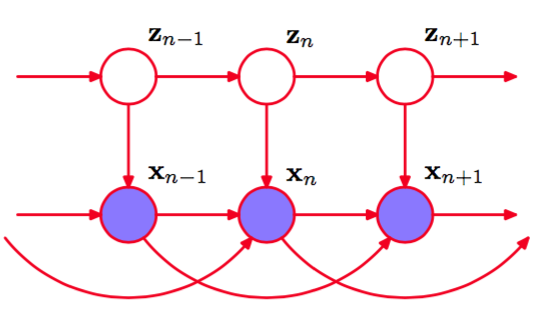
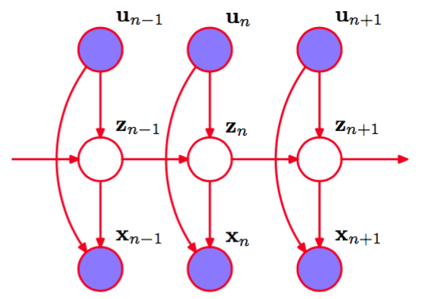
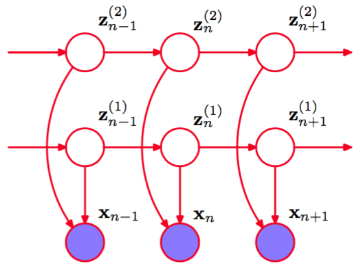
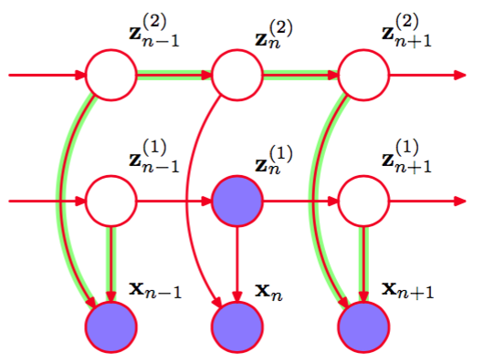

基本的隐马尔科夫模型以及基于最大似然方法的标准训练算法已经通过很多种方式进行了扩展，来满足特定应用的需求。这里，我们讨论几个更重要的例子。    

我们从图13.11的手写数字的例子中可以看到，隐马尔可夫模型对于数据来说，是一个相当差的生成式模型，因为许多人工生成的数字对于训练集来说看起来相当不具有代表性。如果目标是序列分类，那么在确定隐马尔科夫模型的参数时，使用判别式方法而不是最大似然方法会产生很多好处。假设我们有一个训练集，由R个观测序列$$ X_r $$组成，其中$$ r = 1,...,R $$，每个序列根据它的类别$$ m $$进行标记，其中$$ m =
1,...,M $$。对于每个类别，我们有一个独立的隐马尔可夫模型，它的参数为$$ \theta_m $$，我们将确定参数值的问题看成标准的分类问题，其中我们想最优化交叉熵    

$$
\sum\limits_{r=1}^R\ln p(m_r|X_r) \tag{13.72}
$$    

使用贝叶斯定理，这个可以使用与隐马尔可夫模型相关联的序列概率表示，即    

$$
\sum\limits_{r=1}^R\ln \left\{\frac{p(X_r|\theta_r)p(m_r)}{\sum\limits_{l=1}^Mp(X_r|\theta_r)p(l_r)}\right\} \tag{13.73}
$$    

其中$$ p(m) $$是类别$$ m $$的先验概率。对这个代价函数的最优化比最大化似然函数更复杂（Kapadia， 1998），特别的，为了计算式（13.73）的分母，这种方法需要每个训练序列在每个模型下进行计算。隐马尔科夫模型加上判别式的训练方法在语音识别中广泛应用（Kapadia， 1998）。    

隐马尔科夫模型的一个很大的缺点是，系统保持在一个给定的状态下，模型对于时间分布的表示方法。为了说明这个问题，我们注意到，从一个给定的隐马尔科夫模型中采样到一个序列，这个序列在状态$$ k $$恰好花费了$$ T $$个步骤，然后转移到了一个不同的状态，这种情形出现的概率为    

$$
p(T) = (A_{kk})^T(1 - A_{kk}) \proto exp(T\ln A_{kk}) \tag{13.74}
$$     

因此它是$$ T $$的一个指数衰减的函数。对于许多应用，这对于状态持续时间来说是一个相当不现实的模型。问题可以这样解决：直接对状态持续时间建模，其中对角系$$ A_{kk} $$全部被设置为0，每个状态$$ k $$显式的与可能的持续时间的概率分布$$ p(T|k) $$相关联。从生成式的观点来看，当 系统进入状态$$ k $$时，表示系统保持在状态$$ k $$的时间数$$ T $$会从$$ p(T|k) $$中抽取 。模型之后发射出观测变量$$ x_t
$$的$$ T $$个值，这通常被假定为独立的，从而对应的发射概率分布为$$ \prod_{t=1}^Tp(x_t|k) $$。这种方法需要对EM最优化步骤进行简单的修改（Rabiner，1989）。    

标准HMM的另一个局限性是它在描述观测变量的长距离相关性（被许多时间步骤分开的变量的相关性）时，效果很差，因为这些相关性必须被隐含状态的一阶马尔科夫链所调解。长距离的效果原则上可以通过在图13.5所示的图模型中添加额外链接的方式被包含到模型中。一种解决的办法是将HMM进行推广，得到了自回归隐马尔科夫模型（autoregressive hidden Markov model）（Ephraim et al.，
1989)。图13.17给出了这个模型的一个例子。    

      
图 13.17 自回归隐马尔可夫模型的一部分，其中，观测$$ x_n $$的概率分布依赖于之前的观测的子集以及隐状态$$ z_n $$。在这个例子中，$$ x_n $$的分布依赖于两个之前的观测$$ x_{n−1} $$和$$ x_{n−2} $$。

对于离散的观测来说，这对应于将发射概率分布的条件概率表进行扩展。在高斯发射概率密度的情形下，我们可以使用线性高斯的框架，其中，给定前一个观测的值以及$$ z_n $$的值的条件下，$$ x_n
$$的条件概率分布是一个高斯分布，均值为条件变量值的一个线性组合。很明显，图中附加的链接必须被限制，避免自由参数的数量过多。在图13.17给出的例子中，每个观测依赖于前两个观测变量以及隐含状态。虽然这个图看起来很短，但是我们再次采用d-划分，可以看到，事实上，它有一 个简单的概率结构。特别的，如果我们假设以zn为条件，那么我们看到，与标准的HMM相同，$$ z_{n−1} $$和$$ z_{n+1} $$的值是独立的，对应于条件独立性质(13.5)。这很容易验证。我们注意到，每个从结点$$ z_{n−1} $$到结点$$
z_{n+1} $$的路径都要穿过至少一个关于那条路径头到尾连接的观测结点。从而，在EM算法的E步骤中，我们可以再次使用前向后向递归，确定潜在变量的后验概率分布，计算时间与链的长度是线性关系。类似地，M步骤值涉及到对标准的M步骤方程的一个微小的修改。在高斯发射密度的情形下，这涉及到使用第3章讨论的标准线性回归方程估计参数。    

我们已经看到，当我们使用图模型时，自回归HMM可以看成标准HMM的一个很自然的扩展。事实上，概率图模型的观点会产生基于HMM的相当多种不同的图结构。另一个例子是输入 输出隐马尔科夫模型（input-output hidden Markov model）（Bengio and Frasconi，1995），其中我们有一个观测变量的序列$$ u_1,...,u_N $$，以及输出变量的序列$$ x_1,...,x_N
$$，观测变量的值要么影响潜在变量的分布，要么影响输出变量的分布，或者对两者都产生影响。图13.18给出了一个例子。    

      
图 13.18 输入输出隐马尔可夫模型的一个例子。在这种情况下，发射概率和转移概率都依赖于观测序列$$ u_1,...,u_N $$的值。

这将HMM的框架推广到了顺序数据的有监督学习领域。与之前一样，通过使用d-划分，很容易证明潜在变量链的马尔科夫性质(13.5)仍然成立。为了证明这一点，我们注意到从结点$$ z_{n−1} $$到结点$$ z_{n+1} $$只有一条路径，这条路径关于观测结点$$ z_n
$$是头到尾的。这个条件独立性质又一次使得高效的学习算法的公式能够成立。特别的，我们可以通过最大化似然函数$$ L(\theta) = p(X|U , \theta) $$的方式确定模型参数$$ \theta $$，其中$$ U $$是一个矩阵，它的行等于$$ u_n^T $$。由于条件独立性质（13.5），可以使用EM算法对似然函数进行最大化，其中，E步骤涉及到前向和后向的递归。    

HMM的另一个值得一提的变体是因子隐马尔可夫模型（factorial hidden Markov model）（Ghahramani and
Jordan，1997），其中存在多个独立的潜在变量马尔科夫链，并且在一个给定的时刻，观测变量的概率分布以相同时间的所有对应的潜在变量的状态为条件。图13.19展示了对应的图模型。    

      
图 13.19 由两个潜在变量马尔科夫链组成的因子马尔科夫模型。对于连续的观测变量$$ x $$，发射模型的一种可能的选择是线性高斯概率密度，其中高斯分布的均值是对应的潜在变量状态的线性组合。

为了说明研究因子HMM的动机，我们注意到，在一个给定的时刻，为了表示例如10比特的信息，标准的HMM需要$$ K = 2^{10} = 1024 $$个潜在状态，而因子HMM可以使用10个二值潜在链。然而，因子HMM的主要缺点是训练时的额外的复杂度。因子HMM的M步骤很容
易。然而，x变量的观测引入了潜在链之间的依赖关系，从而给E步骤带来了困难，说明如下。我们注意到在图13.19中，变量$$ z_n^{(1)} $$和$$ z_n^{(2)} $$由一个在结点$$ x $$处的头到头的路径链接，因此不是d-划分的。这个模型的精确的E步骤无法对应于在$$ M $$个马尔科夫链上独立地运行前向和后向递归。
我们注意到关键的条件独立性质（13.5）对于因子HMM模型中的各个马尔科夫链不成立，图13.20给出了使用d-划分的结果，从而证实了确实无法独立地运行前向和后向递归。    

      
图 13.20 绿色标记的路径在观测结点$$ x_{n-1} $$和$$ x_{n+1} $$处是头到头的，在非观测结点$$ z_{n-1}^{(2)}, z_n^{(2)} $$和$$ z_{n+1}^{(2)} $$处是头到尾的。因此路径没有被阻隔，从而条件独立性质（13.5）对于因子HMM模型的各个潜在链不成立。结果，这个模型没有高效的精确E步骤。

现在假设有$$ M $$个隐含结点链，并且为了简化起见，我们假设所有的潜在变量的状态数量都为$$ K $$。这样，在一个给定的时刻，一种方法会关注潜在变量的$$ K^M
$$种组合，因此我们可以将模型转化为一个等价的标准HMM，它由一个单独的潜在变量链，每个潜在变量有$$ K^M $$个潜在状态。然后我们可以在E步骤中运行标准的前向后向递归方法。计算复杂度为$$ O(NK^{2M}) $$，它与潜在链的数量$$ M $$是指数的关系，因此除了对于很小的$$ M $$值以外均无法计算。一个解决方法是使用采样方法(第11章讨论)。作为另一个优雅的确定性的解决方法，Ghahramani and
Jordan(1997)研究了使用变分推断方法来得到近似推断的一个可以计算的算法。可以这样做：使用一个简单的变分后验概率分布，它关于潜在变量可以完全分解，或者使用一个更强大的方法，其中变分分布由独立的马尔科夫链描述，马尔科夫链对应于原始模型中的潜在变量链。在后一种情形中，变分推断算法涉及到沿着每条链独立地运行前向和后向递归，这在计算上很有效率，同时也能够描述同一个链上的变量之间的相关性。    

很明显，根据特定的应用需要，可以构建许多可能的概率模型。图模型提供了一个一般的方法来提出、描述、分析这些结果，变分方法提供了一个强大的框架，对无法得到精确解的模型进行推断。
