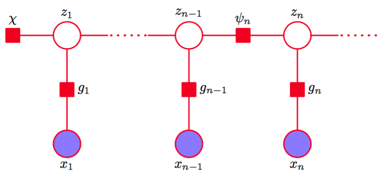
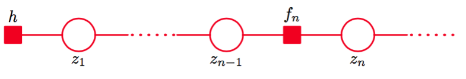

图13.5给出的表示隐马尔可夫模型的有向图是一棵树，因此我们可以使用加-乘算法来求解寻找局部边缘概率的问题。毫不令人惊讶的事实是，这等价于前一节讨论的前向-后向算法，因此加-乘算法给我们提供了一种简单的方式推导alpha-beta递归公式。    

首先，我们将图13.5所示的有向图变换为因子图，图13.14给出了一个代表性的片段。    

      
图 13.14 隐马尔可夫模型的因子图表示的一个片段。

这种形式的因子图显式地画出了潜在结点和观测结点。然而，对于解决推断问题来说，我们总是以变量$$ x_1,...,x_N $$为条件，因此我们可以通过将发射概率整合到转移概率因子中的方式来简化因子图。    

      
图 13.15 一个简化形式的因子图用来描述隐马尔可夫模型。

这就产生了图13.15给出的简化的因子图表示，其中因子为    

$$
\begin{eqnarray}
h(z_1) &=& p(z_1)p(x_1|z_1) \tag{13.45} \\
f_n(z_{n-1},z_n) &=& p(z_n|z_{n-1})p(x_n|z_n) \tag{13.46}
\end{eqnarray}
$$     

为了推导alpha-beta算法，我们将最后的隐含变量$$ z_N $$看成根结点，首先从叶结点$$ h $$向根结点传递信息。根据式（8.66）和（8.69）给出的信息传播的一般结果，我们看到在隐马尔可夫模型中传递的信息的形式为    

$$
\begin{eqnarray}
\mu_{z_{n-1} \to f_n}(z_{n-1}) &=& \mu_{f_{n-1} \to z_{n-1}}(z_{n-1}) \tag{13.47} \\
\mu_{f_n \to z_n}(z_n) &=& \sum\limits_{z_{n-1}}f_n(z_{n-1},z_n)\mu_{z_{n-1} \to f_n}(z_{n-1}) \tag{13.48}
\end{eqnarray}
$$    

这些方程表示沿着链的信息前向传递，等价于前一节推导出的alpha递归，说明如下。注意，由于变量结点$$ z_n $$只有两个相邻结点，因此它们不进行计算。    

我们可以使用式（13.47）从式（13.48）中消去$$ \mu_{z_{n−1} \to f_n}(z_{n−1}) $$，得到$$ f \to z $$的信息的递归方程，形式为    

$$
\mu_{f_n \to z_n}(z_n) = \sum\limits_{z_{n-1}}f_n(z_{n-1},z_n)\mu_{z_{n-1} \to f_n}(z_{n-1}) \tag{13.49}
$$    

如果我们回忆一下定义（13.46），并且如果我们定义    

$$
\alpha(z_n) = \mu_{f_n \to z_n}(z_n) \tag{13.50}
$$    

那么我们就得到了式（13.36）给出的alpha递归方程。我们还需要验证$$ \alpha(z_n) $$本身等价于之前的定义。可以这样做：使用初始条件（8.71），然后注意到$$ \alpha(z_1) $$为$$ h(z_1) = p(z_1)p(x_1|z_1) $$，这与式（13.37）完全相同。由于初始的$$ \alpha $$是相同的，并且它们使用同样的方程进行迭代地计算，因此所有后续的$$ \alpha $$一定相同。    

接下来我们研究从根结点传递回到叶结点的信息，形式为    

$$
\mu_{f_{n+1} \to z_n}(z_n) = \sum\limits_{z_{n+1}}f_{n+1}(z_n,z_{n+1})\mu_{f_{n+2} \to z_{n+1}}(z_{n+1}) \tag{13.51}
$$    

其中，同样的，我们消去了形如$$ z \to f $$的信息，因为变量结点不参与计算。使用定义（13.46）消去$$ f_{n+1}(z_n, z_{n+1}) $$，然后定义    

$$
\beta{z_n} = \mu_{f_{n+1} \to z_n}(z_n) \tag{13.52}
$$    

我们就得到了式（13.38）定义的beta递归方程。我们同样可以验证beta变量本身是等价的。我们注意到式（8.70）表明根变量结点发送的初始结点为$$ \mu_{z_N \to f_N}(z_N) = 1 $$，这与13.2.2节给出了对$$ \beta(z_N) $$的初始化完全相同。    

加-乘算法也指定了如何计算边缘概率，一旦所有的信息都已经被计算出来。特别的，式（8.63）给出的结果表明结点$$ z_n $$处的局部边缘概率是输入信息的乘积。由于我们以变量$$ X = \{x_1,...,x_N\} $$为条件，因此我们计算的是联合概率分布    

$$
p(z_n,X) = \mu_{f_n \to z_n}(z_n)\mu_{f_{n+1} \to z_N}(z_n) = \alpha(z_n)\beta(z_n) \tag{13.53}
$$    

两边同时除以$$ p(X) $$，得到    

$$
\gamma(z_n) = \frac{p(z_n,X)}{p(X)} = \frac{\alpha(z_n)\beta(z_n)}{p(X)} \tag{13.54}
$$    

这与式（13.33）相符。式（13.43）给出的结果可以类似的从式（8.72）中推导出。    

