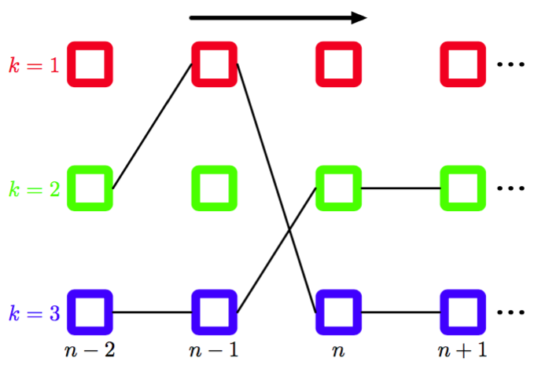

在隐马尔可夫模型的许多应用中，潜在变量有许多有意义的直观意义，因此对于给定的观测序列，我们常常感兴趣的是寻找概率最高的隐含状态序列。例如，在语音识别中，对于一个给定的声音观测序列，我们可能希望找到概率最大的音素序列。由于隐马尔可夫模型的图是一棵有向树，因此这个问题可以使用最大家和算法精确地求解。回忆一下，根据8.4.5节，寻找潜在变量的概率最高的序列与寻找分别概率最高的状态的集合是不相同的。后一个问题可以这样解决：首先运行前向后向算法（加-乘算法）找到潜在变量边缘概率\gamma（z_n），然后单独最大化 每个概率（Duda et al.， 2001）。然而，通常这样的状态集合不会对应于最可能的状态序列。事实上，如果对于两个连续的状态，它们单独的概率都是最高的，但是连接它们的转移矩阵的元素为0，那么这个状态集合表示一个具有零概率的序列。    

在实际应用中，我们通常感兴趣的是寻找最可能的状态序列（sequence），这可以使用最大加和算法高效地求出，这个算法在隐马尔科夫模型中被称为维特比算法（Viterbi algorithm）（Viterbi， 1967）。注意，最大加和算法作用于对数概率，因此无需使用前向后向算法中的重新缩放的变量。图13.16给出了隐马尔科夫模型的晶格图的一个片段。    

      
图 13.16 HMM晶格图片段，画出了两条可能的路径。维特比算法从指数多种可能的路径中高效地确定概率最高的路径。对于任意给定的路径，对应的概率为转移矩阵的元素$$ A_{jk} $$（对应于每个路径片段的概率$$ p(z_{n+1}|z_n) $$）和与路径上的每个结点相关联的发射概率密度$$ p(x_n|k) $$的乘积。 

正如我们已经注意到的，通过经过的可能的路径的数量随着链的长度指数增长。维特比算法高效地搜索这个路径空间，找 到概率最高的路径，计算代价仅仅随着链的长度线性增长。
与加-乘算法相同，我们首先将隐马尔可夫模型表示为因子图，如图13.15所示。同样的，我们将变量结点$$ z_n  $$当成根结点，从根结点开始向叶结点传递信息。使用公式（8.93）和（8.94）的结果，我们看到在最大加和算法中传递的信息为    

$$
\begin{eqnarray}
\mu_{z_n \to f_{n+1}}(z_n) &=& \mu_{f_n \to z_n}(z_n) \tag{13.66} \\
\mu_{f_{n+1} \to z_{n+1}} &=& \max_{z_n}\{\ln f_{n+1}(z_n,z_{n+1}) + \mu_{z_n \to f_{n+1}}(z_n)\} \tag{13.67}
\end{eqnarray}
$$    

如果消去两个方程间的$$ \mu_{z_n \to f_{n+1}}(z_n) $$，然后使用式（13.46），我们得到了$$ f \to  z $$的信息的递归方程，形式为    

$$
\omega(z_{n+1}) = \ln p(x_{n+1}|z_{n+1}) + \max_{z_n}\{\ln p(z_{n+1}|z_n) + \omega(z_n)\} \tag{13.68}
$$    

其中我们引入了记号$$ \omega(z_n) \equiv \mu_{f_n \to z_n}(z_n) $$。     

根据公式（8.95）和（8.96），这些信息使用下面的公式初始化     

$$
\omega(z_1) = \ln p(z_1) + \ln p(x_1|z_1) \tag{13.69}
$$    

其中我们已经使用了式（13.45）。注意，为了保持记号简洁，我们略去了对模型参数$$ \theta $$的依赖关系，它在我们寻找概率最高的序列的过程中保持固定。    

Viterbi算法也可以直接从联合概率分布的定义（13.6）中直接推导，方法是取对数，然后交换求最大值和求和的顺序。很容易看到$$ \omega(z_n) $$具有下面的概率意义    

$$
\omega(z_n) = \max_{z_1,...,z_{n-1}} \ln p(x_1,...,x_n,z_1,...,z_n)\tag{13.70}
$$    

一旦我们完成了在$$ z_n $$上的最大化过程，那么我们就得到了对应于概率最大的路径的联合概率分布$$ p(X, Z) $$。我们还希望找到对应于这条路径的潜在变量值的序列。为了完成这一点，我们简单地使用8.4.5节讨论的反向跟踪方法。具体来说，我们注意到在$$ z_n $$上的最大化过程必须在$$ z_{n+1} $$的$$ K $$个可能值的每一个值上进行。假设对于$$ z_{n+1} $$的$$ K
$$个值中的每一个值，我们都记录下与最大值相对应的$$ z_n $$的值。让我们将这个函数记作$$ \psi(k_n) $$，其中$$ k \in \{1,...,K\} $$。一旦我们将信息传递到了链的末端，找到了概率最大的状态$$ z_n $$，那么我们可以使用这个函数来沿着链进行反向跟踪，方法是递归地应用下式    

$$
k_{n-1}^{max} = \psi(k_n^{max}) \tag{13.71}
$$    

直观上讲，我们可以按照下面的方式理解维特比算法。朴素地说，我们可以显式地考虑通过晶格的指数多条路径，计算每条路径的概率，然后选择具有最高概率的路径。然而，我们注意到，我们可以对计算量进行极大的简化。假设对于每条路径，我们在沿着通过晶格的每条路径前向计算时，通过将转移概率与发射概率的乘积进行求和的方式求出这个概率。考虑一个特定的时刻$$ n $$以及在那个时刻的一个特定的状态$$ k $$。会存在许多条路径收敛到晶格图中的对应的结点。然而，我们只需要保留当前具有最高概率的特定的路径即可。由于在时刻$$ n
$$有$$ K $$个状态，因此我们需要跟踪$$ K $$个这样的路径。在时刻$$ n + 1 $$，会存在$$ K $$个可能的路径要考虑，由在$$ K $$个当前状态中的每个状态引出的$$ K $$个可能的路径组成，但是在$$ n + 1 $$时刻，我们还是只需保留对应于最优路径的K个状态。当我们到达最后的时刻$$ N
$$时，我们会发现哪个状态对应于整体上概率最高的路径。由于存在一个唯一的一条路径进入这个状态，因此我们可以反向跟踪这条路径到$$ N − 1 $$步，看到那一时刻出现了哪个状态，以此类推，沿着晶格跟踪到状态$$ n = 1 $$。
