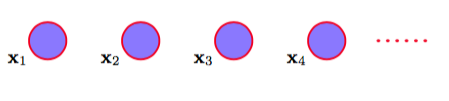
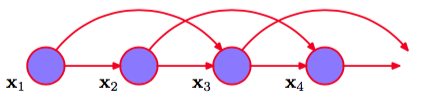

处理顺序数据的最简单的方式是忽略顺序的性质，将观测看做独立同分布，对应于图13.2所示的图。    

      
图 13.2 对顺序观测建模的最简单的方法是将它们看做独立的，对应于没有链接的图。

然而，这种方法无法利用数据中的顺序模式，例如序列中距离较近的观测之间的相关性。例如，假设我们观测一个二值变量，这个二值变量表示某一天是否下雨。给定这个变量的一系列观测，我们希望预测下一天是否会下雨。如果我们将所有的数据都看成独立同分布的，那么我们能够从数据中得到的唯一的信息就是雨天的相对频率。然而，在实际生活中，我们知道天气经常会呈现出持续若干天的趋势。因此，观测到今天是否下雨对于预测明天是否下雨会 有极大的帮助。    

为了在概率模型中表示这种效果，我们需要放松独立同分布的假设。完成这件事的一种最简单的方式是考虑马尔科夫模型（Markov model）。首先我们注意到，不失一般性，我们可以使 用概率的乘积规则来表示观测序列的联合概率分布，形式为    

$$
p(x_1,...,x_N) = p(x_1)\prod\limits_{n=2}^Np(x_n|x_1,...,x_{n-1}) \tag{13.1}
$$    

如果我们现在假设右侧的每个条件概率分布只与最近的一次观测有关，而独立于其他所有之前的观测，那么我们就得到了一阶马尔科夫链（first-order Markov chain），如图13.3所示。这个模型中，$$ N $$次观测的序列的联合概率分布为    

$$
p(x_1,...,x_N) = p(x_1)\sum\limits_{n=2}^Np(x_n|x_{n-1}) \tag{13.2}
$$    

根据d-划分的性质，给定时刻$$ n $$之前的所有观测，我们看到观测$$ x_n $$的条件概率分布为     

$$
p(x_n|x_1,...,x_{n-1} = p(x_n|x_{n-1}) \tag{13.3}
$$

从公式（13.2）开始，使用概率的乘积规则，这个等式很容易验证。因此如果我们使用这样的模型预测序列中的下一次观测，那么预测分布只依赖于最近的一次观测的值，而与所有更早的观测都无关。    

在这种模型的大部分应用中，条件概率分布$$ p(x_n|x_{n−1}) $$被限制为相等的，对应于静止时间序列的假设。这样，这个模型被称为同质马尔科夫链（homogeneous Markov chain）。例如，如 果条件概率分布依赖于可调节的参数（参数的值可以从训练数据中确定），那么链中所有的条件概率分布会共享相同的参数值。    

虽然这比独立的模型要一般一些，但是仍然非常受限。对于许多顺序的观测来说，我们预计若干个连续观测的数据的趋势会为下一次预测提供重要的信息。一种让更早的观测产生影响的方法是使用高阶的马尔科夫链。如果我们允许预测除了与当前观测有关以外，还与当前观测的 前一次观测有关，那么我们就得到了二阶马尔科夫链，如图13.4所示。    

      
图 13.4 一个二阶马尔科夫链，其中特定的观测$$ x_n $$依赖于前两次观测$$ x_{n−1} $$和$$ x_{n−2} $$的值。

现在，联合概率分布为    

$$
p(x_1,...,x_N) = p(x_1)p(x_2|x_1)\prod\limits_{n=3}^Np(x_n|x_{n-1},x_{n_2}) \tag{13.4}
$$    

与之前一样，使用d-划分或者直接计算，我们看到给定$$ x_{n-1} $$和$$ x_{n-2} $$的条件下$$ x_n $$的条件概率分布 与所有的$$ x_1,...,x_{n−3} $$的观测无关。现在，每次观测由之前的两次观测所影响。我们可以类似地考虑扩展到$$ M $$阶马尔科夫链，其中一个特定的变量依赖于前$$ M $$个变量。然而，这种增长的灵活性是有代价的，因为现在模型中参数的数量要多得多。假设观测是具有$$ K $$个状态的离散变量，那么一阶马尔科夫链中的条件概率分布$$
p(x_n|x_{n-1}) $$由$$ K − 1 $$个参数指定，每个参数都对应于$$ x_{n-1} $$的$$ K $$个状态，因此参数的总数为$$ K(K − 1) $$。现在假设我们将模型推广到$$ M $$阶马尔科夫链，从而联合概率分布由条件概率分布$$ p(x_n|x_{n−M},...,x_{n-1}) $$构建。如果变量是离散变量，且条件概率分布使用一般的条件概率表的形式表示，那么这种模型中参数的数量为$$ K^M (K − 1) $$。 由于这个量随着$$ M $$指数增长，因此通常对于大的$$ M $$来说，使用这种方法是不实际的。    

对于连续变量来说，我们可以使用线性高斯条件概率分布，其中每个结点都是一个高斯概率分布，均值是父结点的一个线性函数。这被称为自回归（autoregressive）模型或者AR模型 （Box et al.， 1994; Thiesson et al.， 2004）。另一种方法是为$$ p(x_n|x_{n−M},..., x_{n-1}) $$使用参数化的模型，例如神经网络。这种方法有时被称为抽头延迟线（tapped delay line），因为它对应于存储（延迟）观测变量的前面$$ M
$$个值来预测下一个值。这样，参数的数量远远小于一个一般的模型（例如此时参数的数量可能随着$$ M $$线性增长），虽然这样做会使得条件概率分布被限制在一 个特定的类别中。    

假设我们希望构造任意阶数的不受马尔科夫假设限制的序列模型，同时能够使用较少数量的自由参数确定。我们可以引入额外的潜在变量来使得更丰富的一类模型能够从简单的成分中构建，正如我们在第9章讨论混合概率分布和第12章讨论连续潜在变量模型时所做的那样。对于每个观测$$ x_n $$，我们引入一个对应的潜在变量$$ z_n $$（类型或维度可能与观测变量不同）。我们现在假设潜在变量构成了马尔科夫链，得到的图结构被称为状态空间模型（state space model），如图
13.5所示。它满足下面的关键的条件独立性质，即给定$$ z_n $$的条件下，$$ z_{n−1} $$和$$ z_{n+1} $$是独立的，从 而    

$$
z_{n+1} \perp z_{n-1}|z_n \tag{13.5}
$$    

这个模型的联合概率分布为    

$$
p(x_1,...,x_N,z_1,...,z_N) = p(z_1)\left[\prod\limits_{n=2}^Np(z_n|z_{n-1})\right]\prod\limits_{n=1}^Np(x_n|z_n) \tag{13.6}
$$    

使用d-划分准则，我们看到总存在一个路径通过潜在变量连接了任意两个观测变量$$ x_n $$和$$ x_m $$，且这个路径永远不会被阻隔。因此对于观测变量$$ x_{n+1} $$来说，给定所有之前的观测，条件概率分布$$ p(x_{n+1} |x_1,...,x_n) $$不会表现出任何的条件独立性，因此我们对$$ x_{n+1} $$的预测依赖于所有之前的观测。然而，观测变量不满足任何阶数的马尔科夫性质。我们在本章的后面几节会讨论如何计算预测分布。    

对于顺序数据来说，这个图描述了两个重要的模型。如果潜在变量是离散的，那么我们得到了隐马尔科夫模型（hidden Markov model）或HMM（Elliott et al.， 1995）。注意，HMM中的观测变量可以是离散的或者是连续的，并且可以使用许多不同的条件概率分布进行建模。如果潜在变量和观测变量都是高斯变量（结点的条件概率分布对于父结点的依赖是线性高斯的形式），那么我们就得到了线性动态系统（linear dynamical system）。
