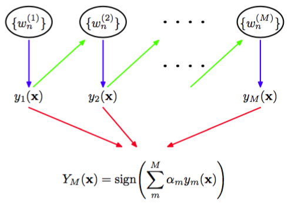

提升方法是一种很强大的方法，它将多个“基”分类器进行组合，产生一种形式的委员会，委员会的表现会比任何一个基分类器的表现好得多。这里，我们介绍提升方法的最广泛使用的 一种形式，被称为AdaBoost，是“可调节提升方法（adaptive boosting）”的简称，由Freund and Schapire（1996）提出。即使基分类器的表现仅仅比随机猜测的表现稍好，提升方法仍可以产生比较好的结果。这种基分类器有时被称为弱学习器（weak learner）。提升方法最初被用来解决 分类问题，但是也可以推广到回归问题（Friedman， 2001）。    

提升方法和委员会方法（例如上面讨论的打包方法）的主要不同在于，基分类器是顺序训练的，每个基分类器使用数据集的一个加权形式进行训练，其中与每个数据点相关联的权系数依赖于前一个分类器的表现。特别地，被一个基分类器误分类的点在训练序列中的下一个分类器时会被赋予更高的权重。一旦所有的分类器都训练完毕，那么它们的预测就会通过加权投票的 方法进行组合，如图14.1所示。    

      
图 14.1 提升方法框架的图形表示。每个基分类器$$ y_m(x) $$都在训练数据集的一个加权形式（蓝色箭头）上进行训练，权值$$ w_n^{(m)} $$依赖于前一个基分类器$$ y_{m-1}(x) $$（绿色箭头）的表现。一旦所有的基分类器训练完毕，它们被组合得到最终的分类器$$ Y_M(x) $$（红色箭头）。

考虑一个二分类问题，其中训练数据由输入向量$$ x_1,...,x_N $$以及对应的二值目标变量$$ t_1,...,t_N $$组成，其中$$ t_n \in \{−1,1\} $$。每个数据点被赋予了一个关联的权值参数$$ w_n $$，对于所有的数据点，它都被初始化为$$ 1 / N $$。我们假设我们有一个使用加权数据训练基分类器的方法，得到函数$$ y(x) \in \{−1,1\} $$。在算法的每个阶段，AdaBoost使用一个数据集训练一个新的分类器，其中权系数根据前一个训练的分类器的表现进行调节，从而为误分类的数据点赋予更高的权值。最后，当我们训练了所需数量的基分类器之后，它们进行组合，形成一个委员会，组合的系数会为不同的基分类器赋予不同的权值。AdaBoost算法的精确形式叙述如下。    

1. 初始化数据加权系数$$ \{w_n\} $$，方法是对$$ n = 1,...,N $$，令$$ w_n^{(1)} = 1 / N $$。    
2. 对于$$ m = 1,...,M $$：    
* 使用训练数据调节一个分类器$$ y_m(x) $$，调节的目标是最小化加权的误差函数    
$$
J_m = \sum\limits_{n=1}^Nw_n^{(m)}I(y_m(x_n) \neq t_n) \tag{14.15}
$$    
其中$$ I(y_m(x_n) \neq t_n）$$是一个示性函数，当$$ y_m(x_n) \neq t_n $$时，值为1，其他情况下值为0。    
* 计算    
$$
\epsilon_m = \frac{\sum\limits_{n=1}^N w_n^{(m)}I(y_m(x_n) \neq t_n)}{\sum\limits_{n=1}^N w_n^{(m)}} \tag{14.16}
$$    
然后计算    
$$
\alpha_m = \ln\left\{\frac{1-\epsilon_m}{\epsilon_m}\right\} \tag{14.17}
$$    
* 更新数据权系数     
$$
w_n^{(m+1)} = w_n^{(m)}exp\{\alpha_mI(y_m(x_n) \neq t_n)\} \tag{14.18}
$$    
3. 使用最终的模型进行预测，形式为    
$$
Y_M(x) = sign\left(\sum\limits_{m=1}^M\alpha_my_m(x)\right) \tag{14.19}
$$    

我们看到第一个基分类器$$ y_1(x) $$使用全部相等的加权系数$$ w_n^{(1)} $$进行训练，因此它对应于训练单一的分类器的通常的步骤。根据（14.18），我们看到在后续的迭代过程中，权系数$$ w_n^{(m)} $$对于误分类的数据点会增大，对于正确分类的数据点不改变。因此后续的分类器就会更关注那些被前一个分类器错误分类的数据点。$$ \epsilon_m $$表示每个基分类器在数据集上的错误率的加权度量。于是我们看到式（14.17）定义的权系数$$ \alpha_m $$会在计算整体输出（14.19）时，为更准确的分类器赋予更高的权值。    

AdaBoost算法如图14.2所示，数据集是图A.7所示的分类数据集的由30个数据点组成的子集。    

      
图 14.2 提升方法的说明,其中基学习器由作用于某个轴的简单的阈值组成。每张图给出了目前训练的基学习器的数量$$ m $$，以及最近的基学习器的决策边界（黑色虚线）和组合的决策边界（绿色实线）。每个数据点用圆圈表示，它的半径表示在训练最近添加的基学习器时数据点的权值。因此，例如，我们看到被$$ m = 1 $$的学习器误分类的点在训练$$ m = 2 $$的学习器时被赋予了更高的权值。

这里，每个基分类器由一个输入变量的阈值组成。这个简单的分类器对应于一种被称为“决策树桩”的决策树形式，即一个具有单结点的决策树。因此，每个基学习器根据一个输入特征是否超 过某个阈值对输入进行分类，因此仅仅使用一个与一个坐标轴垂直的线性决策面将空间划分为 两个区域。
