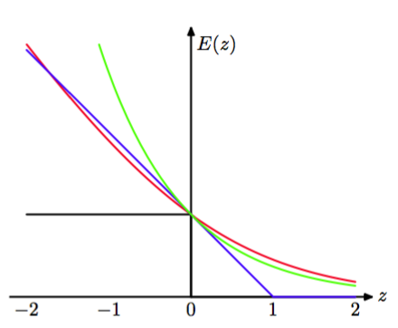
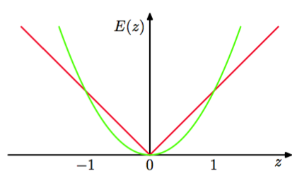

AdaBoost算法最小化的指数误差函数与之前章节讨论的误差函数不同。为了更深刻地理解指数误差函数的本质，我们首先考虑期望误差，形式为    

$$
\mathbb{E}_{x,t}[exp\{-ty(x)\}] = \sum\limits_t\int exp\{-ty(x)\}p(t|x)p(x)dx \tag{14.27}
$$    

如果我们关于所有可能的函数$$ y(x) $$进行变分最小化，那么我们有    

$$
y(x) = \frac{1}{2}\ln\left\{\frac{p(t=1|x)}{p(t=-1|x)}\right\} \tag{14.28}
$$    

它是log odds函数的一半。因此AdaBoost算法是在由基分类器的线性组合表示的函数空间中，寻找对log odds的最好的近似，对应于顺序最优化策略下的受限最小化。这个结果说明了在式（14.19）中使用符号函数得到最终的分类决策的原因。    

我们已经看到，二分类问题的交叉熵误差函数（4.90）的最小函数$$ y(x) $$由后验类概率密度给出。在目标变量$$ t \in \{−1, 1\} $$的情形下，我们已经看到误差函数为$$ \ln(1 + exp(−yt)) $$。图14.3给出了它与指数误差函数的对比，其中我们将交叉熵误差函数除以了一个常数因子$$ \ln(2) $$，从而它穿过点$$ (0， 1) $$，使得更加容易进行对比。    

      
图 14.3 指数误差函数（绿色）、缩放的交叉熵误差函数（红色）以及支持向量机使用的铰链误差函数（蓝色）和误分类误差函数（黑色）的图像。注意，对于$$ z = ty(x) $$的较大的负值，交叉熵误差函数给出了一个线性增长的惩罚，而指数误差函数给出了一个指数增长的惩罚。

我们看到，这两个函数都可以看成对理想误分类误差函数的连续近似。指数误差的一个优点是它的顺序最小化会得到简单的AdaBoost方法。然而，一个缺点是，与交叉熵误差函数相比，它对负的$$ ty(x) $$的惩罚较大。特别地，我们看到对于$$ ty $$的很大的值，交叉熵随着$$ \vert ty \vert $$线性增长，而指数误差随着$$ \vert ty \vert
$$指数增长。因此指数误差函数对于异常点和误分类的数据点并不鲁棒。交叉熵误差函数和指数误差函数的另一个区别是后者无法表示为任何具有良好定义的概率模型的似然函数。此外，指数误差无法推广到具有$$ K > 2 $$个类别的分类问题，这再次与概率模型的交叉熵相反，它可以很容易地推广，得到(4.108)。    

将提升方法表示为指数误差下的可加性模型的最优化(Friedman et al.， 2000)引出了一大类与提升方法相似的算法，包括对多类问题的推广，方法是使用其他的误差函数。它也引出了对于回归问题的推广(Friedman， 2001)。如果我们考虑回归问题的平方和误差函数，那么形如(14.21)的可加性模型的顺序最小化仅仅涉及到将新的分类器根据前一个模型的残留误差$$ t_n −
f_{m−1}(x_n) $$进行调节。然而，正如我们已经注意到的那样，平方和误差函数对于异常点不健壮。这个问题可以通过将绝对偏差$$ |y − t| $$应用到提升方法中的方式得到解决。图14.4给出了这两个误差函数的对比。

      
图 14.4 平方误差（绿色）和绝对误差（红色）的对比。图中展示了后者为较大的误差赋予较低的重视程度，从而后者对于异常点和误分类的点更加健壮。
