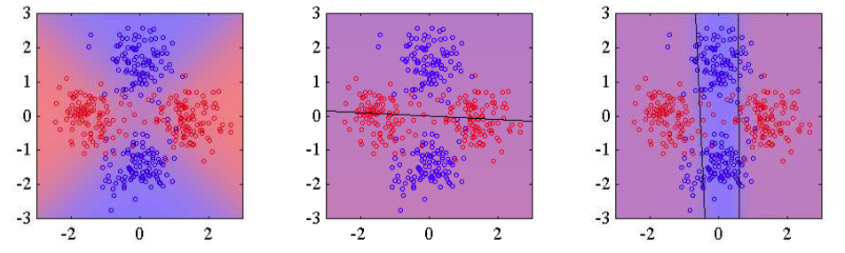

由于线性回归模型定义了给定输入变量的条件下目标变量的一个条件概率分布，因此很容易将其用作混合模型中的分量分布，从而与单一的logistic回归模型相比，可以表示更丰富的一类 条件概率分布。这个例子涉及到对本书前面章节讨论的思想的一个直接组合，有助于帮助读者巩固这些知识。    

对于$$ K $$个logistic回归模型来说，目标变量的条件概率分布为    

$$
p(t|\phi,\theta) = \sum\limits_{k=1}^K\pi_ky_k^t[1-y_k]^{1-t} \tag{14.45}
$$    

其中$$ \phi $$是特征向量，$$ y_k = \sigma(w_k^T\phi) $$是分量$$ k $$的输出，$$ \theta $$表示可调节参数，即$$ \{\pi_k\} $$和$$ \{w_k\} $$。    

现在假设我们有一个数据集$$ \{\phi_n, t_n\} $$。从而对应的似然函数为    

$$
p(t|\theta) = \prod\limits_{n=1}^N\left(\sum\limits_{k=1}^K\pi_ky_{nk}^{t_n}[1-y_{nk}]^{1-t_n}\right) \tag{14.46}
$$    

其中$$ y_{nk} = \sigma(w_k^T\phi_n), t = (t_1,...,t_N)^T $$。我们可以使用EM算法迭代地最大化这个似然函数。这涉及到引入潜在变量$$ z_{nk} $$，它对应于每个数据点$$ n $$的用1-of-K方式编码的二值指示器变量。完整数据的似然函数为    

$$
p(t,Z|\theta) = \prod\limits_{n=1}^N\prod\limits_{k=1}^K\{\pi_ky_{nk}^{t_n}[1-y_{nk}]^{1-t_n}\}^{z_{nk}} \tag{14.47}
$$    

其中$$ Z $$是潜在变量矩阵，元素为$$ z_{nk} $$。我们通过选择模型参数的一个初始值$$ \theta^{old} $$来初始化EM算法。之后在E步骤中，我们使用这些参数值来计算每个数据点$$ n $$的分量$$ k $$的后验概率，形式为    

$$
\gamma_{nk} = \mathbb{E}[z_{nk}] = p(k|\phi_n, \theta^{old}) = \frac{\pi_ky_{nk}^{t_n}[1-y_{nk}]^{1-t_n}}{\sum\limits_j\pi_jy_{nj}^{t_n}[1-y_{nj}]^{1-t_n}} \tag{14.48}
$$    

这些责任项然后用于寻找完整数据对数似然函数的期望，它作为\theta的一个函数，形式为     

$$
\begin{eqnarray}
Q(\theta，\theta^{old}) &=& \mathbb{E}_Z[\ln p(t,Z|\theta)] \\
&=& \sum\limits_{n=1}^N\sum\limits_{k=1}^K\gamma_{nk}\{\ln\pi_k + t_n\ln y_{nk} + (1-t_n)\ln(1-y_{nk})\} \tag{14.49}
\end{eqnarray}
$$    

M步骤涉及到关于$$ \theta $$最大化这个函数，保持$$ \theta^{old} $$不变，从而$$ \gamma_{nk} $$保持不变。关于$$ \pi_k $$的最大化可以使用通常的方式进行，引入拉格朗日乘数来强制满足$$ \sum_k\pi_k = 1 $$的限制，得到下面的熟悉的结果    

$$
\pi_k = \frac{1}{N}\sum\limits_{n=1}^N\gamma_{nk} \tag{14.50}
$$    

为了确定$$ \{w_k\} $$，我们注意到$$ Q(\theta,\theta^{old}) $$由一组下标为$$ k $$项的求和式组成，它只依赖于向量$$ w_k $$中的一个，因此不同的向量在EM算法的M步骤中可以独立进行优化。换句话说，不同的分量只通过责任项产生相互作用，它在M步骤中是固定的。注意，M步骤没有封闭解，必须使用例如迭代重加权最小平方（IRLS）算法迭代地求解。对于向量$$ w_k $$的梯度和Hessian矩阵为    

$$
\begin{eqnarray}
\nabla_kQ &=& \sum\limits_{n=1}^N\gamma_{nk}(t_n - y_{nk})\phi_n \tag{14.51} \\
H_k = -\nabla_k\nabla_kQ = \sum\limits_{n=1}^N\gamma_{nk}y_{nk}(1-y_{nk})\phi_n\phi_n^T \tag{14.52}
\end{eqnarray}
$$    

其中$$ \nabla_k $$表示关于$$ w_k $$的梯度。对于固定的$$ \gamma_{nk} $$，梯度和Hessian矩阵独立于$$ j \neq k $$的$$ \{w_j\} $$，因此我们可以使用IRLS算法分别对每个$$ w_k $$求解。因此分量$$ k $$的M步骤方程仅仅对应于使用数据集调整一个单独的logistic回归模型，其中数据点$$ n $$携带权值$$ \gamma_{nk} $$。图14.10给出了logistic回归模型的混合模型应用于简单的分类问题中的例子。    

      
图 14.10 ogistic回归模型的混合的例子。左图给出了从两个类别中抽取的数据点，两个类别分别用红色和蓝色表示，其中背景颜色（从纯红变化到纯蓝）表示模型标签的真实概率。中图表示使用最大似然方法拟合单一的logistic回归模型的结果，其中背景颜色表示类别标签的对应的概率。由于颜色几乎是均匀的紫色，因此我们看到模型在输入空间中的大部分区域都会分配一个近似为0.5的概率。右图给出了使用两个logistic回归模型的混合模型进行调节的结果，它对于蓝色类别中的许多点，都会给正确的标签赋予高得多的概率。

将这个模型推广为softmax模型的混合模型来处理多类问题是很容易的。
