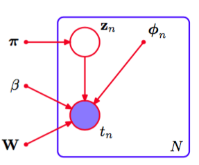
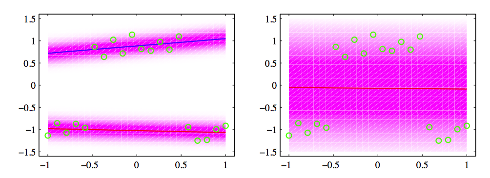

用概率形式表示线性回归模型的众多优点之一是它可以用作更复杂的概率模型的一个分量。例如，将表示线性回归模型的条件概率分布看成有向概率图中的一个结点，即可完成这件事。 这里，我们考虑一个简单的例子，对应于线性回归模型的混合，它是9.2节讨论的高斯混合模型的一个直接推广，推广到了条件高斯分布的情形。    

因此，我们考虑$$ K $$个线性回归模型，每个模型都由自己的权参数$$ w_k $$控制。在许多应用中，比较合适的做法是对所有$$ K $$个分量使用一个共同的噪声方差，由精度参数$$ \beta $$控制，这正是我们这里讨论的情形。我们再次将注意力集中于单一目标变量$$ t $$，但是推广到多个输出是很容易的。如果我们将混合系数记作$$ \pi_k $$，那么混合概率分布可以写成    

$$
p(t|\theta) = \sum\limits_{k=1}^K\pi_k\mathcal{N}(t|w_k^T\phi,\beta^{-1}) \tag{14.34}
$$    

其中$$ \theta $$表示模型中所有可调节参数的集合，即$$ W = \{w_k\}, \pi = \{\pi_k\} $$以及$$ \beta $$。给定一组观测数据集$$ \{\phi_n, t_n\} $$，这个模型的对数似然函数的形式为    

$$
\ln p(t|\theta) = \sum\limits_{n=1}^N\ln\left(\sum\limits_{k=1}^K\pi_k\mathcal{N}(t_n|w_k^T\phi_n,\beta^{-1})\right) \tag{14.35}
$$    

其中$$ t = (t_1,...,t_N)^T $$表示目标变量组成的向量。     

为了最大化这个似然函数，我们可以再次使用EM算法。可以证明它是9.2节讨论的无条件高斯混合模型的EM算法的一个简单推广。于是我们可以基于我们对无条件混合分布的经验构造模型，引入一组二值潜在变量$$ Z = \{z_n\} $$，其中$$ z_{nk} \in \{0, 1\} $$，其中对于每个数据点$$ n $$，所有的$$ k = 1,...,K $$中只有一个元素为1，其余元素都等于0。等于1的元素表示哪个混合分布用于生成数据点。潜在变量与观测变量的联合概率分布可以用图14.7的图模型表示。    

      
图 14.7 表示由公式（14.35）定义的线性回归模型的混合模型的概率有向图。

这样，完整数据的对数似然函数的形式为    

$$
\ln p(t,Z|\theta) = \sum\limits_{n=1}^K\sum\limits_{k=1}^Kz_{nk}\ln\{\pi_k\mathcal{N}(t_n|w_k^T\phi_n,\beta^{-1})\} \tag{14.36}

$$    

EM算法在开始时，首先选择模型参数的初始值$$ \theta^{old} $$。在E步骤中，这些参数用于计算每个数据点$$ n $$的每个分量$$ k $$的后验概率分布或者“责任”，结果为    

$$
\gamma_{nk} = \mathbb{E}[z_{nk}] = p(k|\phi_n,\theta^{old}) = \frac{\pi_k\mathcal{N}(t_n|w_k^T\phi_n,\beta^{-1})}{\sum\limits_j\pi_j\mathcal{N}(t_n|w_j^T\phi_n,\beta^{-1})} \tag{14.37}
$$    

然后，“责任”被用于确定完整数据对数似然函数关于后验概率分布$$ p(Z|t, \theta^{old}）$$的期望，形式为    

$$
Q(\theta,\theta^{old}) = \mathbb{E}_Z[\ln p(t,Z|\theta)] = \sum\limits_{n=1}^N\sum\limits_{k=1}^K\gamma_{nk}\{\ln\pi_k + \ln\mathcal{N}(t_n|w_k^T\phi_n,\beta^{-1})\}
$$    

在M步骤中，我们关于$$ \theta $$最大化函数$$ Q(\theta, \theta^{old}) $$，保持$$ \gamma_{nk} $$不变。对于关于混合系数$$ \pi_k $$的最优化， 我们需要考虑限制条件$$ \sum_k\pi_k = 1 $$  这使用拉格朗日乘数法即可完成，得到了$$ \pi_k $$的M步骤重估计方程，形式为    

$$
\pi_k = \frac{1}{N}\sum\limits_{n=1}^N\gamma_{nk} \tag{14.38}
$$    

注意，这个函数形式与公式（9.22）给出的无条件的简单高斯混合的对应结果形式相同。    

接下来，考虑关于第$$ k $$个线性回归模型的参数向量$$ w_k $$的最大化。代入高斯分布的表达式，我们看到$$ Q(\theta, \theta^{old}) $$关于参数向量$$ w_k $$的函数形式为    

$$
Q(\theta,\theta^{old}) = \sum\limits_{n=1}^N\gamma_{nk}\left\{-\frac{\beta}{2}(t_n - w_k^T\phi_n)^2\right\} + const \tag{14.39}
$$    

其中常数项包含来自$$ j \neq k $$的其他权向量$$ w_j $$的贡献。注意，我们最大化的量类似于单一线性回归模型的标准平方和误差函数（3.12）的负对数，但是包含了责任项$$ \gamma_{nk} $$。这代表了加权最小平方（weighted least squares）问题，其中对应于第$$ n $$个数据点的项带有一个加权系数$$ \beta\gamma_{nk} $$，它可以
被看成每个数据点的有效精度。我们看到，混合模型中的每个分量线性回归模型由自身的参数向量$$ w_k $$控制，在M步骤中使用整个数据集分别进行调节，但是每个数据点$$ n $$由责任项$$ \gamma_nk $$加权，它表示模型$$ k $$对这个数据点的作用。令（14.39）关于$$ w_k $$的导数等于0，可得    

$$
0 = \sum\limits_{n=1}^N\gamma_{nk}(t_n - w_k^T\phi_n)\phi_n \tag{14.40}
$$    

它可以用矩阵的记号表示为     

$$
p = \Phi^TR_k(t - \Phi w_k) \tag{14.41}
$$    

其中$$ R_k = diag(\gamma_{nk}) $$是一个$$ N \times N $$的对角矩阵。解出$$ w_k $$，我们有    

$$
w_k = (\Phi^TR_k\Phi)^{-1}\Phi^TR_kt \tag{14.42}
$$    

它表示一组修改过的规范方程，对应于加权的最小平方问题，与logistic回归问题中得到的结果（4.99）具有相同的形式。注意，在每个E步骤之后，矩阵$$ R_k $$会发生变化，因此我们在后续M步骤中必须重新解规范方程。    

最后，我们关于$$ \beta $$最大化$$ Q(\theta, \theta^{old}) $$。只保留依赖于$$ \beta $$的项，函数$$ Q(\theta, \theta^{old}) $$可以写成

$$
Q(\theta, \theta^{old}) = \sum\limits_{n=1}^N\sum\limits_{k=1}^K\gamma_{nk}\left\{\frac{1}{2}\ln\beta - \frac{\beta}{2}(t_n - w_k^T\phi_n)^2\right\} \tag{14.43}
$$    

令它关于$$ \beta $$的导数等于0，整理，我们得到了$$ \beta $$的M步骤方程，形式为    

$$
\frac{1}{\beta} = \frac{1}{N}\sum\limits_{n=1}^N\sum\limits_{k=1}^K\gamma_{nk}(t_n - w_k^T\phi_n)^2 \tag{14.44}
$$    

在图14.8中，我们使用了一个简单的例子来说明这个EM算法。    

      
图 14.8 人工生成的数据的例子，用绿色点表示，具有一个输入变量$$ x $$和一个输出变量$$ t $$。同时画出了两个线性回归模型的混合，它的均值函数$$ y(x, w_k) $$用蓝线和红线表示，其中$$ k \in \{1, 2\} $$。上方三张图表示初始配置(左图)、运行了30轮EM迭代的结果(中图)以及运行了50轮EM迭代的结果(右图)。这里，$$ \beta $$被初始化为目标值集合的真实方差的倒数。下方三张图将每个数据点的对应的责任项用竖直线表示，其中蓝色线段的长度表示那个数据点的蓝色线的后验概率(红色线段的含义与之类似)。

这个例子中，我们根据数据集来调整由两条直线组成的混合模型，数据集有一个输入变量$$ x $$和一个目标变量$$ t
$$。预测密度（14.34）如图14.9所示，使用了从EM算法中得到的收敛的参数值，对应于图14.8的右图。    

      
图 14.9 左图表示对应于图14.8的收敛解的预测条件概率密度。对数似然函数的值为-3.0。在特定的$$ x $$处，穿过图像的垂直切片表示条件概率分布$$ p(t|x) $$，可以看到它是双峰的。右图给出了使用最大似然方法用同样的数据集拟合的单一线性回归模型。模型的对数似然函数值较小，为-27.6。

图中同时给出的是拟合单一的线性回归模型的结果，它给出了一个单峰的预测密度。我们看到，混合模型可以更好地表示数据分布，这一点通过更高的似然函数值反映出来。然而，混合模型也将相当大的概率质量分配到了没有数据的区域，因为它的预测分布对于x的所有值来说是双峰的。这个问题可以这样解决：将模型扩展，使得混合系数本身是$$ x $$的一个函数，这就产生了5.6 节讨论的混合密度网络模型，以及14.5.3节讨论的专家层次混合模型。
