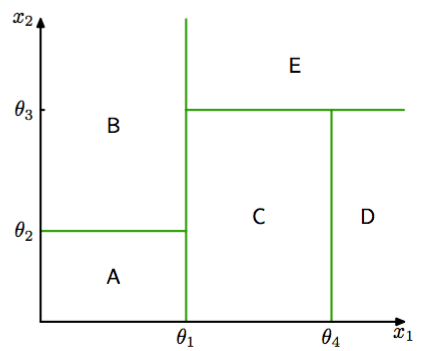
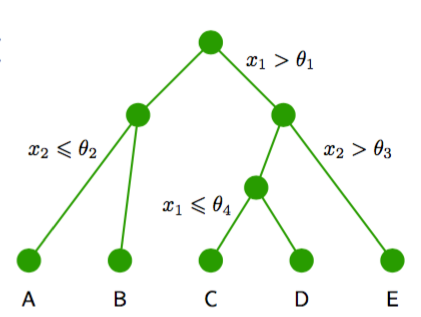

有许多简单但广泛使用的模型，它们将输入空间划分为超立方体区域，超立方体的边与坐标轴对齐，然后为每个区域分配一个简单的模型（例如，一个常数）。这些模型可以被看成一种模型组合方法，其中只有一个模型对于输入空间中任意给定点的预测起作用。给定一个新的输入x，选择一个具体的模型的过程可以由一个顺序决策的过程描述，这个过程对应于对一个二叉树（每个节点划分为两个分支的树）的遍历。这里，我们关注一个特定的基于树的框架，被 称为分类与回归树（classification and regression tree），或者CART（Breiman et al.， 1994），虽 然还有很多其他的变体，例如ID3和C4.5（Quinlan， 1986; Quinlan， 1993）。    

图14.5和图14.6给出了对输入空间进行递归二分的例子，以及对应的树结构。   

      
图 14.5 二维输入空间使用与坐标轴平行的边界被划分为了五个区域。

      
图 14.6 对应于图14.5的输入空间的划分的二叉树。

在这个例子中，第一步根据$$ x_1 \leq \theta_1 $$或$$ x_1 > \theta_1 $$，将输入空间划分为两个区域，其中$$ \theta_1 $$是一个模型参数。这创建了两个子区域，每个区域之后可以独立地进行划分。例如，区域$$ x_1 \leq \theta_1 $$进一步根据$$ x_2 \leq \theta_2 $$或$$ x_2 > \theta_2 $$进行进一步划分，得到的区域被记作$$ A $$和$$ B
$$。递归的过程可以用图14.6给出的二叉树的遍历进行描述。对于任意新的输入$$ x $$，我们确定它所属区域的方法是，从树顶端的根结点开始，根据每个结点的决策准则，沿着路径向下走到具体的叶结点。注意，这种决策树不 是概率图模型。    

在每个区域内，有一个单独的模型预测目标变量的值。例如，在回归问题中，我们简单地在每个区域内预测一个常数，或者在分类问题中，我们将每个区域分配为一个具体的类别。基于树的模型的一个关键的性质是模型可以由人类表述，因为模型对应于作用在输入变量上的一个二元决策序列。这使得模型在例如医疗诊断领域很流行。例如，为了预测一个病人的疾病，我 们可以首先问“病人的体温是否大于某个阈值?”。如果回答是肯定的，那么我们可以问“病人的 血压是否低于某个阈值?”。然后树的每个叶结点都与一个具体的诊断相关联。    

为了从一个训练数据集里学习到这样的一个模型，我们必须确定树的结构，包括在每个结点处选择哪个输入变量构成划分准则，以及用于划分的阈值参数\thetai的值。我们也必须确定每个区域内的预测变量的值。    

首先考虑一个回归问题，其中我们的目标是从输入变量$$ D $$维向量$$ x = (x_1,...,x_D)^T $$中预测单一的目标变量$$ t $$的值。训练数据由输入向量$$ \{x_1,...,x_N\} $$以及对应的连续标签$$ \{t_1,...,t_N\} $$组成。如果输入空间的划分给定，并且我们最小化平方和误差函数，那么在任意给定区域的预测变量的最优值就是落在哪个区域的数据点的$$ t_n $$值的平均。   

现在考虑如何确定决策树的结构。即使对于结点数量固定的树，确定最优结构（包括每次划分使用的输入变量以及对应的阈值）来最小化平方和误差函数的问题通常在计算上是不可行的，因为可能的组合数量相当大。相反，我们通常使用贪心的最优化。从对应于整个输入空间的一个单独的根结点开始，然后通过每次添加一个结点的方式构建树。在每一步，输入空间中会有若干个可以切分的候选的区域，对应于向当前的树中添加一对叶结点。对于每个这种候选区域，我们要选择使用D个输入变量中的哪一个进行划分，以及阈值的大小。划分区域的选择以及输入变量和阈值的选择可以通过彻底搜索的方式高效地进行联合最优化。我们注意到，对于给定的划分变量和阈值的选择，预测变量的最优选择是数据的局部平均值，如前所述。对划 分变量的所有可能选择重复上述步骤，得到最小的平方和误差的一个划分变量被保留下来。    

得到构建树的贪心策略之后，剩下的问题是如何停止添加结点。一个简单的方法是当残留误差的减小量低于某个阈值时停止。然而，我们通过实验发现，经常出现这样的情形：没有划分方式会使误差函数产生显著的减小，但是再进行几次划分之后，就会找到一个使误差函数显著减小的划分方式。因此，在实际应用中通常构建一个较大的树，使用基于与叶结点关联的数据点数量的停止准则，然后进行剪枝，生成最终的树。剪枝的过程基于的准则会在残留误差与模 型复杂度之间进行平衡。我们将剪枝开始时的树记作$$ T_0 $$，然后我们对于$$ T \subset
T_0 $$，如果它能够通过从$$ T_0 $$剪枝（即通过合并对应区域来收缩内部结点）的方式被得到，那么它就被定义为$$ T_0 $$的一个子树。假设叶结点的索引为$$ \tau = 1,...,|T| $$，叶结点$$ \tau $$表示具有$$ N_\tau $$个数据点的区域$$ R_\tau $$，$$ |T | $$表示叶结点的总数。那么区域$$ R_\tau $$给出的最优的预测为      

$$
y_\tau = \frac{1}{N_\tau}\sum\limits_{x_n \in R_\tau} t_n \tag{14.29}
$$    

它对于残留的平方和误差的贡献为    

$$
Q_\tau(T) = \sum\limits_{x_n \in R_\tau}\{t_n - y_\tau\}^2 \tag{14.30}
$$    

从而剪枝准则为    

$$
C(T) = \sum\limits_{\tau = 1}^{|T|}Q_\tau(T) + \lambda|T| \tag{14.31}
$$     

正则化参数$$ \lambda $$确定了整体的残留平方和误差与模型复杂度之间的折中，模型复杂度用叶结点的数量$$ |T| $$表示，它的值通过交叉验证的方式确定。    

对于分类问题，树的构建和剪枝的过程很类似，区别在于平方和误差函数被替换为一个更合适的性能的度量。如果我们将$$ p_{\tau k} $$定义为区域$$ R_\tau $$中被分配到类别$$ k $$的数据点的比例，其中$$ k = 1,...,K $$，那么经常使用的两个度量是交叉熵    

$$
Q_\tau(T) = -\sum\limits_{k=1}^Kp_{\tau k}\ln p_{\tau k} \tag{14.32}
$$    

以及基尼系数（Gini index）     

$$
Q_\tau(T) = \sum\limits_{k=1}^Kp_{\tau k}(1-p_{\tau k}) \tag{14.33}
$$     

如果对于任意的$$ k = 1,...,K $$都有$$ p_{\tau k} = 1 $$，那么这两个量都等于0，此时对于所有$$ j \neq k $$都有$$ p_{\tau j} = 0 $$。如果对于所有的$$ k = 1,...,K $$都有$$ p_{\tau k} = 1 / K $$，那么这两个量都会达到最大值。这两个量倾向于让区域中属于同一个类别的数据点的比例较高。在构建树的过程中，与分类错误率相比，交叉熵和基尼系数是一个更好的度量，因为这两个量对于结点的概率更敏感。并且，与分类错误率不同，它们是可微的，因此更适合基于梯度的最优化方法。对于接下来对树的剪枝过 程，通常使用分类错误率。    

像CART这种树模型的可以由人类进行表述这一性质通常被视为它的一个重要的优点。然而，在实际应用中，学习到的特定的树结构对于数据集的细节非常敏感，从而训练集的一个微 小的改变就会产生一个相当不同的划分集合（Hastie et al.， 2001）。    

本节讨论的这种基于树的方法有一些其他的问题。一个问题是，划分边界是与特征空间的坐标轴对齐的，这相当不好。例如，为了将最优边界与坐标轴成45度角的两个类别划分开，我们需要相当多的与坐标轴平行的划分，这个数量要远大于一个单一的不与坐标轴平行的划分的数量。此外，决策树中的划分是硬划分，从而输入空间中的每个区域与一个叶结点模型关联，并且只与一个叶结点模型关联。最后一个问题在解决回归问题时相当严重，其中我们通常的目标是对光滑的函数建模，但是树模型生成了分段常数的预测，划分的边界是不连续的。
