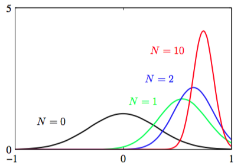
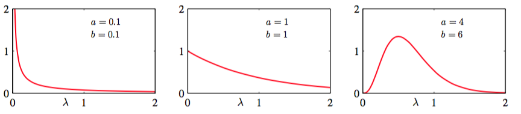
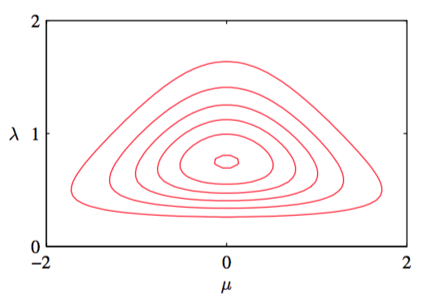

最大似然估计提供了一个估计参数$$ \mu, \Sigma $$的框架。现在我们通过引入这些参数的先验分布，来介绍贝叶斯方法。让我们以单元随机高斯变量$$ x $$这个简单的例子作为开始。假设方差$$ \delta^2 $$已知，考虑从$$ N $$个观测量$$ X = \{x_1,...,x_N\} $$中推断出均值$$ \mu $$的任务。对于给定$$ \mu $$的观测到数据的概率的似然函数是关于$$ \mu $$的函数，为：    

$$
p(X|\mu) = \prod\limits_{n=1}^Np(x_n|\mu) = \frac{1}{(2\pi\delta^2)^{N/2}}exp\left\{-\frac{1}{2\delta^2}\sum\limits_{n=1}^N(x_n-\mu)^2\right\} \tag{2.137}
$$

再一次强调似然函数$$ p(x|\mu) $$不是关于$$ \mu $$的概率分布，也不是标准化的。    

我们看到似然函数的指数以$$ \mu $$的二次型的形式出现。这意味着，如果我们选择高斯先验$$ p(\mu) $$，那么它会是似然函数的共轭分布。因为对应的后验是两个$$ \mu $$的二次函数的指数的乘积，因此也是一个高斯分布。先令我们的先验分布为：    

$$
p(\mu) = \mathcal{N}(\mu|\mu_0, \delta_0^2) \tag{2.138}
$$

且后验分布由：    

$$
p(\mu|X) \propto p(X|\mu)p(\mu) \tag{2.139}
$$

给出。
通过简单的配出指数中二次项的操作，可以得到的后验分布为：    

$$
p(\mu|X) = \mathcal{N}(\mu|\mu_N, \delta_N^2) \tag{2.140}
$$

其中    

$$
\begin{eqnarray}
\mu_N &=& \frac{\delta^2}{N\delta_0^2+\delta^2}\mu_0 + \frac{N\delta_0^2}{N\delta_0^2+\delta^2}\mu_{ML} \tag{2.141} \\ 
\frac{1}{\delta_N^2} &=& \frac{1}{\delta_0^2} + \frac{N}{\delta^2} \tag{2.142} 
\end{eqnarray}
$$

其中$$ \mu_{ML} $$是$$ \mu $$的最大似然解，由样本均值给出：    

$$
\mu_{ML} = \frac{1}{N}\sum\limits_{n=1}^Nx_n \tag{2.143}
$$

花一点时间来学习后验均值和方差的形式是有价值的。首先，我们注意到由式（2.141）给出的后验分布的均值位于先验均值$$ \mu_0 $$与最大似然解$$ \mu_{ML} $$之间。如果观测到的数据点$$ N = 0 $$，那么式（2.141）像预期一样退化到先验均值。当$$ N \to \infty
$$时，后验分布由最大似然解给出。同样的，考虑式（2.142）给出的后验分布的方差。我们看到用方差的逆也就是精度来表示会更加自然。此外，精度是可加的，所以后验的精度是先验精度加上每个观测到的数据点对精度贡献。当观测到更多的数据，精度稳定的增加，对应的后验分布的方差稳定的减少。当没有观测到数据时，我们得到先验方差。当数据量$$ N \to \infty $$时，方差$$ \delta_N^2
$$趋向与0，同时后验分布在最大似然解附近变成无限高的尖峰。因此式（2.143）给出的$$ \mu $$的最大似然的点估计可以通过贝叶斯在观测数量趋于无穷时恢复精度。注意，即使对于有限的$$ N $$，当$$ \delta^2 \to \infty $$即先验有无限的方差，那么式（2.141）的后验均值退化成最大似然解，而式（2.142）的后验方差由$$ \delta_N^2 = \delta^2 / N $$给出。    

图2.12展示了高斯分布均值的贝叶斯推断的分析。可以很直接地把这个结果推广到已知方差未知均值的$$ D $$维高斯随机变量$$ x $$的情况。

      
图 2.12 高斯分布的均值$$ \mu $$的贝叶斯推断

我们已经看到最大似然如何构造在观测到第$$ N $$个数据之后，更新之前$$ N - 1 $$个数据点得到的均值表达式的顺序方法。实际上，对于推断问题来说，贝叶斯范式很自然的引出顺序观点。为了证明这点，让我们来讨论一下高斯分布下的均值推断，把后验分布中最后一个数据点$$ x_N $$的贡献单独写出来：    

$$
p(\mu|D) \propto \left[p(\mu)\prod\limits_{n=1}^{N-1}p(x_n|\mu)\right]p(x_N|\mu) \tag{2.144}
$$

方括号中的项（忽略标准化系数）是观测到$$ N − 1 $$个数据点之后的后验概率分布。把它看成一个先验分布，然后使用贝叶斯定理与和$$ x_N $$相关的似然函数结合到了一起，得到了观测到$$ N $$个数据点之后的后验概率。这种贝叶斯推断的顺序观点是非常通用的，可以应用于任何独立同分布的观测数据问题中。    

之前，我们假设高斯分布的数据的方差是已知的，目标是推断出均值。现在假设均值是已知的，希望推断出方差。同样的，如果选择先验分布的共轭形式，我们的计算会得到大量简化。使用精度$$ \lambda \equiv 1 / \sigma^2 $$进行计算是最方便的。关于$$ \lambda $$的似然函数为：     

$$
p(X|\lambda) = \prod\limits_{n=1}^N\mathcal{N}(x_n|\mu, \lambda^{-1}) \propto \lambda^{N/2}exp\left\{-\frac{\lambda}{2}\sum\limits_{n=1}^N(x_n - \mu)^2\right\} \tag{2.145}
$$

因此，对应的共轭先验正比于$$ \lambda $$的幂次数和$$ \lambda $$的线性函数的指数。这就是Gamma分布，定义为：    

$$
Gam(\lambda|a,b) = \frac{1}{\Gamma(a)}b^a\lambda^{a-1}exp(-b\lambda) \tag{2.146}
$$

其中，$$ \Gamma(a) $$是（1.141）中定义的gamma函数，同时保证了式（2.146）被正确的标准化。如果$$ a > 0 $$那么gamma分布积分是有穷的，如果$$ a \leq 1 $$，那么分布本身是有穷的。图2.13展示了不同的$$ a,b $$的情况下分布。

      
图 2.13 gamma分布

Gamma分布的均值和方差为：    

$$
\begin{eqnarray}
\mathbb{E}[\lambda] &=& \frac{a}{b} \tag{2.147} \\
var[\lambda] &=& \frac{a}{b^2} \tag{2.148}
\end{eqnarray}
$$

考虑先验分布$$ Gam(\lambda|a_0,b_0) $$。如果乘以似然函数（2.145），那么就得到后验分布：    

$$
p(\lambda|X) \propto \lambda^{a_0-1}\lambda^{N/2}exp\left\{-b_0\lambda - \frac{\lambda}{2}\sum\limits_{n=1}^N(x_n - \mu)^2\right\} \tag{2.149}
$$

我们可以把它当作形式为$$ Gam(\lambda|a_N, b_N) $$的gamma分布，其中：    

$$
\begin{eqnarray}
a_N &=& a_0 + \frac{N}{2} \tag{2.150} \\ 
b_N &=& b_0 + \frac{1}{2}\sum\limits_{n=1}^N(x_n - \mu)^2 = b_0 + \frac{N}{2}\sigma_{ML}^2 \tag{2.151}
\end{eqnarray}
$$

其中$$ \sigma_{ML}^2 $$是对方差的最大似然估计。注意，在式（2.149）中不需要一直关注先验分布和似然函数的标准化常数，因为如果需要，可以使用式（2.146）给出的Gamma分布的表达式求出正确的系数。

从式（2.150）得到观测到$$ N $$个数据点的效果是使$$ a $$增加了$$ N / 2 $$。因此我们可以把先验分布中的参数$$ a_0 $$看成$$ 2a_0 $$个“有效”先验观测。同样的，从式（2.151）中得到$$ N $$个数据点为参数$$ b $$贡献了$$ N\delta_{ML}^2 / 2 $$其中$$ \delta_{ML}^2 $$是方差，所以把先验中的参数$$ b_0 $$解释为从$$ 2a_0 $$个“有效”的先验观测的方差为$$ 2b_0/(2a_0) = b_0/a_0
$$。回忆一下，我们在Dirichlet先验中做过类似的解释。这些分布是指数族的例子，我们将会看到，把共轭先验解释为有效的虚拟数据点是指数族分布的一种通用方法。    

在使用方差本身而不是精度的情况下，共轭先验被称为逆Gamma（inverse gamma）分布。我们不会详细地讨论这个分布，因为使用精度来进行计算会更加方便。    

现在，假设均值和精度都是未知的。为了找到共轭先验，考虑似然函数对$$ \mu, \lambda $$的依赖：    

$$
\begin{eqnarray}
p(X|\mu,\lambda) &=& \prod\limits_{n=1}^N\left(\frac{\lambda}{2\pi}\right)^{\frac{1}{2}}exp\left\{-\frac{\lambda}{2}(x_n - \mu)^2\right\}  \\
&\propto& \left[\lambda^{1/2}exp\left(-\frac{\lambda\mu^2}{2}\right)\right]^Nexp\left\{\lambda\mu\sum\limits_{n=1}^Nx_n-\frac{\lambda}{2}\sum\limits_{n=1}^Nx_n^2\right\} \tag{2.152}
\end{eqnarray}
$$

现在，我们在想找到一个对于$$ \mu, \lambda $$的依赖与似然函数有着相同的函数形式的先验分布$$ p(\mu,\lambda) $$因此，采用形式：    

$$
\begin{eqnarray}
p(\mu,\lambda) &\propto& \left[\lambda^{1/2}exp\left(-\frac{\lambda\mu^2}{2}\right)\right]^\beta exp\{c\lambda\mu - d\lambda\} \\
&=& exp\left\{-\frac{\beta\lambda}{2}(\mu-c/\beta)^2\right\}\lambda^{\beta/2}exp\left\{-\left(d-\frac{c^2}{2\beta}\right)\lambda\right\} \tag{2.153}
\end{eqnarray}
$$

其中$$ c, d, \beta $$是常量。由于总有$$ p(\mu,\lambda) = p(\mu|\lambda)p(\lambda) $$，我们可以通过观察找到$$ p(\mu|\lambda), p(\lambda) $$。特别的，当$$ p(\mu|\lambda) $$是一个精度为关于$$ \lambda $$的线性函数的高斯分布，$$ p(\lambda) $$是一个gamma分布时，得到的标准化的先验形式为：    

$$
p(\mu,\lambda) = \mathcal{N}(\mu|\mu_0,(\beta\lambda)^{-1})Gam(\lambda|a,b) \tag{2.154}
$$

其中，我们的新常数为$$ \mu_0 = c/\beta, a = 1 + \beta / 2, b = d - c^2/2\beta $$。式（2.154）的分布被称为正态-gamma（normal-gamma）或高斯-gamma（Gaussian-gamma）分布，并在图2.14中展示。    

      
图 2.14 高斯-gamma分布

注意，因为$$ \mu $$的精度是$$ \lambda $$的线性函数，所以不能简单的把一个独立的$$ \mu $$上的的高斯先验与一个$$ \lambda $$上的的Gamma分布相乘。即使选择一个$$ \mu, \lambda $$ 相互独立的先验，后验分布中$$ \mu $$的精度和$$ \lambda $$的值也会相互耦合。    

对于$$ D $$维向量$$ x $$的多元高斯分布$$ \mathcal{N}(x|\mu, \Lambda^{−1}) $$，假设精度已知，那么均值$$ \mu $$共轭先验还是高斯分布。对于已知的均值，未知的精度矩阵$$ \Lambda $$，共轭先验是Wishart分布：     

$$
\mathcal{W}(\Lambda|W, v) = B|\Lambda|^{(v-D-1)/2}exp\left(-\frac{1}{2}Tr(W^{-1}\Lambda)\right) \tag{2.155}
$$

其中$$ v $$是分布的自由度，$$ W $$是$$ D \times D $$的伸缩矩阵，$$ TR(\dot) $$记作迹。标准化常量$$ B $$为：    

$$
B(W,v) = |W|^{-v/2}\left(2^{vD/2}\pi^{D(D-1)/4}\prod\limits_{i=1}^D\Gamma\left(\frac{v+1-i}{2}\right)\right)^{-1} \tag{2.156}
$$

同样的，用协方差矩阵本身(而不是精度)定义的先验分布也可行的，这会推导出逆Wishart分布，但是我们不会详细讨论这一点。如果均值和精度同时未知，那么，和一元变量类似的推理得到共轭先验：    

$$
p(\mu,\Lambda|\mu_0,\beta,W,v) = \mathcal{N}(\mu|\mu_0,(\beta\Lambda)^{-1})\mathcal{W}(\Lambda|W,v) \tag{2.157} 
$$

这被称为正态-Wishart分布或高斯-Wishart分布。
