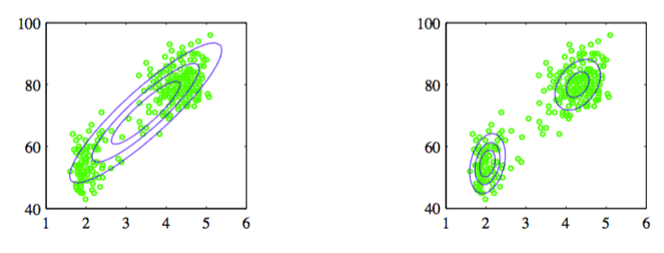
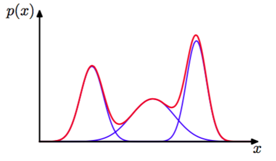
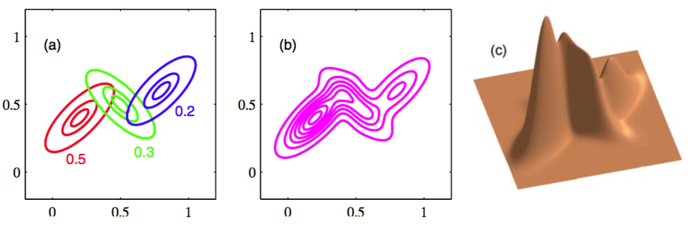

虽然高斯分布有一些重要的分析性质，但是在对实际数据建模时，会有巨大的局限性。考虑图2.21给出的例子。这是美国黄石国家公园的“忠实泉”272次间歇喷发的测量的数据集。

      
图 2.21 忠实泉间歇喷发数据

每条测量记录包括持续喷发多少分钟（横轴）和距离下次喷发间隔多少分钟（纵轴）。我们看到数据集主要聚集在两大堆中，简单的高斯分布不能描述这样的结构，而两个高斯分布的线性叠加可以更好地描述这个数据集的特征。   

想这样的，把多个基本的概率分布（例如高斯分布）进行线性组合的叠加方法的被形式化称为混合分布（mixture distributions）（McLachlan and Basford, 1988; McLachlan and Peel, 2000）。在图2.22中展示了高斯分布线性组合出相当复杂的概率密度形式。    

      
图 2.22 混合高斯

通过使用足够多的高斯分布，并且调节它们的均值和方差以及线性组合的系数，可以以任意的精度近似几乎所有的连续概率密度。    

于是考虑$$ K $$个高斯概率密度的叠加情况：    

$$
p(x) = \sum\limits_{k=1}^K \pi_k \mathcal{N}(x|\mu_k, \Sigma_k) \tag{2.188}
$$

这被称为混合高斯。每个高斯密度$$ \mathcal{N}(x|\mu_k, \Sigma_k) $$被称为混合的一个组件，且有自己的均值和方差$$ \mu_k, \Sigma_k $$。图2.23展示了包含3个组件的混合高斯的等高线和表面图。

      
图 2.23 3个组件的混合高斯等高线及表面图

在这一节中，我们使用高斯组件来阐释混合模型框架。更一般的，混合模型可以包含其它分布的线性组合。例如在9.3.3中将使用伯努利分布的混合来对离散变量进行混合模型。    

式（2.188）中的参数$$ \pi_k $$被称为混合系数。如果我们同时在两边对$$ x $$进行积分，（注意$$ p(x) $$和单独的高斯组件都是标准化的），得到：     

$$
\sum\limits_{k=1}^K \pi_k = 1 \tag{2.189}
$$

且，$$ p(x) \geq 0, \mathcal{N}(x|\mu_k, \Sigma_k) \geq 0 $$这些条件隐含的对于任意$$ k $$都有$$ \pi_k \geq 0 $$。结合条件（2.189）得到：    

$$
0 \leq \pi_k \leq 1 \tag{2.190}
$$

因此，我们看到混合系数满足成为概率的要求。    

根据加法和乘法规则，得到边缘密度为：    

$$
p(x) = \sum\limits_{k=1}^Kp(k)p(x|k) \tag{2.191}
$$

其中，把$$ \pi_k = p(k) $$看成使用第$$ k $$个组件的先验概率，把密度$$ \mathcal{N}(x|\mu_k,\Sigma_k) = p(x|k) $$看成以$$ k $$为条件的$$ x $$的概率，这就等于式（2.188）。      

就像我们在之后的章节看到的那样，后验概率$$ p(k|x) $$有时也被称为责任（responsibilities），起着很重要的作用。根据贝叶斯定理，后验概率为：    

$$
\begin{eqnarray}
\gamma_k(x) &\equiv& p(k|x) \\
&=& \frac{p(k)p(x|k)}{\sum_lp(l)p(x|l)} \\
&=& \frac{\pi_k\mathcal{N}(x|\mu_k, \Sigma_k)}{\sum_l\pi_l\mathcal{N}(x|\mu_l, \Sigma_l)} \tag{2.192}
\end{eqnarray}
$$

将在第9章比较详细地讨论混合分布的概率意义。    

控制混合高斯分布的参数$$ \pi,\mu,\Sigma $$，被记为$$ \pi \equiv \{\pi_1,...,\pi_K\}, \mu \equiv \{\mu_1,...,\mu_K\}, \Sigma \equiv \{\Sigma_1,...,\Sigma_K\} $$。确定这些参数值的一种方法是使用最大似然。根据公式（2.188）得到对数似然函数：    

$$
\ln p(X|\pi, \mu, \Sigma) = \sum\limits_{n=1}^N \ln\left\{\sum\limits_{k=1}^K\pi_k\mathcal{N}(x_n|\mu_k,\Sigma_k)\right\} \tag{2.193}
$$

其中 $$ X = \{x_1,...,x_N\} $$。因为对数中存在一个根据$$ k $$的求和公式，这比一元高斯分布复杂得多。这导致参数的最大似然解不再是一个封闭形式的解析解。最大化这个似然函数的一种方法是使用迭代数值优化法（Fletcher, 1987; Nocedal and Wright, 1999; Bishop and Nabney, 2008）。另一种方法是使用一种被称为期望最大化（expectation maximization）的强大的框架，将在第9章详细讨论。
