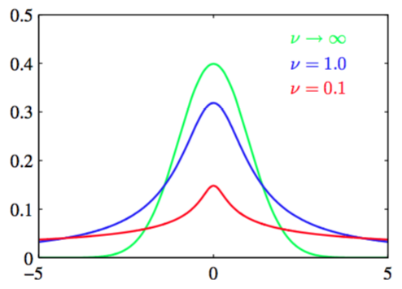

我们已经证明高斯分布的精度的共轭先验是gamma分布。如果把一元高斯$$ \mathcal{N}(x|\mu,\tau) $$和Gamma先验$$ Gam(\tau|a,b) $$结合一起并积分掉精度，得到$$ x $$的边缘分布形式：    

$$
\begin{eqnarray}
p(x|\mu,a,b) &=& \int\limits_0^\infty\mathcal{N}(x|\mu,\tau^{-1})Gam(\tau|a,b)d\tau \\
&=&  \int\limits_0^\infty\frac{b^ae^{(-br)}\tau^{a-1}}{\Gamma(a)}\left(\frac{\tau}{2\pi}\right)^{1/2}exp\left\{-\frac{\tau}{2}(x-\mu)^2\right\}d\tau \\
&=& \frac{b^a}{\Gamma(a)}\left(\frac{1}{2\pi}\right)^{1/2}\left[b+\frac{(x-\mu)^2}{2}\right]^{-a-1/2}\Gamma(a+1/2) \tag{2.158}
\end{eqnarray}
$$

其中我们使用了变量替换$$ z = \tau[b+(x-\mu)^2/2] $$。为了方便，我们定义了新变量$$ v = 2a, \lambda = a/b $$那么分布$$ p(x|\mu,a,b) $$就可以写成：    

$$
St(x|\mu,\lambda,v) = \frac{\Lambda(v/2+1/2)}{\Lambda(v/2)}\left(\frac{\lambda}{\pi v}\right)^{1/2}\left[1+\frac{\lambda(x-\mu)^2}{v}\right]^{-v/2-1/2}  \tag{2.159}
$$

这就是学生t分布。参数$$ \lambda $$有时被称为t分布的精度，虽然它并不总是等于方差的逆。参数$$ v $$表示自由度，图2.15展示了它的影响。

      
图 2.15 自由度对t分布的影响

对于$$ v = 1 $$这样特殊的情况，t分布退化成了Cauchy分布，而当$$ v \to \infty $$时t分布$$ St(x|\mu,\lambda,v) $$变成了均值和精度分别为为$$ \mu, \lambda $$的高斯分布$$ \mathcal{N}(x|\mu,\lambda^{-1}) $$。    

从式（2.158）我们得到学生t分布是由无穷多个相同均值不同精度高斯分布相加而成的。这可以解释为无限的高斯混合模型（高斯混合模型将会在2.3.9节详细讨论）。结果是一个通常有着比高斯分布更长的“尾巴”的概率分布，正如图2.15展示的。这给出了t分布的一个叫做健壮性（robustness）的重要性质，这表示对于数据集里存在几个离群点（outlier），t分布不会像高斯分布那样敏感。图2.16展示了t分布的健壮性，并对比了高斯分布和t分布的最大似然解

      
图 2.16 t分布与高斯分布    

注意t分布的最大似然解可以通过期望最大化（EM）算法求得。现在我们知道少量的离群点对于t分布的影响要远远小于高斯分布。在实际应用中，离群点可能在长尾的概率分布的数据生成或误标记的数据中产生。健壮性也是回归问题中的一个重要属性。由于与回归中的最小平方方法对应的是（条件）高斯分布下的最大似然解它显然并不具备健壮性。基于一个长尾的概率分布（例如t分布）的回归模型是比较健壮的模型。     

如果我们回到式（2.158）并代入参数$$ v = 2a, \lambda = a/b, \eta = \tau b/a $$，得到t分布可以写成：     

$$
St(x|\mu,\lambda,v) = \int\limits_0^\infty\mathcal{N}(x|\mu,(\eta\lambda)^{-1})Gam(\eta|v/2,v/2)d\eta \tag{2.160}
$$

可以把它推广到多元高斯$$ \mathcal{N}(x|\mu,\Lambda) $$来得到对应的多元t分布：    

$$
St(x|\mu,\Lambda,v) = \int\limits_0^\infty\mathcal{N}(x|\mu,(\eta\Lambda)^{-1})Gam(\eta|v/2,v/2)d\eta \tag{2.161}
$$

使用与一元变量相同的方法，求解这个积分，得：    

$$
St(x|\mu,\Lambda,v) = \frac{\Gamma(D/2+v/2)}{\Gamma(v/2)}\frac{|\Lambda|^{1/2}}{(\pi v)^{D/2}}\left[1+\frac{\Delta^2}{v}\right]^{-D/2-v/2} \tag{2.162}
$$

其中$$ D $$是向量$$ x $$的维数，$$ \Delta^2 $$是由

$$
\Delta^2 = (x-\mu)^T\Lambda(x-mu) \tag{2.163}
$$

定义的马氏距离（Mahalanobis distance）的平方。这个形式的多元t分布满足下面这些性质：    

$$
\begin{eqnarray}
\mathbb{E}[x] &=& \mu, & \text{if } v > 1 \tag{2.164} \\
cov[x] &=& \frac{v}{(v-2)}\Lambda^{-1}, & \text{if } v > 2 \tag{2.165} \\
mode[x] &=& \mu \tag{2.166}
\end{eqnarray}
$$

对应地，可以得到一元变量的结果。

