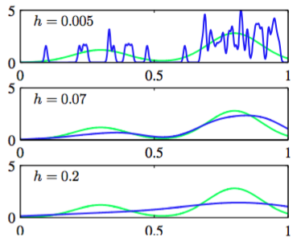

假设，我们的观测来自于$$ D $$维欧式空间中的未知概率密度$$ p(x) $$，希望估计出$$ p(x) $$。根据之前对于局部性的讨论，让我们考虑包含$$ x $$的小区域$$ R $$。这个区域的概率质量是由

$$
P = \int_Rp(x)dx \tag{2.242}
$$

给出的。假设已经收集了服从分布$$ p(x) $$的$$ N $$次观测。由于每个数据点都有落在区域$$ R $$中的概率$$ P $$，所以位于区域$$ R $$内部的数据点的总数$$ K $$将服从二项分布

$$
Bin(K|N,P) = \frac{N!}{K!(N-K)!}P^K(1-P)^{N-K} \tag{2.243}
$$

使用式（2.11），得到落在区域内部的数据点的平均比例为$$ \mathbb{E}[K/N] = P $$，同时引用式（2.12）得到这个均值的方差为$$ var[K/N] = P(1-P)/N $$。对于大的$$ N $$值，这个分布将会在均值附近产生尖峰，且   

$$
K \simeq NP \tag{2.244}
$$

但是，如果同时假定区域$$ R $$足够小，使得在这个区域内的概率密度$$ p(x) $$大致为常数，那么就有

$$
P \simeq p(x)V \tag{2.245}
$$

其中$$ V $$是$$ R $$的体积。结合式（2.244）和（2.245）得到密度估计的形式：    

$$
p(x) = \frac{K}{NV} \tag{2.246}
$$

注意，式（2.246）的成立依赖于两个相互矛盾的假设，即区域$$ R $$要足够小，使得这个区域内的概率密度近似为常数，但是也要足够大（关于密度的值），使得落在这个区域内的数据点的数量$$ K $$足够让二项分布达到尖峰。    

有两种方法来利用式（2.246）的结果。可以固定$$ K $$然后通过数据中确定$$ V $$的值，这就是马上就要讨论的K临近算法。也可以固定$$ V $$然后通过数据中确定$$ K $$的值，这就是核方法。可以证明，在极限$$ N \to \infty $$下，如果$$ V $$ 随着$$ N $$而合适地收缩，且$$ K $$随着$$ N $$增大，那么$$ K $$近邻密度估计和核密度估计都会收敛到真实的概率密度(Duda and Hart, 1973)。    

先详细讨论核方法。首先，我们把区域$$ R $$取成以想确定概率密度的点$$ x $$为中心的小超立方体。为了统计落在这个区域内的数据点的数量$$ K $$，定义函数    

$$
k(u) =
\begin{cases}
1, |u_i| \leq 1/2, i=1,...,D, \\
0, otherwise
\end{cases} \tag{2.247}
$$

会比较方便。这表示一个以原点为中心的单位立方体。函数$$ k(u) $$是核函数的一个例子。在这个问题中也被称为Parzen window。从式（2.247），如果数据点$$ x_n $$位于以$$ x $$为中心的边长为$$ h $$的立方体中，那么量$$ k((x-x_n)/h) $$等于1，否则它的值为0。位于这个立方体内的数据点的总数为：    

$$
K = \sum\limits_{n=1}^Nk\left(\frac{x-x_n}{h}\right) \tag{2.248}
$$

把这个表达式代入式（2.246），可以得到点$$ x $$处的概率密度估计

$$
p(x) = \frac{1}{N}\sum\limits_{n=1}^N\frac{1}{h^D}k\left(\frac{x-x_n}{h}\right) \tag{2.249}
$$

其中使用了$$ D $$维边长为$$ h $$的立方体的体积公式$$ V = h^D $$。使用函数$$ k(u) $$的对称性，可以重新解读这个等式为以$$ N $$个数据点$$ x_n $$为中心的$$ N $$个立方体的和，而不是解读为以$$ x $$为中心的一个立方体。    

核密度估计（2.249）和之前的直方图方法一样会碰到人为带来的非连续性的问题。这个是由密度估计中立方体的边界带来的。如果我们选择一个平滑的核函数，那么就可以得到一个更加光滑的模型。一个常用的选择是高斯核函数，它给出

$$
p(x) = \frac{1}{N}\sum\limits_{n=1}^N\frac{1}{(2\pi h^2)^{1/2}}exp\left\{-\frac{\Vert x-x_n\Vert^2}{2h^2}\right\} \tag{2.250}
$$

核概率密度模型。其中$$ h $$表示高斯分布的标准差。这个密度模型是通过使每个数据点服从高斯，然后把它们的贡献加起来得到的，之后除以$$ N $$，使得概率密度被正确的标准化。图2.25中展示了把模型（2.250）应用于之前用来说明直方图方法的数据集上的图像。

      
图 2.25 核密度模型的例子

看到，和我们期望的一样，参数$$ h $$担当平滑参数的角色，且需要在，小的$$ h $$会造成模型对噪声过于敏感,而大的$$ h $$会造成过度平滑间做一个权衡。同样的，对$$ h $$的优化是一个模型复杂度的问题，类似于直方图密度估计中对于箱子宽度的选择，也类似于曲线拟合问题中的多项式阶数。    

要满足条件：

$$
\begin{eqnarray}
k(u) &\geq& 0, \tag{2.251} \\
\int k(u)du &=& 1 \tag{2.252}
\end{eqnarray}
$$

可以任意选择公式(2.249)中的核函数。这确保了最终求得的概率分布在处处都是非负的，且积分等于1。式（2.249）给出的这类密度模型被称为核密度估计，或Parzen估计。它的一个很大的优点是：因为“训练”阶段只需要存储训练集即可，所以它不需要进行“训练”阶段的计算。然而，这也是一个巨大的缺点，因为评估密度的计算代价随着数据集的规模线性增长。    
