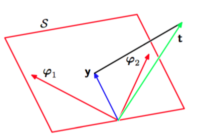

现在，考虑最小二乘方法的几何解释比较有指导意义。为了达到这个目的，考虑坐标轴由$$ t_n $$给出的$$ N $$维空间，$$ \textbf{t} = (t_1,...,t_N)^T $$是空间中的向量。通过$$ N $$个点估计出的每个基函数$$ \phi_j(x_n) $$也可以表示成相同空间中的一个向量，记作$$ \varphi_j $$，如图3.2展示。    

      
图 3.2 最小二乘几何解释

注意$$ \varphi_j $$对应的是$$ \Phi $$的第$$ j $$列，而$$ \phi(x_n） $$对应的是$$ \Phi $$的第$$ n $$行。如果基函数的数量$$ M $$小于数据点的数量$$ N $$，那么$$ M $$个向量$$ \phi_j(x_n) $$可以生成$$ M $$维线性子空间$$ S $$。我们定义$$ \textbf{y} $$是$$ N $$维向量，其中第$$ n^{th} $$个元素由$$ y(x_n,w) , n = 1,....,N $$。由于$$ \textbf{y} $$是向量$$ \varphi_j $$的任意线性组合，所以它可以在$$ M
$$维子空间的任意位置。平方和误差（3.12）等于$$ \textbf{y, t} $$之间的欧式距离（相差一个因子1/2）。所以$$ w $$的最小二乘解，对应子空间$$ S $$中与$$ t $$最近的$$ \textbf{y} $$的选择。直观地来说，从图3.2得到，我们预期这个解与$$ t $$在子空间$$ S $$上的投影正交。我们看到$$ \textbf{y} $$的解是由$$ \Phi w_{ML} $$给出的，然后可以很容易的证明它就是是正交投影的形式这一事实。    

在实际应用中，当$$ \Phi^T\Phi $$接近奇异矩阵时，直接求解标准方程会导致数值计算上的困难。特别地，当两个或更多的基向量$$ \varphi_j $$共线或接近共线时，参数的结果会相当大。这样的退化在处理真实数据集的时候并不少见。这样的数值计算上的困难可以通过奇异值分解（singular value decomposition）简称SVD的方法来解决（Press et al., 1992; Bishop and Nabney, 2008）。注意，额外的正则项可以确保即使在退化的情况下，矩阵也是非奇异的。
