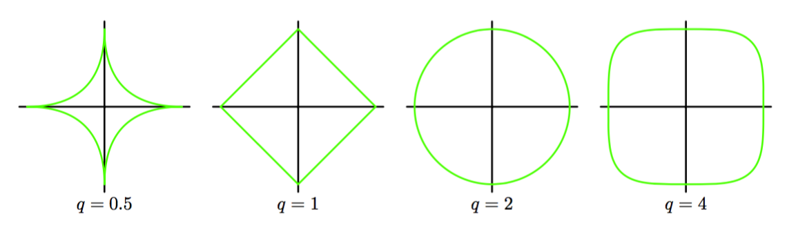

在1.1节中，我们介绍了通过添加一个正则项来防止误差函数过拟的想法，得到的需要最小化的总误差函数的形式为：     

$$
E_D(w) + \lambda E_W(w) \tag{3.24}
$$

其中$$ \lambda $$是控制数据依赖误差$$ E_D(w) $$和正则项$$ E_W(w) $$的相对重要性的正则化参数。一个最简单的正则化项是加权向量元素的平方和：    

$$
E_W(w) = \frac{1}{2}w^Tw \tag{3.25}
$$

如果我们考虑由

$$
E(w) = \frac{1}{2}\sum\limits_{n=1}^N\{t_n-w^T\phi(x_n)\}^2 \tag{3.26}
$$

给出的平方和误差函数，那么我们的总误差函数为：   

$$
\frac{1}{2}\sum\limits_{n=1}^N\{t_n-w^T\phi(x_n)\}^2 + \frac{\lambda}{2}w^Tw \tag{3.27}
$$

由于顺序学习算法，除非有数据支持，不然它倾向于让权值向零的方向衰减，所以这种正则项的选择在机器学习的文献中被称为加权衰减（weight decay）。在统计学中，由于它使参数向0收缩，所以它是参数收缩（parameter shrinkage）方法的一个例子。这种方法的优点是误差函数是$$ w $$的二次函数，因此精确的最小值有解析解。具体来说，令式（3.27）关于$$ w $$的梯度等于零，并求出$$ w $$，得到：    

$$
w = (\lambda I + \Phi^T\Phi)^{-1}\Phi^Tt \tag{3.28}
$$

这是最小二乘解（3.15）的一个简单扩展。     

有时会使用一种正则化误差形式为    

$$
\frac{1}{2}\sum\limits_{n=1}^N{t_n - w^T\phi(x_n)}^2 + \frac{\lambda}{2}\sum\limits_{j=1}^M\|w_j\|^q \tag{3.29}
$$

的更加一般的正则化项。其中$$ q=2 $$对应二次正则项（3.27）。图3.3给出了不同$$ q $$值下的正则化函数的等高线。

      
图 3.3 不同$$ q $$值下的正则化函数    

当$$ q=1 $$时，在统计文献中被称为lasso（Tibshirani, 1996）。它具有如果$$ \lambda $$充分大，那么某些系数$$ w_j $$会变为零，从而得到一个使得对应的基函数不起作用的稀疏模型。为了证明这点，首先注意到最小化式（3.29）等价于最小化满足限制

$$
\sum\limits_{j=1}^M\|w_j\|^q \leq \eta \tag{3.30}
$$

的未正则化的平方和误差（3.12）。这样，这两种方法通过拉格朗日乘数法被联系到了一起。从图3.4可以知道稀疏性的来源：在限制条件（3.30）下误差函数的最小值。随着$$ \lambda $$的增大，越来越多的参数会变为零。

      
图 3.4 lasso模型

正则化方法通过限制有效模型的复杂度，使得复杂的模型能够在有限大小的数据集上进行训练，而不产生严重的过拟。然而，这就使确定最优的模型复杂度的问题从确定合适的基函数的数量问题转移到了确定合适的正则化系数$$ \lambda $$的问题上。在本章的后面还会回到这个模型复杂度的问题上。    

对于本章的其余部分，由于实际应用中的重要性，和分析可追溯性我们将把注意力放在二次正则化项（3.27）上。
