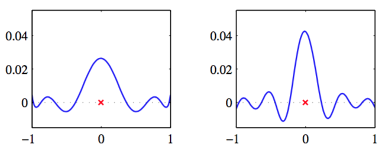

线性基函数模型的后验均值解（3.53）有一个很有趣的解释，它为核方法（包括高斯过程）提供了舞台。如果我们把式（3.53）代入式（3.3），那么预测均值就可以写成

$$
y(x,m_N) = m_N^T\phi(x)=\beta\phi(x)^TS_N\Phi^Tt=\sum\limits_{n=1}^N\beta\phi(x)^TS_N\phi(x_n)t_n \tag{3.60}
$$

的形式。其中$$ S_N $$由式（3.51）给出。因此点$$ x $$处的预测分布是由训练集的目标变量$$ t_n $$的线性组合给出，可以写成

$$
y(x,m_N) = \sum\limits_{n=1}^Nk(x,x_n)t_n \tag{3.61}
$$

其中函数

$$
k(x,x') = \beta\phi(x)^TS_N\phi(x') \tag{3.62}
$$

被称为平滑矩阵（smoother matrix）或等价核（equivalent kernel）。像这样，通过训练集的目标值的线性组合来进行预测的回归函数被称为线性平滑（linear smoother）。注意，因为这些输入值$$ x_n $$出现在了$$ S_N $$的定义中，所以等价核依赖来自数据集的输入值$$ x_n $$。图3.10展示了在高斯基函数下，三个不同的$$ x $$值的等价核核函数$$ k(x,x') $$与$$ x' $$的函数关系。

      
图 3.10 高斯基函数

我们看到，它们在局限在$$ x $$的周围，所以在$$ x
$$处的预测分布的均值$$ y(x,m_N) $$可以通过对目标值加权组合的方式获得（距离$$ x $$较近的数据点有较高的权值，而距离$$ x $$较远的数据点有较低的权值）。直观来讲，赋予局部信息比远处信息更高的权值是很合理的。注意，就像图3.11展示的那样，这个局部性不仅对于局部的高斯基函数成立，对非局部的多项式基函数和sigmoid基函数也成立。

      
图 3.11 $$ x = 0 $$时的等价核$$ k(x, x') $$的例子，图中给出了关于$$ x' $$的函数图像。左图对应于多项式基函数，右图对应于sigmoid基函数，如图3.1所示。注意，这些是$$ x' $$的局部函数，即使对应的基函数不是局部的。

考虑$$ y(x),y(x') $$间的协方差

$$
\begin{eqnarray}
cov[y(x),y(x')] &=& cov[\phi(x)^Tw,w^T\phi(x')] \\
&=& \phi(x)^TS_N\phi(x') = \beta^{-1}k(x,x') \tag{3.63}
\end{eqnarray}
$$

可以进一步了解等价核的作用。其中使用了式（3.49），（3.62）。从等价核的形式，我们可以得到预测的均值与附近的点高度相关，而与距离较远的点相关性较低。    

图3.8展示的预测分布允许我们逐点的可视化预测的由式（3.59）控制不确定性。然而，通过从$$ w $$的后验分布中抽取样本，再在图3.9中画出对应的模型函数$$ y(x,w) $$，我们可视化了$$ y $$值与两个（者更多）$$ x $$值后验概率分布中位处的之间的由等价核控制不确定性。    

用核函数表示线性回归是解决回归问题的另一种方法。在给定观测数据集的条件下，直接定义一个局部的核函数，而不是引入一组基函数来隐式地定义了一个等价的核，然后使用这个核函数对新的输入变量$$ x $$做预测。这就是将在6.4节详细讨论的用于回归问题（以及分类问题）的一个称为高斯过程（Gaussian process）的实用框架。    

我们已经看到，有效核定义了训练数据集里的目标值组合的权值，然后对新的$$ x $$值做预测。可以证明权值的和为1，即：    

$$
\sum\limits_{n=1}^Nk(x,x_n) = 1 \tag{3.64}
$$

对于所有$$ x $$成立。注意，这个求和等价于对于所有的$$ n $$都有$$ t_n = 1 $$的目标数据集的预测均值$$ \hat{y}(x) $$。提供线性无关的基函数，且数据点比基函数多，其中一个基函数是常数（对应偏置参数），很明显我们可以精确的拟合训练数据，因此预测均值就是简单的$$ \hat{y}(x) = 1
$$，这样就非形式化的证明了（3.64）这个直观上很漂亮的结果。注意，核函数可以为负也可以为正，因此它虽然满足和限制，但是对应的预测未必是训练集目标值的凸组合。    

最后，我们注意到等价核（3.62）满足一个与一般的核函数共有的要性质，即它可以表示为非线性函数的向量$$ \psi(x) $$的内积，即

$$
k(x,z) = \psi(x)^T\psi(z) \tag{3.65}
$$

其中$$ \psi(x) = \beta^{1/2}S_N^{1/2}\phi(x) $$。

