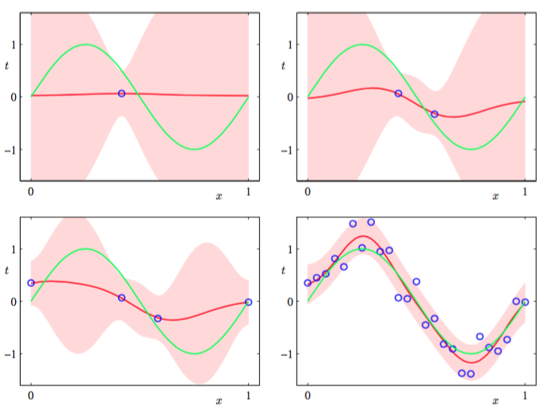
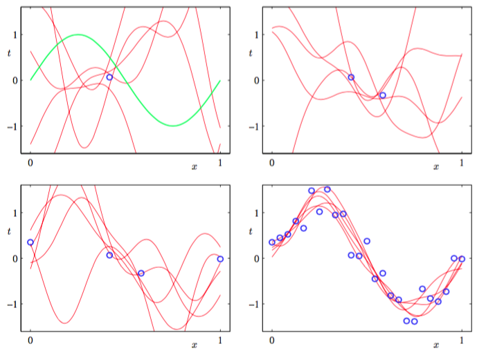

在实际应用中，我们对新的$$ x $$的值预测出$$ t $$比$$ w $$的值本身更感兴趣。这需要我们估计出定义为    

$$
p(t|\textbf{t},\alpha,\beta) = \int p(t|w,\beta)p(w|\textbf{t},\alpha,\beta)dw \tag{3.57}
$$

的预测分布。其中$$ \textbf{t} $$是训练集中的目标向量，且为了简化记号，我们省略了右手边条件表达式中的输入向量。目标变量的条件分布由式（3.8）给出，后验权重加权分布由式（3.49）给出。我们看到式（3.57）涉及两个高斯分布的卷积，所以使用8.1.4节中得到的式（2.115）的结果，得到的预测分布的形式为：    

$$
p(t|x,\textbf{t},\alpha,\beta) = \mathcal{N}(t|m_N^T\phi(x),\delta_N^2(x)) \tag{3.58}
$$

其中预测分布的方差$$ \delta_N^2(x) $$是由

$$
\delta_N^2(x) = \frac{1}{\beta} + \phi(x)^TS_N\phi(x) \tag{3.59}
$$

给出。式（3.59）中的第一项表示数据上的噪声，而第二项反应了与参数$$ w $$关联的不确定性。由于噪声的处理与$$ w $$的分布是相互独立的高斯，它们的方差是可加的。注意，当额外的数据点被观测到的时候，后验概率分布会变窄。从而可以证明$$ \delta_{N+1}^2(x) \leq \delta_N^2(x) $$（Qazaz et al., 1997）。在取极限$$ N \to \infty $$的情况下，式（3.59）的第二项趋向于0，这时预测分布的方差只来自于由参数$$ \beta $$控制的可加噪声。     

为了阐释贝叶斯线性回归模型的预测分布，让我们回到1.1节中人工生成的正弦数据集。在图3.8中，我们展示了在由高斯基函数线性组合成的模型下，不同数据集大小和对应的后验分布的关系。

      
图 3.8 不同数据集下的拟合

其中，绿色曲线对应生成数据（加上高斯噪声）的函数$$ \sin(2\pi x) $$。大小为$$ N=1, N=2, N=4, N=25 $$的数据集以蓝色的圈展示在图中。每幅图中红色曲线展示了高斯预测分布的均值，红色阴影区域是均值两侧的一个标准差范围的区域。注意，预测的不确定性依赖于$$ x $$，且在数据点的邻域内最小。还有就是，不确定性的程度随着观测到的数据点的增多而逐渐减小。    

图3.8中的图像只逐点以$$ x $$的函数的形式展示了预测方差。为了更加深刻地认识对于不同的$$ x $$值的预测之间的协方差，可以从$$ w $$的后验分布中抽取样本，然后画出对应的函数$$ y(x, w) $$，如图3.9所示：

      
图 3.9 $$ w $$的后验分布

如果我们使用局部化的基函数（如高斯基函数），那么在距离基函数中心比较远的区域，预测方差（3.59）的第二项的贡献将会趋向于0，只剩下噪声贡献$$ \beta^{−1} $$。因此，模型相当确定对于处于基函数所在的区域之外的区域所做出的预测，这通常不是我们想要的结果。通过采用一种被称为高斯过程的另一种贝叶斯方法，可以避免这个问题。    

注意，如果$$ w, \beta $$都被当成未知的，那么根据2.3.6节的讨论，我们可以引入一个由高斯-Gamma分布给出的共轭先验分布$$ p(w, \beta) $$(Denison et al., 2002)。在这种情况下，预测是一个学生t分布。
