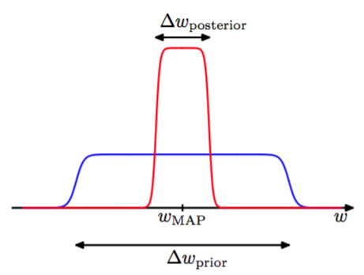
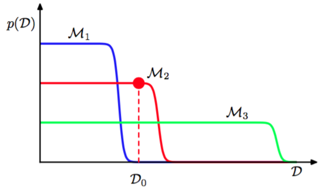

在第一章中，我们强调了过拟问题。使用交叉验证技术，来设置正则参数的值或从中选择一个合适的模型。现在，我们从贝叶斯的观点来考虑模型选择的问题。本节中的讨论会非常通用，在3.5节中，我们将会看到这些想法是如何应用到线性回归的正则参数的确定的问题中的。     

正如我们将要看到的一样，最大似然的的过拟问题可以通过可以通过对模型的参数的边缘化（求和或积分）而不是对这些值做点估计，来避免。这样模型可以不需要验证集，而是通过训练数据直接比较。这允许在训练中使用所有的有效数据，也可以避免为交叉验证的所有模型执行多次训练。它也可以在训练过程中确定多个复杂度参数。例如，在第7章中我们引入的相关向量机（relevance vector machine）。这是每个训练数据点都有一个复杂度参数的贝叶斯模型。    

模型比较的贝叶斯观点简单的涉及一致的运用概率的加法和乘法规则，并用概率来表示选择模型的不确定性。假设我们需要比较模型$$ \{M_i\} , i = 1,...,L $$集合$$ L $$。其中的模型是观测数据$$ D $$上的概率分布。在多项式曲线拟合问题中，输入值$$ X $$是已知的，分布被定义在目标值$$ \textbf{t} $$上。其他类型的模型定义了$$ X,\textbf{t}
$$上的联合分布。我们假设数据是由这些模型中的一个生成的，但是不知道究竟是哪一个。我们的不确定性由先验概率分布$$ p(M_i) $$表示。给定一个数据集$$ D $$，我们希望得到后验分布

$$
p(M_i|D) \propto p(M_i)p(D|M_i) \tag{3.66}
$$

先验让我们能够表达不同模型之间的优先级。让我们假设所有模型给出相同的先验概率。比较有意思的一项是表达了数据展现出的不同模型的优先级的模型证据（model evidence）$$ p(D|M_i) $$，稍后我们会稍微详细地研究这一项。因为模型证据可以被看成参数已经被边缘化掉的模型空间中的似然函数。两个模型的模型证据的比例$$ p(D|M_i) / p(D|M_j) $$被称为贝叶斯因子（Bayes factor）（Kass and Raftery, 1995）。    

一旦知道模型上的后验分布，根据加法乘法规则就可以得到预测分布：    

$$
p(t|x,D) = \sum\limits_{i=1}^Lp(t|x,M_i,D)p(M_i|D) \tag{3.67}
$$

这是混合分布的一个例子，对各个模型的预测分布$$ p(t|x,M_i,D) $$，通过后验分布$$ p(M_i|D) $$权重，加权平均得到了整体的预测分布。例如，如果我们有两个后验相等的两个模型，一个预测了$$ t = a $$附近的一个很窄的分布，另一个预测了$$ t = b $$附近的一个很窄的分布，俺么整体的预测分布是两个峰值分别位于$$ t = a , t = b $$处的双峰分布，而不是峰值位于$$ t = (a+b)/2 $$处的单峰模型。    

对模型求平均的一个简单的近似是使用最可能模型做预测。这被称为模型选择（model selection）。    

对于一个由参数集合$$ w $$控制的模型，根据概率的加法和乘法规则，模型证据为：    

$$
p(D|M_i) = \int p(D|w,M_i)p(w|M_i)dw \tag{3.68}
$$

从取样的角度来看，边缘似然函数可以被看成从一个参数是从先验中随机取样的模型中生成数据集$$ D $$的概率。由于

$$
p(w|d,M_i) = \frac{p(D|w,M_i)p(w|M_i)}{p(D|M_i)} \tag{3.69}
$$

所以我们注意到，模型证据恰好是估计参数的后验分布时出现在贝叶斯定理的分母中的标准化项。    

通过对参数的积分进行一个简单的近似，我们可以对模型证据有更深的认识。首先考虑模型有一个参数$$ w $$的情况。参数的后验概率正比于$$ p(D|w)p(w) $$，其中为了简化记号，我们省略了对于模型$$ M_i $$的依赖。如果我们假设后验分布在最大似然值$$ w_{MAP} $$附近是一个宽度为$$ \Delta w_{posterior} $$的尖峰，那么这个积分可以近似为这个被积函数在最大处的值乘以峰的宽度。如果我们进一步假设先验是宽度为$$ \Delta w_{prior} $$的平的分布，即$$ p(w) = 1/\Delta w_{prior}
$$，那么我们就有    

$$
p(D) = \int p(D|w)p(w)dw \simeq p(D|w_{MAP}) \frac{\Delta w_{posterior}}{\Delta w_{prior}} \tag{3.70}
$$

取对数得到

$$
\ln p(D) \simeq \ln p(D|w_{MAP}) + \ln \left(\frac{\Delta w_{posterior}}{\Delta w_{prior}}\right) \tag{3.71}
$$

图3.12展示了这个近似

      
图 3.12 模型近似

第一项表示数据的拟合是由最可能的参数值给出，对于平的先验，这对应于对数似然。第二项根据模型的复杂度来惩罚模型。因为$$ \Delta w_{posterior} < \Delta w_{prior} $$，所以这一项为负，且随着比例$$ \Delta w_{posterior}/ \Delta w_{prior} $$的减小，它的绝对值会增大。因此，如果参数根据后验分布中的数据作精确的调整，那么惩罚项是非常大的。    

对于有$$ M $$个参数的模型，我们可以依次对每一个参数做类似的近似。假设所有的参数具有同样的比例$$  \Delta w_{posterior}/ \Delta w_{prior} $$，得到：     

$$
\ln p(D) \simeq \ln p(D|w_{MAP}) + M\ln \left(\frac{\Delta w_{posterior}}{\Delta w_{prior}}\right) \tag{3.72}
$$

因此，在这种非常简单的近似下，复杂度惩罚项的大小随着模型中自适应参数$$ M $$的数量线性增长。当我们增加模型的复杂度时，因为一个更加复杂的模型能更好地拟合数据，所以第一项通常会减小，由于第二项依赖于$$ M $$所以它会增加。由最大模型证据确定的最优的模型复杂度需要在这两个相互竞争的项之间做权衡。我们后面会介绍这种近似的一个依赖于后验概率分布的高斯近似的更加精炼版本。    

通过图3.13，我们可以进一步认识贝叶斯模型比较，并且理解边缘似然是如何倾向于选择中等复杂度的模型的。

      
图 3.13 模式阐述

这里，横轴是可能的数据集构成的空间的一个一维表示，因此轴上的每个点都对应着一个具体的数据集。我们现在考虑$$ M_1, M_2, M_3
$$这三个复杂度依次增加的模型。假设让这三个模型产生样本数据集，然后观察这些数据集的分布。由于参数由先验概率分布控制，且对于任意一种参数的选择都可能在目标变量上增加一个随机噪声，所以任意给定的模型都能够生成一系列不同的数据集。为了从具体的模型中生成一个特定的数据集，我们首先从先验分布$$ p(w) $$中选择参数的值，然后对于这些参数的值我们按概率$$ p(D|w)
$$对数据进行采样。一个简单的模型（例如，基于一阶多项式）几乎没有变化性，因此生成的数据集彼此之间都十分相似。因此它的分布$$ p(D) $$被限制在横轴的一个相对小的区域。相反，一个复杂的模型（例如九阶多项式）可以生成变化性相当大的数据集，因此它的分布$$ p(D) $$散布在数据集空间中的一个相当大的区域。由于概率分布$$ p(D|M_i) $$是标准化的，所以我们标准化看到特定的数据集$$ D_0
$$对中等复杂度的模型有最高的模型证据。本质上说，简单的模型不能很好的拟合数据，而更复杂的模型把它的预测概率散布于过多的可能的数据集当中，从而对它们当中的每一个赋予的概率都相对较小。    

贝叶斯模型比较框架中隐含的假设生成数据的真实的概率分布包含在考虑的模型集合当中。如果这个假设确实成立，那么我们我们可以证明，贝叶斯模型比较基本上会选择出正确的模型。为了证明这一点，考虑$$ M_1, M_2 $$这两个模型，其中$$ M_1 $$是真实的。对于给定的有限数据集，确实有可能出现错误的模型反而使贝叶斯因子较大的事情。
但是，如果我们把贝叶斯因子在数据集分布上进行平均，可以得到期望贝叶斯因子：    

$$
\int p(D|M_1)\ln\frac{p(D|M_1)}{p(D|M_2)}dD \tag{3.73}
$$

这是关于数据的真实分布求的平均值。它是Kullback-Leibler散度的一个例子，且满足恒为正的性质，除非两个分布相等，这时它等于0。因此基本来说，贝叶斯因子总会倾向于选择正确的模型。    

我们已经看到，贝叶斯框架避免了过拟合的问题，且使得模型能够基于训练数据自身进行对比。但是，与模式识别中其他方法一样，贝叶斯方法需要对模型的形式作出假设，且如果做出的假设不合理，那么结果就会出错。特别地，我们从图3.12可以看出，模型证据对先验的很多方面都很敏感，如在尾部的行为等等。实际上，如果先验分布是非正常的，因为非正常的先验分布有着任意的缩放因子（换句话说，因为分布根本无法被标准化所以标准化系数无法定义），那么模型证据是无法定义的。如果我们考虑一个正常的先验，然后取一个适当的极限来获得一个非正常的先验（如方差无穷大的高斯先验)，那么模型证据就会趋于0，这可以从式（3.70）和图3.12知道。但是，首先考虑两个模型的证据比，然后取极限的方式，也可能得到一个有意义的答案。  

因此，在实际应用中，保留一个独立的测试数据集评估最终系统的整体表现，是一种明智的做法。
